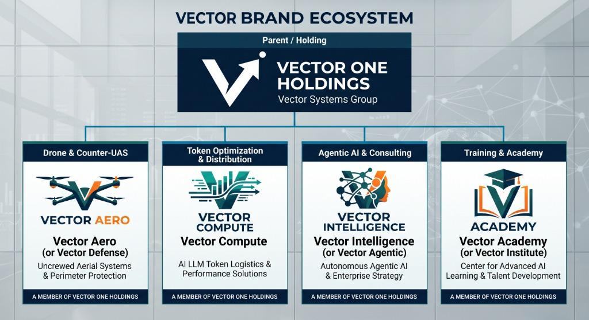
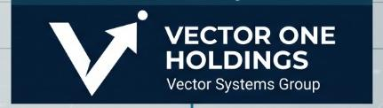

# 🚀 Vector One Holdings — Integrated Deep-Tech & Autonomous Systems Group

<p align="center">
  
</p>

<p align="center">
  <a href="https://silattrader.github.io/vector-one-holdings/"><b>🌐 Live Enterprise Website</b></a> | 
  <a href="#-the-5-core-operating-subsidiaries"><b>🏢 Operating Subsidiaries</b></a> | 
  <a href="#-repository-asset-index"><b>📁 Asset Index</b></a> | 
  <a href="#-proprietary-ip--governance-notice"><b>⚖️ Legal & IP</b></a>
</p>

---

## 🎯 North Star Goal

> *"Position Vector One Holdings as the premier integrated deep-tech group operating across physical aerospace defense (Vector Aero), AI compute logistics (Vector Compute), enterprise agentic deployment (Vector Intelligence), and human capital upskilling (Vector Institute)."*

---

## 🏛️ Executive Business Overview

**Vector One Holdings** (operating legally under Companies Commission of Malaysia SSM registration) is a sovereign deep-technology conglomerate bridging **physical kinetic airspace defense** with **digital cognitive infrastructure**. By combining tactical Counter-Uncrewed Aerial Systems (C-UAS) with high-throughput foundation model token distribution and multi-agent autonomous deployment, Vector One provides end-to-end operational resilience for enterprise, government, defense, and institutional clients across Southeast Asia and global markets.

---

## 🏢 The 5 Core Operating Subsidiaries

<p align="center">
  
</p>

### 1. 🛡️ Vector Aero (Vector Defense)
* **Core Mandate:** Tactical Airspace Dominance & Physical Infrastructure Protection.
* **Solutions:** Commercial and defense-grade drone operations, Active Electronically Scanned Array (AESA) 3D micro-radar, directional RF jamming guns, High-Power Microwave (HPM) interdictors, and kinetic net-drone interceptors.
* **Software Stack:** Vector Aero Command & Control (C2) Gateway with sub-10ms target trajectory calculation and sensor-fusion engine.
* **Logo Asset:** `vector_aero_logo.jpg`

---

### 2. ⚡ Vector Compute
* **Core Mandate:** Cognitive Infrastructure, Token Distribution & Compute Efficiency.
* **Solutions:** Authorized reseller, distributor, and integration partner for leading foundation model tokens (**MiniMax** and global frontier LLMs).
* **Proprietary Technology:** **EvoMax Token Engine (v1.5)**—context-compression middleware that prunes prompt context, reduces LLM API bills by **30%–40%**, and shaves **120ms average latency** with a guaranteed **RAM-Only Zero Data Retention SLA**.
* **Logo Asset:** `vector_compute_logo.jpg`

---

### 3. 🤖 Vector Intelligence (Vector Agentic)
* **Core Mandate:** Data Science, Strategic Consulting & Autonomous Systems Architecture.
* **Solutions:** 
  * *Analytics as a Service (AaaS):* Quantitative modeling, data architecture, and predictive analytics.
  * *Agentic AI Implementation:* Systems integrator for autonomous multi-agent workflows, tool-use schemas, and deterministic execution.
* **Logo Asset:** `vector_intelligence_logo.jpg`

---

### 4. 🎓 Vector Institute (Vector Academy)
* **Core Mandate:** Human Capital Upskilling & Center of AI Excellence.
* **Solutions:** Executive bootcamps, C-suite AI leadership retreats, prompt engineering certifications, and agentic workflow orchestration training for corporate workforces.
* **Logo Asset:** `vector_academy_logo.jpg`

---

### 5. 🎪 Vector Enterprise MICE
* **Core Mandate:** Corporate Events, Trade Summits & Networking.
* **Solutions:** High-level Meetings, Incentives, Conferences, and Exhibitions for aerospace defense leaders, tech executives, and government trade delegations.

---

## 📁 Repository Asset Index

All enterprise strategy, technical PRDs, sales outreach, legal compliance suites, and investor data rooms are included in this repository:

| File Name | Document Title & Purpose |
| :--- | :--- |
| **[`index.html`](index.html)** | **Live Dynamic Web Application** *(Hero Page, About Us, EvoMax Calculator, C-UAS Radar, Contact Form)* |
| **[`vector_one_business_plan.md`](vector_one_business_plan.md)** | **10-Section Comprehensive Business Plan** *(3-Year P&L Forecast, $1.8M to $12.5M Revenue Trajectory)* |
| **[`vector_one_pitch_deck.md`](vector_one_pitch_deck.md)** | **12-Slide Investor Pitch Deck** *($3.5M Seed/Series A Raise Target)* |
| **[`vector_one_prd_architecture.md`](vector_one_prd_architecture.md)** | **Product Requirements Document (PRD)** *(EvoMax Engine v1.5 & Vector Aero C2 Gateway Architecture)* |
| **[`vector_one_sales_outreach_proposals.md`](vector_one_sales_outreach_proposals.md)** | **B2B Sales Outreach & SOW Proposals** *(Cold Email Sequences & $150k SOW Templates)* |
| **[`vector_one_legal_compliance.md`](vector_one_legal_compliance.md)** | **Legal, Compliance & IP Suite** *(MSA Redlines, Data Sovereignty SLA, SOC2 Readiness Matrix)* |
| **[`vector_one_investor_dataroom.md`](vector_one_investor_dataroom.md)** | **Investor Data Room Index** *(Qualified VC Target List & 5-Folder DD Room Structure)* |
| **[`vector_one_recruiting_interview.md`](vector_one_recruiting_interview.md)** | **Recruiting & Talent Acquisition Kit** *(Phase 1 JDs & 3-Part Technical Interview Rubrics)* |
| **[`vector_one_board_update.md`](vector_one_board_update.md)** | **Board & Investor Reporting Suite** *(Monthly Investor Letter & Quarterly Board Presentation)* |
| **[`vector_one_competitive_analysis.md`](vector_one_competitive_analysis.md)** | **Competitive Analysis & Moats** *(Benchmarking Matrix & 3-Pillar Strategic Moat Breakdown)* |
| **[`vector_one_google_sheets_integration.md`](vector_one_google_sheets_integration.md)** | **Google Sheets Database Lead Integration** *(Cloud Sync Setup for `silattrader@gmail.com`)* |
| **[`vector_one_website_deployment_guide.md`](vector_one_website_deployment_guide.md)** | **Web Activation & Deployment Guide** *(Step-by-step Vercel, Netlify, and GitHub Pages Setup)* |
| **[`startup-context.md`](startup-context.md)** | **5-Pillar Master Startup Profile** |

---

## ⚡ Technical & Deployment Quickstart

### **1. Run Web Application Locally**
Simply clone the repository and open `index.html` in any modern Web Browser:
```bash
git clone https://github.com/silattrader/vector-one-holdings.git
cd vector-one-holdings
# Open index.html in your browser
```

### **2. Deploy to Production**
This repository is configured for zero-build static deployment on **GitHub Pages**, **Vercel**, or **Netlify**:
- **GitHub Pages:** Automatically deployed at `https://silattrader.github.io/vector-one-holdings/`
- **Vercel / Netlify:** Import repository directly from GitHub with zero build command required (`Root Directory: ./`).

---

## ⚖️ Proprietary IP & Governance Notice

> **PROPRIETARY INFORMATION & INTELLECTUAL PROPERTY NOTICE**  
> All data, information, technology specifications, software algorithms (including EvoMax Token Engine & Vector Aero C2 Command Gateway), logos, trade dress, media, and proprietary materials contained in this repository and website are the sole and exclusive property of **Vector One Holdings / Vector One Enterprise**. All rights reserved. Any unauthorized copying, distribution, disclosure, reproduction, or reverse engineering of any portion of this site or proprietary technology without prior express written authorization from Vector One Holdings is strictly prohibited and subject to full legal enforcement under Malaysian and international intellectual property laws.

---

<p align="center">
  <b>© Vector One Holdings / Vector One Enterprise. All Rights Reserved.</b><br>
  <i>Global Headquarters: Malaysia | Sovereign Defense & Cognitive Infrastructure</i>
</p>
