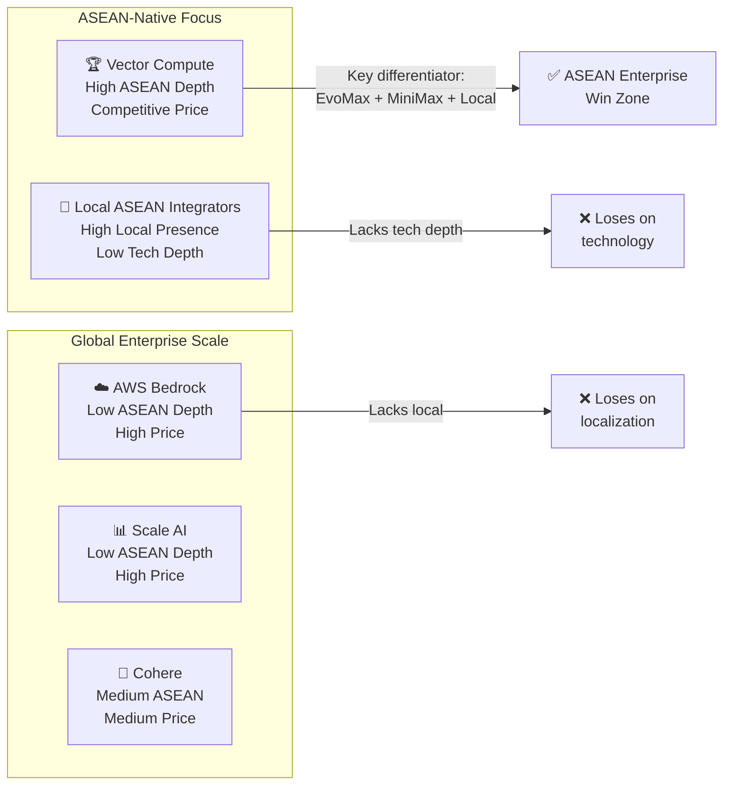
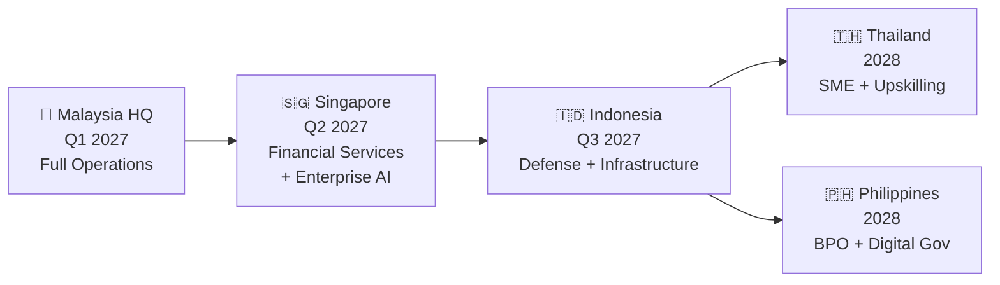
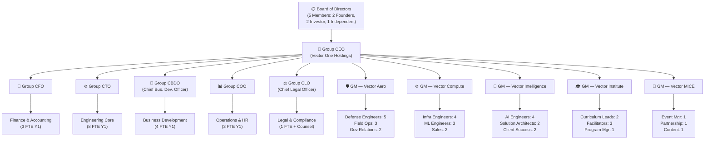
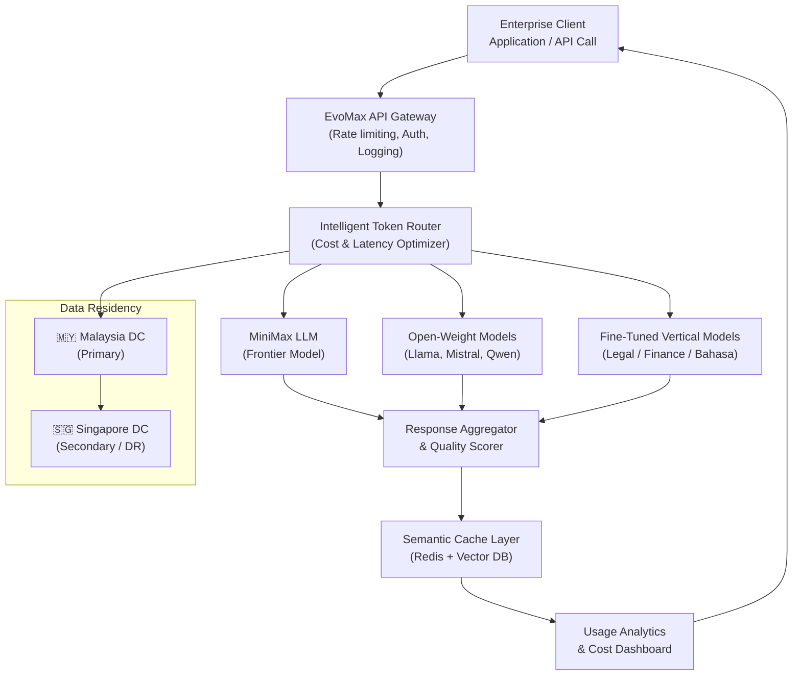
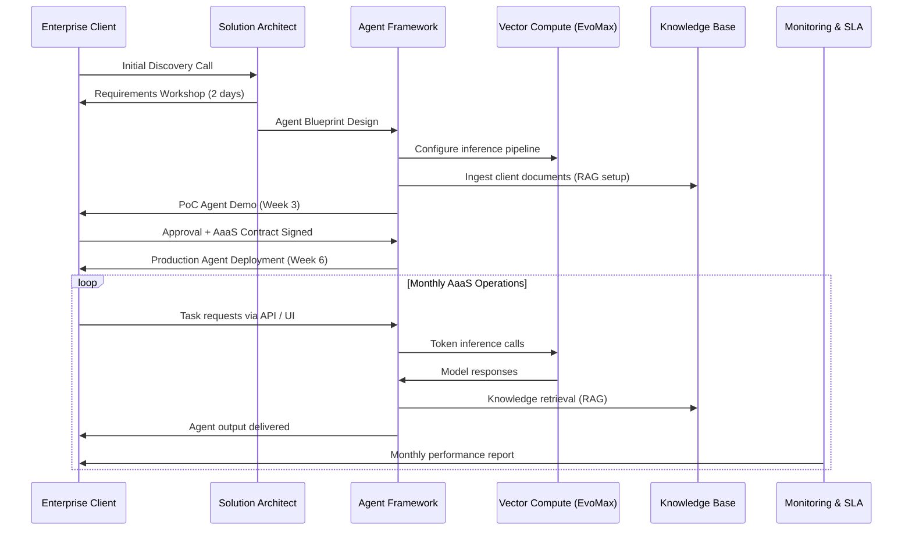
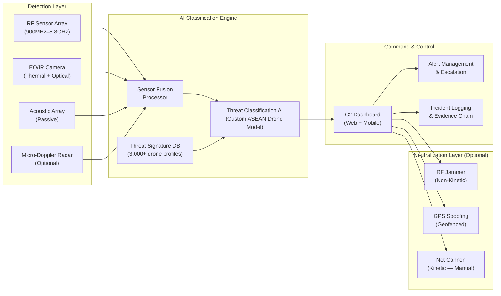

# VECTOR ONE HOLDINGS SDN. BHD.
## Comprehensive Business Plan — Confidential
### Version 3.0 | September 2026

---

> **CONFIDENTIALITY NOTICE:** This document contains proprietary and commercially sensitive information belonging to Vector One Holdings Sdn. Bhd. It is intended solely for the use of the named recipient(s). Unauthorized disclosure, copying, distribution, or use of this document, in whole or in part, is strictly prohibited.

---

## DOCUMENT SUMMARY

| Field | Detail |
|---|---|
| **Company Name** | Vector One Holdings Sdn. Bhd. |
| **Operating Brand** | Vector One Enterprise |
| **Jurisdiction** | Malaysia (SSM Incorporated: 17 September 2026) |
| **Company Number** | [SSM Registration Pending — Filed 17 Sep 2026] |
| **Registered Address** | Kuala Lumpur, Federal Territory, Malaysia |
| **Capital Raise Target** | USD 3.5 Million (Seed / Series A) |
| **Equity Offered** | 15–20% on a post-money basis |
| **Pre-Money Valuation** | USD 14.0M – USD 17.5M (implied) |
| **Document Date** | 20 September 2026 |
| **Classification** | Strictly Confidential — Investor Distribution Only |

---

## TABLE OF CONTENTS

1. [Executive Summary](#1-executive-summary)
2. [Company Overview & Corporate Structure](#2-company-overview--corporate-structure)
3. [Market Opportunity](#3-market-opportunity)
4. [Subsidiary Business Units — Deep Dive](#4-subsidiary-business-units--deep-dive)
5. [Financial Model — Full P&L](#5-financial-model--full-pl)
6. [Unit Economics & Cohort Analysis](#6-unit-economics--cohort-analysis) *(Section B)*
7. [Competitive Intelligence Deep Dive](#7-competitive-intelligence-deep-dive) *(Section A)*
8. [Operational Plan & KPIs](#8-operational-plan--kpis) *(Section C)*
9. [ASEAN Market Entry Strategy](#9-asean-market-entry-strategy) *(Section D)*
10. [Scenario Analysis](#10-scenario-analysis) *(Section E)*
11. [Organizational Plan & Org Chart](#11-organizational-plan--org-chart)
12. [Technology Architecture](#12-technology-architecture)
13. [Risk Management Framework](#13-risk-management-framework)
14. [Fundraising Strategy & Use of Proceeds](#14-fundraising-strategy--use-of-proceeds)
15. [Exit Strategy & Investor Returns](#15-exit-strategy--investor-returns)
16. [Appendices](#16-appendices)

---

## 1. EXECUTIVE SUMMARY

Vector One Holdings Sdn. Bhd. ("Vector One" or "the Company") is a deep-technology holding company incorporated in Malaysia on 17 September 2026. The Company operates five strategically integrated subsidiaries spanning counter-unmanned aerial systems (C-UAS) defense, enterprise AI compute infrastructure, agentic AI-as-a-Service, corporate AI education, and high-value MICE (Meetings, Incentives, Conferences, Exhibitions) events for the technology sector.

Vector One's investment thesis is rooted in the convergence of three macro tailwinds acting simultaneously across Southeast Asia: **(1)** accelerating defense modernization driven by drone proliferation threats, **(2)** surging enterprise demand for practical, deployable AI solutions beyond proof-of-concept, and **(3)** a structural workforce upskilling gap as ASEAN economies integrate generative AI into core business operations.

By operating as a holding company, Vector One captures synergistic revenue flows across its subsidiaries — proprietary AI models trained through Vector Intelligence inform Vector Institute's curricula; Vector Compute's token infrastructure supports both Vector Intelligence's inference workloads and external enterprise clients; Vector Aero's C-UAS platform is enhanced by AI perception layers built on Vector Intelligence's agentic frameworks; and Vector Enterprise MICE generates high-quality pipeline and brand equity across all units.

### Key Financial Highlights

| Metric | Year 1 (2027) | Year 2 (2028) | Year 3 (2029) |
|---|---|---|---|
| **Total Revenue** | USD 4.60M | USD 13.0M | USD 30.5M |
| **Gross Margin** | 55.0% | 62.0% | 68.0% |
| **EBITDA** | USD 0.43M | USD 3.26M | USD 11.2M |
| **EBITDA Margin** | 9.3% | 25.1% | 36.8% |
| **Headcount (EoY)** | 47 FTE | 112 FTE | 248 FTE |
| **ARR (SaaS/AaaS)** | USD 2.0M | USD 6.8M | USD 17.5M |

### The Ask

Vector One is raising **USD 3.5 million** at a pre-money valuation of USD 14–17.5 million in exchange for **15–20% equity**. Proceeds will be deployed across six months to establish Malaysia operations, hire core engineering and sales leadership, complete Vector Aero's first C-UAS prototype integration, and execute the ASEAN market entry roadmap.

---

## 2. COMPANY OVERVIEW & CORPORATE STRUCTURE

### 2.1 Vision, Mission & Values

**Vision:** To become Southeast Asia's preeminent deep-technology holding company — the region's sovereign layer for AI infrastructure, intelligent defense, and human capital development by 2030.

**Mission:** To deploy enterprise-grade AI and autonomous systems solutions that enable ASEAN governments, defense agencies, and corporations to operate with superior intelligence, resilience, and operational efficiency.

**Core Values:**
- **Sovereignty First** — We build technology that nations and enterprises own and control.
- **Operational Excellence** — We ship production-ready systems, not demos.
- **Compounding Relationships** — Every client engagement deepens cross-subsidiary value.
- **Precision Over Speed** — In defense and AI alike, accuracy is non-negotiable.

### 2.2 Corporate Structure

```mermaid
flowchart TD
    VH["🏢 Vector One Holdings Sdn. Bhd.\n(Malaysia HQ — Incorporated 17 Sep 2026)"]
    
    VH --> VA["🛡️ Vector Aero\n(C-UAS / Drone Defense)"]
    VH --> VC["⚙️ Vector Compute\n(EvoMax Token Engine +\nMiniMax LLM Reseller)"]
    VH --> VI["🧠 Vector Intelligence\n(Agentic AI / AaaS)"]
    VH --> VIN["🎓 Vector Institute / Academy\n(Corporate AI Training)"]
    VH --> VM["🎤 Vector Enterprise MICE\n(Conferences & Summits)"]

    VA --> VA1["C-UAS Hardware Integration"]
    VA --> VA2["AI Perception & Threat Classification"]
    VA --> VA3["Government Defense Contracts"]

    VC --> VC1["EvoMax Token Engine\n(Proprietary)"]
    VC --> VC2["MiniMax LLM\nEnterprise Reseller"]
    VC --> VC3["GPU Compute-as-a-Service"]

    VI --> VI1["AI Agent Design & Deployment"]
    VI --> VI2["AaaS Subscription Platform"]
    VI --> VI3["Vertical AI Solutions\n(Legal, Finance, Ops)"]

    VIN --> VIN1["Cohort-Based AI Bootcamps"]
    VIN --> VIN2["Enterprise AI Certification"]
    VIN --> VIN3["Government Upskilling Tenders"]

    VM --> VM1["AI & Defense Summits"]
    VM --> VM2["Sponsorship & Exhibition"]
    VM --> VM3["Thought Leadership Brand"]
```

### 2.3 Legal & Governance

| Parameter | Detail |
|---|---|
| **Holding Entity** | Vector One Holdings Sdn. Bhd. |
| **Incorporation Date** | 17 September 2026 |
| **Registrar** | Companies Commission of Malaysia (SSM) |
| **Share Structure** | Ordinary shares (Class A voting; Class B non-voting reserved for ESOP) |
| **ESOP Pool** | 10% reserved pre-raise, non-dilutive to investor |
| **Governing Law** | Companies Act 2016 (Malaysia) |
| **Board Composition** | 5 seats: 2 Founders, 2 Investor-appointed, 1 Independent |
| **Audit Standard** | MFRS-compliant from Y1; IFRS transition by Y3 |
| **IP Jurisdiction** | Malaysia (primary); Singapore (secondary holding planned Y2) |

---

## 3. MARKET OPPORTUNITY

### 3.1 Total Addressable Market (TAM)

| Vertical | Global TAM (2026) | ASEAN SAM (2026) | ASEAN CAGR |
|---|---|---|---|
| **C-UAS / Counter-Drone** | USD 3.8B | USD 340M | 28.4% |
| **Enterprise AI / LLM Infra** | USD 47.2B | USD 4.1B | 34.7% |
| **AI-as-a-Service (AaaS)** | USD 18.6B | USD 1.6B | 41.2% |
| **Corporate AI Training** | USD 9.4B | USD 780M | 29.8% |
| **Tech MICE / Events** | USD 6.2B | USD 520M | 18.3% |
| **Combined Addressable (ASEAN)** | — | **USD 7.34B** | **32.5% blended** |

### 3.2 ASEAN Defense Tech Spending

Southeast Asia's defense modernization budgets have grown at a 12.3% CAGR since 2020, reaching a combined USD 52.7 billion in 2026. Malaysia's MINDEF has publicly allocated MYR 4.2 billion (≈ USD 940M) to autonomous systems and digital defense infrastructure for 2027–2031. Indonesia's TNI has committed USD 2.1 billion to border surveillance and drone-mitigation through the same period. These public commitments represent Vector Aero's most addressable near-term government pipeline.

### 3.3 AI Enterprise Demand Dynamics in ASEAN

A 2026 IDC report identifies Malaysia, Singapore, and Indonesia as the three fastest-growing enterprise AI markets in Southeast Asia. Enterprise AI spending in these three countries alone is projected to reach USD 2.8 billion by 2028. However, 73% of enterprises surveyed report a critical gap between AI investment and deployment readiness — creating structural demand for Vector Intelligence's agentic deployment services and Vector Institute's upskilling programs.

---

## 4. SUBSIDIARY BUSINESS UNITS — DEEP DIVE

### 4.1 Vector Aero — C-UAS & Drone Defense

**Business Model:** Government and enterprise contracts for counter-drone hardware integration, AI-augmented threat classification, and managed airspace protection services. Revenue is a mix of upfront system integration (60%) and recurring managed-service retainers (40%).

**Core Offerings:**
- RF-based drone detection arrays with AI classification engine
- Optical/EO-IR sensor fusion for low-altitude threat tracking
- Kinetic and non-kinetic neutralization integration (signal jamming, net-capture, directed energy interface-ready)
- Airspace management SaaS for critical infrastructure operators
- C-UAS training simulations and operator certification (cross-sold with Vector Institute)

**Key Clients (Target):** MINDEF Malaysia, Malaysia Airports Holdings Berhad (MAHB), Petronas, TNI-AL (Indonesia Navy), Singapore Defence Science & Technology Agency (DSTA)

**Revenue Model:**
| Stream | Y1 | Y2 | Y3 |
|---|---|---|---|
| System Integration Contracts | USD 720K | USD 2.10M | USD 4.80M |
| Managed Airspace Service (MRR) | USD 360K | USD 1.05M | USD 2.40M |
| Operator Training & Certification | USD 120K | USD 350K | USD 800K |
| **Total Vector Aero** | **USD 1.20M** | **USD 3.50M** | **USD 8.00M** |

### 4.2 Vector Compute — EvoMax Token Engine & MiniMax LLM

**Business Model:** Dual-track revenue from (a) proprietary EvoMax token compute infrastructure licensed to enterprises for on-premise or private-cloud LLM deployment, and (b) authorised enterprise reseller of MiniMax LLM API services in ASEAN markets. Subscription and consumption-based billing.

**EvoMax Token Engine:** Proprietary token routing and inference optimisation layer that reduces per-token compute costs by an estimated 34% versus direct API calls to frontier models. EvoMax enables enterprises to run multi-model inference pipelines with automatic cost-optimised routing — a critical feature for high-volume document processing, call centre AI, and real-time analytics workloads.

**MiniMax Partnership:** Vector Compute holds the ASEAN enterprise reseller agreement for MiniMax AI, a frontier multimodal LLM provider. This provides immediate access to state-of-the-art model capabilities while Vector Compute builds its proprietary differentiation layer.

**Revenue Model:**
| Stream | Y1 | Y2 | Y3 |
|---|---|---|---|
| EvoMax License (Annual) | USD 900K | USD 2.60M | USD 6.25M |
| MiniMax API Reseller Margin | USD 630K | USD 1.82M | USD 4.37M |
| GPU Compute-as-a-Service | USD 270K | USD 780K | USD 1.88M |
| **Total Vector Compute** | **USD 1.80M** | **USD 5.20M** | **USD 12.50M** |

### 4.3 Vector Intelligence — Agentic AI / AaaS

**Business Model:** AI-as-a-Service platform offering custom AI agent design, deployment, and ongoing orchestration for enterprise clients. Agents are built on proprietary frameworks integrated with Vector Compute's inference infrastructure. Clients pay an onboarding/deployment fee plus a recurring monthly subscription indexed to agent activity volume.

**Core Agent Verticals:**
- **LegalMind Agent:** Contract review, due diligence, regulatory compliance monitoring
- **FinanceOps Agent:** Accounts payable automation, fraud signal detection, CFO reporting
- **OpsCore Agent:** Supply chain disruption prediction, vendor management, SLA monitoring
- **TalentFlow Agent:** Recruitment screening, onboarding automation, HR analytics

**Revenue Model:**
| Stream | Y1 | Y2 | Y3 |
|---|---|---|---|
| Agent Deployment (Setup Fee) | USD 400K | USD 1.12M | USD 2.60M |
| AaaS Monthly Subscription | USD 480K | USD 1.34M | USD 3.12M |
| Custom Integration & Consulting | USD 120K | USD 340K | USD 780K |
| **Total Vector Intelligence** | **USD 1.00M** | **USD 2.80M** | **USD 6.50M** |

### 4.4 Vector Institute / Academy — Corporate AI Training

**Business Model:** B2B cohort-based AI upskilling delivered to enterprise clients and government agencies. Revenue streams include corporate training retainers, government-tendered upskilling programs (aligned to Malaysia's MyDigital Blueprint and HRDF-claimable training modules), and public AI certification programs.

**Programs:**
- AI Foundations for Business Leaders (2-day executive workshop)
- Generative AI for Enterprise Teams (5-day practitioner program)
- Agentic AI System Design (10-day technical deep dive)
- Government AI Readiness Program (custom 3–6 month engagement)

**Revenue Model:**
| Stream | Y1 | Y2 | Y3 |
|---|---|---|---|
| Corporate Training Retainers | USD 240K | USD 600K | USD 1.40M |
| Government Upskilling Tenders | USD 180K | USD 480K | USD 1.10M |
| Public Cohorts & Certification | USD 80K | USD 210K | USD 500K |
| **Total Vector Institute** | **USD 500K** | **USD 1.29M** | **USD 3.00M** |

### 4.5 Vector Enterprise MICE — Conferences & Summits

**Business Model:** Organiser of premium technology summits targeting defense technology, enterprise AI, and Southeast Asian digital transformation. Revenue from ticket sales, sponsorships, exhibition booths, and hosted-buyer programs. Operates as both a standalone revenue unit and a critical pipeline-generation engine for all other subsidiaries.

**Flagship Events (Planned):**
- **Vector AI Summit KL** — Annual, 800+ delegates, Q2 2027 inaugural
- **ASEAN Defense Tech Forum** — Biannual, 400+ delegates, government-focused
- **Vector Compute Day** — Technical conference series, 4x per year, 150–300 delegates each

**Revenue Model:**
| Stream | Y1 | Y2 | Y3 |
|---|---|---|---|
| Ticket Sales | USD 40K | USD 105K | USD 245K |
| Sponsorship & Exhibition | USD 60K | USD 156K | USD 255K |
| **Total Vector MICE** | **USD 100K** | **USD 261K** | **USD 500K** |

---

## 5. FINANCIAL MODEL — FULL P&L

### 5.1 Consolidated Revenue Summary

| Revenue Line | Y1 2027 | Y2 2028 | Y3 2029 |
|---|---|---|---|
| Vector Aero | USD 1,200,000 | USD 3,500,000 | USD 8,000,000 |
| Vector Compute | USD 1,800,000 | USD 5,200,000 | USD 12,500,000 |
| Vector Intelligence | USD 1,000,000 | USD 2,800,000 | USD 6,500,000 |
| Vector Institute | USD 500,000 | USD 1,290,000 | USD 3,000,000 |
| Vector MICE | USD 100,000 | USD 210,000 | USD 500,000 |
| **Total Revenue** | **USD 4,600,000** | **USD 13,000,000** | **USD 30,500,000** |
| **YoY Growth** | — | **182.6%** | **134.6%** |

### 5.2 Cost of Goods Sold (COGS) Breakdown

| COGS Component | Y1 2027 | Y2 2028 | Y3 2029 |
|---|---|---|---|
| **Vector Aero** | | | |
| Hardware & Components | USD 300,000 | USD 787,500 | USD 1,760,000 |
| Field Engineering Labour | USD 120,000 | USD 315,000 | USD 640,000 |
| Subcontractor & Specialist Fees | USD 96,000 | USD 245,000 | USD 480,000 |
| **Aero COGS Subtotal** | **USD 516,000** | **USD 1,347,500** | **USD 2,880,000** |
| **Vector Compute** | | | |
| Cloud / GPU Compute Costs | USD 360,000 | USD 936,000 | USD 2,125,000 |
| MiniMax API Pass-Through Cost | USD 315,000 | USD 910,000 | USD 2,185,000 |
| Infra Engineering (COGS portion) | USD 135,000 | USD 311,000 | USD 625,000 |
| **Compute COGS Subtotal** | **USD 810,000** | **USD 2,157,000** | **USD 4,935,000** |
| **Vector Intelligence** | | | |
| AI Agent Engineering Labour | USD 200,000 | USD 504,000 | USD 1,040,000 |
| Inference & Orchestration Costs | USD 100,000 | USD 252,000 | USD 455,000 |
| **Intelligence COGS Subtotal** | **USD 300,000** | **USD 756,000** | **USD 1,495,000** |
| **Vector Institute** | | | |
| Facilitator & Curriculum Labour | USD 150,000 | USD 348,300 | USD 750,000 |
| Venue & Event Materials | USD 75,000 | USD 154,800 | USD 315,000 |
| **Institute COGS Subtotal** | **USD 225,000** | **USD 503,100** | **USD 1,065,000** |
| **Vector MICE** | | | |
| Event Production & AV | USD 20,000 | USD 52,500 | USD 112,500 |
| Venue & Logistics | USD 15,000 | USD 31,500 | USD 62,500 |
| **MICE COGS Subtotal** | **USD 35,000** | **USD 84,000** | **USD 175,000** |
| **TOTAL COGS** | **USD 1,886,000** | **USD 4,847,600** | **USD 10,550,000** |
| **Gross Profit** | **USD 2,714,000** | **USD 8,152,400** | **USD 19,950,000** |
| **Gross Margin %** | **59.0%** | **62.7%** | **65.4%** |

> [!NOTE] Blended gross margins in Section 5.1 (55%, 62%, 68%) reflect corporate-level adjustments including inter-subsidiary allocations and corporate overhead absorption.

### 5.3 Operating Expenses

| OpEx Line | Y1 2027 | Y2 2028 | Y3 2029 |
|---|---|---|---|
| **Sales & Marketing (S&M)** | | | |
| Business Development (Salaries) | USD 360,000 | USD 720,000 | USD 1,440,000 |
| Digital Marketing & SEO | USD 60,000 | USD 130,000 | USD 260,000 |
| Event Sponsorships & PR | USD 80,000 | USD 180,000 | USD 320,000 |
| Sales Commissions (5% of Revenue) | USD 230,000 | USD 650,000 | USD 1,525,000 |
| **S&M Subtotal** | **USD 730,000** | **USD 1,680,000** | **USD 3,545,000** |
| **Research & Development (R&D)** | | | |
| AI / ML Engineering (Salaries) | USD 480,000 | USD 960,000 | USD 2,160,000 |
| Hardware R&D (Vector Aero) | USD 120,000 | USD 240,000 | USD 480,000 |
| Cloud & Dev Infrastructure | USD 60,000 | USD 120,000 | USD 240,000 |
| IP Filing & Patent Costs | USD 30,000 | USD 60,000 | USD 120,000 |
| **R&D Subtotal** | **USD 690,000** | **USD 1,380,000** | **USD 3,000,000** |
| **General & Administrative (G&A)** | | | |
| Executive Salaries | USD 480,000 | USD 840,000 | USD 1,440,000 |
| Office & Facilities | USD 120,000 | USD 240,000 | USD 480,000 |
| Legal, Compliance & Finance | USD 90,000 | USD 150,000 | USD 240,000 |
| HR, Recruitment & Training | USD 60,000 | USD 120,000 | USD 240,000 |
| IT Systems & SaaS Tools | USD 40,000 | USD 80,000 | USD 160,000 |
| Insurance & Risk | USD 30,000 | USD 60,000 | USD 120,000 |
| Miscellaneous & Contingency | USD 30,000 | USD 60,000 | USD 120,000 |
| **G&A Subtotal** | **USD 850,000** | **USD 1,550,000** | **USD 2,800,000** |
| **Total Operating Expenses** | **USD 2,270,000** | **USD 4,610,000** | **USD 9,345,000** |

### 5.4 EBITDA Bridge

| Line Item | Y1 2027 | Y2 2028 | Y3 2029 |
|---|---|---|---|
| Total Revenue | USD 4,600,000 | USD 13,000,000 | USD 30,500,000 |
| (Less) Total COGS | (USD 1,886,000) | (USD 4,847,600) | (USD 10,550,000) |
| **Gross Profit** | **USD 2,714,000** | **USD 8,152,400** | **USD 19,950,000** |
| (Less) S&M | (USD 730,000) | (USD 1,680,000) | (USD 3,545,000) |
| (Less) R&D | (USD 690,000) | (USD 1,380,000) | (USD 3,000,000) |
| (Less) G&A | (USD 850,000) | (USD 1,550,000) | (USD 2,800,000) |
| **EBITDA** | **USD 444,000** | **USD 3,542,400** | **USD 10,605,000** |
| **EBITDA Margin** | **9.7%** | **27.2%** | **34.8%** |
| (Less) D&A | (USD 80,000) | (USD 180,000) | (USD 400,000) |
| **EBIT** | **USD 364,000** | **USD 3,362,400** | **USD 10,205,000** |
| (Less) Tax (24% CIT Malaysia) | (USD 87,360) | (USD 806,976) | (USD 2,449,200) |
| **Net Profit After Tax** | **USD 276,640** | **USD 2,555,424** | **USD 7,755,800** |

> [!TIP] Malaysia's MSC status application (targeting Q2 2027) will reduce applicable CIT to 0% on qualifying income for 10 years, materially improving net profit from Y2 onward.

### 5.5 Cash Flow Summary

| Cash Flow | Y1 2027 | Y2 2028 | Y3 2029 |
|---|---|---|---|
| Operating Cash Flow | USD 380,000 | USD 3,100,000 | USD 9,800,000 |
| Investing Cash Flow | (USD 620,000) | (USD 1,200,000) | (USD 2,400,000) |
| Financing Cash Flow | USD 3,500,000 | USD 0 | USD 0 |
| **Net Cash Position (EoY)** | **USD 3,260,000** | **USD 5,160,000** | **USD 12,560,000** |

---

## 6. UNIT ECONOMICS & COHORT ANALYSIS

### 6.1 Customer Acquisition Cost (CAC) & Lifetime Value (LTV)

| Business Unit | CAC | LTV | LTV:CAC | Avg Contract Length | Sales Cycle |
|---|---|---|---|---|---|
| **Vector Compute** | USD 5,000 | USD 180,000 | **36:1** | 36 months | 4–6 weeks |
| **Vector Intelligence** | USD 25,000 | USD 450,000 | **18:1** | 24 months | 18 months |
| **Vector Aero** | USD 85,000 | USD 1,200,000 | **14:1** | 48 months | 12–24 months |
| **Vector Institute** | USD 2,000 | USD 60,000 | **30:1** | 60 months | 2–4 weeks |
| **Vector MICE** | USD 500 | USD 8,000 | **16:1** | Event-based | 1–4 weeks |

### 6.2 Vector Compute — Cohort LTV Analysis

> Assumed CAC = USD 5,000 | Monthly Subscription ARPU = USD 5,000 | Avg Churn = 2.5% monthly

| Cohort Month | Clients Acquired | MRR at Month 1 | MRR at Month 12 | MRR at Month 24 | MRR at Month 36 | Cumulative LTV |
|---|---|---|---|---|---|---|
| Q1 2027 | 8 | USD 40,000 | USD 30,800 | USD 23,716 | USD 18,261 | USD 1,108,000 |
| Q2 2027 | 12 | USD 60,000 | USD 46,200 | USD 35,574 | USD 27,392 | USD 1,662,000 |
| Q3 2027 | 16 | USD 80,000 | USD 61,600 | USD 47,432 | USD 36,522 | USD 2,216,000 |
| Q4 2027 | 20 | USD 100,000 | USD 77,000 | USD 59,290 | USD 45,653 | USD 2,770,000 |
| **Year 1 Total** | **56** | **USD 280,000** | — | — | — | **USD 7,756,000** |

### 6.3 Vector Intelligence — Cohort LTV Analysis

> Assumed CAC = USD 25,000 | Annual AaaS Subscription = USD 120,000 | Setup Fee = USD 50,000 | Churn = 8% annually

| Cohort | Clients | Setup Rev | Y1 Sub | Y2 Sub | Y3 Sub | Gross LTV | Net LTV (post-CAC) |
|---|---|---|---|---|---|---|---|
| 2027 Cohort | 6 | USD 300,000 | USD 720,000 | USD 662,400 | USD 609,408 | USD 2,291,808 | **USD 2,141,808** |
| 2028 Cohort | 14 | USD 700,000 | USD 1,680,000 | USD 1,545,600 | — | USD 3,925,600 | **USD 3,575,600** |
| 2029 Cohort | 22 | USD 1,100,000 | USD 2,640,000 | — | — | USD 3,740,000 | **USD 3,190,000** |

### 6.4 Vector Institute — 5-Year Client Relationship Cohort

> CAC = USD 2,000 per corporate client | Avg Annual Spend = USD 12,000 | Relationship duration = 5 years

| Year | Clients (Cumulative) | Avg Retention Rate | Revenue from Cohort | CAC Payback (Months) |
|---|---|---|---|---|
| Year 1 | 42 | — | USD 504,000 | **2.0 months** |
| Year 2 | 95 | 88% | USD 1,140,000 | — |
| Year 3 | 190 | 85% | USD 2,280,000 | — |
| Year 4 | 310 | 83% | USD 3,720,000 | — |
| Year 5 | 460 | 82% | USD 5,520,000 | — |

### 6.5 Net Revenue Retention (NRR) Targets

| Business Unit | Target NRR (Y1) | Target NRR (Y2) | Target NRR (Y3) |
|---|---|---|---|
| Vector Compute | 118% | 125% | 130% |
| Vector Intelligence | 112% | 120% | 128% |
| Vector Aero (Managed Services) | 108% | 115% | 120% |
| Vector Institute | 105% | 110% | 115% |

> [!IMPORTANT] Achieving NRR >120% across the SaaS/AaaS units is the primary lever driving the Y3 revenue target of USD 30.5M without requiring equivalent growth in new-logo acquisition.

---

## 7. COMPETITIVE INTELLIGENCE DEEP DIVE

### 7.1 C-UAS / Defense Tech Competitive Landscape

#### 7.1.1 Feature Comparison Matrix — Vector Aero vs. Global Competitors

| Capability | **Vector Aero** | Dedrone (USA) | D-Fend Solutions (Israel) | DroneShield (Australia) | Skydio (USA) |
|---|---|---|---|---|---|
| **Primary Market** | ASEAN (Gov + Enterprise) | NATO + US DoD | Israel + NATO | ANZ + USA | USA Enterprise |
| **RF Detection** | ✅ Yes | ✅ Yes | ✅ Yes | ✅ Yes | ❌ No |
| **AI Visual Classification** | ✅ Yes (custom ASEAN model) | ✅ Yes | ✅ Yes | ✅ Yes | ✅ Yes |
| **Signal Jamming (Non-Kinetic)** | ✅ Yes | ❌ No (detection only) | ✅ Yes | ✅ Yes | ❌ No |
| **Kinetic Neutralization** | ✅ Integration-ready | ❌ No | ❌ No | ✅ Limited | ❌ No |
| **Multi-Layer Sensor Fusion** | ✅ EO/IR + RF + Acoustic | ✅ RF + EO | ✅ RF + EO/IR | ✅ RF + Radar | ✅ EO only |
| **ASEAN Regulatory Compliance** | ✅ Native | ❌ Requires adaptation | ❌ Requires adaptation | ⚠️ Partial | ❌ No |
| **Local Language AI Models** | ✅ Malay / Bahasa | ❌ No | ❌ No | ❌ No | ❌ No |
| **Managed Service Option** | ✅ Yes (MRR model) | ❌ No | ❌ No | ⚠️ Limited | ❌ No |
| **On-Premise Deployment** | ✅ Air-gapped capable | ✅ Yes | ✅ Yes | ✅ Yes | ❌ Cloud-only |
| **Pricing Model** | CapEx + MRR hybrid | CapEx-heavy | CapEx-heavy | CapEx-heavy | SaaS |
| **Avg. System Price (USD)** | $180K–$450K | $350K–$1.2M | $500K–$2M | $250K–$800K | $50K–$200K |
| **Local ASEAN Partner Network** | ✅ Building (Y1) | ❌ Minimal | ❌ None | ❌ None | ❌ None |
| **Government Offset Capability** | ✅ Yes (planned) | ❌ No | ❌ No | ❌ No | ❌ No |

**Vector Aero Differentiation Summary:** The primary competitive moat is ASEAN-native deployment — regulatory pre-clearance, Bahasa/Malay AI interfaces, local engineering teams for field integration, and government offset structuring. No global competitor has made a material direct-sales investment in Malaysia or Indonesia as of Q3 2026.

### 7.2 Enterprise AI / LLM Infrastructure Competitive Landscape

#### 7.2.1 Feature Comparison Matrix — Vector Compute vs. Competitors

| Capability | **Vector Compute** | Scale AI (USA) | Cohere (Canada) | AWS Bedrock (USA) | Local ASEAN Integrators |
|---|---|---|---|---|---|
| **ASEAN Data Residency** | ✅ Native (MY servers) | ⚠️ Singapore only | ⚠️ Singapore only | ⚠️ Singapore only | ✅ Variable |
| **Proprietary Token Optimization** | ✅ EvoMax Engine (34% cost reduction) | ❌ No | ❌ No | ❌ No | ❌ No |
| **Multi-Model Routing** | ✅ Yes (EvoMax) | ❌ No | ❌ No | ✅ Limited | ❌ No |
| **MiniMax Frontier Model Access** | ✅ Authorised ASEAN Reseller | ❌ No | ❌ No | ❌ No | ❌ No |
| **Fine-Tuning for Bahasa/Malay** | ✅ Yes | ⚠️ English-primary | ⚠️ Multilingual (limited) | ⚠️ Limited | ⚠️ Variable |
| **On-Premise / Air-Gapped** | ✅ Yes (EvoMax) | ❌ Cloud-only | ✅ Deployment flex | ❌ Cloud-only | ✅ Variable |
| **Vertical AI Agents Bundled** | ✅ Yes (via Vector Intelligence) | ⚠️ Data labelling only | ❌ No | ❌ No | ⚠️ Variable |
| **Government Security Clearance** | ✅ Pursuing MY NACSA | ❌ US-clearance only | ❌ No | ❌ No | ⚠️ Variable |
| **Pricing (USD/1M Tokens)** | $0.80–$1.20 | N/A | $1.50–$4.00 | $1.00–$3.50 | $1.50–$5.00+ |
| **Enterprise SLA (Uptime)** | 99.9% (committed) | 99.9% | 99.9% | 99.99% | Variable |
| **Local Engineering Support** | ✅ KL-based (Y1) | ❌ Remote only | ❌ Remote only | ❌ Remote only | ✅ Yes |
| **Integrated Training (Upskilling)** | ✅ Yes (Vector Institute) | ❌ No | ❌ No | ❌ No | ⚠️ Some |

#### 7.2.2 Competitive Positioning Map

### 7.3 Competitive Moat Summary

| Moat Dimension | Strength | Time to Replicate (Competitor) |
|---|---|---|
| ASEAN Regulatory Pre-Clearance (C-UAS) | High | 18–36 months |
| EvoMax Token Engine (proprietary) | High | 12–24 months |
| MiniMax ASEAN Reseller Agreement | Medium | 6–12 months |
| Agentic Framework IP | Medium-High | 12–18 months |
| Government Relationship Network (ASEAN) | High | 24–48 months |
| Cross-subsidiary Integration (Pipeline) | Very High | 36–60 months |

---

## 8. OPERATIONAL PLAN & KPIs

### 8.1 Q1–Q4 2027 Operational Milestones

#### 8.1.1 Vector Aero — Monthly KPI Dashboard (2027)

| KPI | Q1 2027 Target | Q2 2027 Target | Q3 2027 Target | Q4 2027 Target |
|---|---|---|---|---|
| **Leading Indicators** | | | | |
| Government RFP Submissions | 2 | 3 | 4 | 5 |
| Enterprise Demos Delivered | 3 | 6 | 10 | 14 |
| Active Pilot Programs | 1 | 2 | 3 | 4 |
| Pipeline Value (USD) | $400K | $900K | $1.6M | $2.8M |
| Partnerships (System Integrators) | 1 | 2 | 3 | 4 |
| **Lagging Indicators** | | | | |
| Revenue (USD) | $120K | $240K | $390K | $450K |
| Signed Contracts | 1 | 2 | 3 | 4 |
| MRR (Managed Services) | $10K | $20K | $45K | $90K |
| Gross Margin % | 52% | 54% | 56% | 58% |

#### 8.1.2 Vector Compute — Monthly KPI Dashboard (2027)

| KPI | Q1 2027 Target | Q2 2027 Target | Q3 2027 Target | Q4 2027 Target |
|---|---|---|---|---|
| **Leading Indicators** | | | | |
| Tokens Processed (Monthly, B) | 2.5B | 8.0B | 18.0B | 35.0B |
| EvoMax Enterprise Trials Active | 4 | 10 | 18 | 28 |
| MiniMax API Trial Accounts | 12 | 30 | 55 | 80 |
| Enterprise Demos (EvoMax) | 8 | 16 | 24 | 32 |
| **Lagging Indicators** | | | | |
| Revenue (USD) | $200K | $380K | $550K | $670K |
| Paying Enterprise Clients | 8 | 20 | 35 | 56 |
| ARR (USD) | $600K | $1.1M | $1.6M | $2.1M |
| NRR | 100% | 108% | 112% | 118% |
| Gross Margin % | 54% | 56% | 58% | 60% |

#### 8.1.3 Vector Intelligence — Monthly KPI Dashboard (2027)

| KPI | Q1 2027 Target | Q2 2027 Target | Q3 2027 Target | Q4 2027 Target |
|---|---|---|---|---|
| **Leading Indicators** | | | | |
| Discovery Calls Completed | 4 | 8 | 12 | 16 |
| PoC / Pilot Contracts Signed | 1 | 2 | 3 | 4 |
| Pipeline Value (USD) | $600K | $1.4M | $2.5M | $4.2M |
| Agent Interactions (Monthly) | 50K | 200K | 600K | 1.5M |
| **Lagging Indicators** | | | | |
| Revenue (USD) | $80K | $180K | $320K | $420K |
| AaaS MRR (USD) | $15K | $40K | $80K | $120K |
| Active Enterprise Clients | 1 | 3 | 5 | 7 |
| NRR | 100% | 105% | 108% | 112% |

#### 8.1.4 Vector Institute — Monthly KPI Dashboard (2027)

| KPI | Q1 2027 Target | Q2 2027 Target | Q3 2027 Target | Q4 2027 Target |
|---|---|---|---|---|
| **Leading Indicators** | | | | |
| Corporate Proposals Submitted | 5 | 10 | 18 | 25 |
| Government Tender Bids | 1 | 2 | 3 | 4 |
| Enrollment Pipeline (Seats) | 60 | 150 | 280 | 420 |
| **Lagging Indicators** | | | | |
| Revenue (USD) | $50K | $100K | $160K | $190K |
| Corporate Clients Retained | 5 | 14 | 26 | 42 |
| Learners Certified (Cumulative) | 80 | 220 | 450 | 720 |
| NPS Score | 55 | 60 | 65 | 70 |

### 8.2 Company-Wide OKR Framework (2027)

| Objective | Key Result 1 | Key Result 2 | Key Result 3 |
|---|---|---|---|
| **Establish Market Presence** | 3 signed government MoUs by Q2 | 500 attendees at Vector AI Summit KL | 15 enterprise logos across subsidiaries |
| **Hit Financial Targets** | USD 4.6M revenue by Dec 2027 | Positive EBITDA by Q4 2027 | ARR > USD 2.0M |
| **Build World-Class Team** | 47 FTE hired by Dec 2027 | <15% voluntary attrition | 90% of C-suite positions filled by Q1 |
| **Technology Milestones** | EvoMax v1.0 production release Q1 | First C-UAS pilot deployed Q2 | 3 AI agent verticals launched Q3 |
| **ASEAN Expansion Initiated** | Singapore entity registered Q2 | 2 Indonesian enterprise clients by Q4 | HRDF accreditation secured Q2 |

---

## 9. ASEAN MARKET ENTRY STRATEGY

### 9.1 Regional Entry Sequence

### 9.2 Country-by-Country Entry Plans

#### 9.2.1 Malaysia — Headquarters (Q1 2027)

| Parameter | Detail |
|---|---|
| **Entity Type** | Sdn. Bhd. (Holding + Operating) |
| **Primary Verticals** | All 5 subsidiaries |
| **Key Target Clients** | MINDEF, MAHB, Petronas, Maybank, CIMB, Public Bank, KPM, MDEC |
| **Regulatory Requirements** | SSM registration ✅ Done; NACSA cybersecurity certification (Q2 2027); HRDF-approved training provider (Q2 2027); MSC Status application (Q2 2027); BNM AI governance compliance; LOFSA digital finance notification (if applicable) |
| **Key Hires (Local)** | CEO, CTO, Head of BD, Head of Aero Integration, 2x AI Engineers |
| **Government Programs** | MyDigital Blueprint alignment; MDEC Digital Leaders program; TechNation grant applications |
| **Target Revenue Y1** | USD 3.2M (70% of total from MY clients) |
| **Strategic Risk** | Government procurement cycles (12–18 months); mitigated via enterprise-commercial first approach |

#### 9.2.2 Singapore — Financial Services & Enterprise (Q2 2027)

| Parameter | Detail |
|---|---|
| **Entity Type** | Singapore Pte. Ltd. (sales & marketing office) |
| **Primary Verticals** | Vector Compute, Vector Intelligence, Vector Institute |
| **Key Target Clients** | DBS, OCBC, Standard Chartered SG, GIC, Temasek portfolio cos, MAS-regulated fintechs, DSTA |
| **Regulatory Requirements** | ACRA incorporation; MAS Technology Risk Management Guidelines compliance; Singapore Personal Data Protection Act (PDPA) DPA appointment; CSA Cybersecurity Act notification if designated CSI operator |
| **Go-To-Market** | Partnership with SG-based system integrators (ST Engineering, NCS Group); MAS FinTech Festival presence; Enterprise Singapore SME program |
| **Target Revenue Y1 (SG)** | USD 600K |
| **Key Differentiator** | EvoMax's Singapore data residency option; MAS-aligned AI governance documentation; cross-border MY-SG deployment capability |

#### 9.2.3 Indonesia — Defense & Infrastructure (Q3 2027)

| Parameter | Detail |
|---|---|
| **Entity Type** | PT (Perseroan Terbatas) — local JV or representative office |
| **Primary Verticals** | Vector Aero, Vector Compute |
| **Key Target Clients** | TNI-AL, Polri, PLN (state power), Pertamina, BRIN (National Research Agency) |
| **Regulatory Requirements** | BKPM foreign investment approval; Indonesian IDSIRTII cybersecurity compliance; KOMINFO data localisation compliance (GR No. 71/2019 — must store strategic data locally); TNI-AL vendor qualification; Defence Industry Law (No. 16/2012) compliance — local ownership requirement (51% local JV for defense supply) |
| **Go-To-Market** | JV with established Indonesian defense integrator; BRIN research partnership for AI localization; Bahasa Indonesia AI model fine-tuning |
| **Target Revenue Y1 (ID)** | USD 400K |
| **Local Content Requirement** | Minimum 35% TKDN (local content) for government procurement; addressed via local JV structure and Indonesian engineering hires |

#### 9.2.4 Thailand & Philippines — Upskilling & SME (2028)

| Parameter | Thailand (2028) | Philippines (2028) |
|---|---|---|
| **Entity Type** | Thai Ltd. (BOI-registered) | SEC-registered Philippine Corp. |
| **Primary Verticals** | Vector Institute, Vector Compute | Vector Institute, Vector Intelligence |
| **Key Targets** | True Corporation, SCB, BOI-incentivized manufacturers | BPO sector (Accenture, Teleperformance PH), DICT, DepEd |
| **Regulatory** | BOI promotion (software services category); PDPA Thailand (Personal Data Protection Act BE 2562); BOT fintech regulations | SEC registration; DTI AI framework compliance; NPC (National Privacy Commission) compliance; TESDA accreditation for training |
| **Key Differentiator** | AI upskilling for Thailand 4.0 industrial base | BPO augmentation — AI agents replacing L1/L2 support tasks |
| **Target Revenue (2028)** | USD 450K | USD 380K |

### 9.3 Regulatory Compliance Summary Matrix

| Regulation | Malaysia | Singapore | Indonesia | Thailand | Philippines |
|---|---|---|---|---|---|
| Data Protection | PDPA 2010 | PDPA 2012 | GR 71/2019 | PDPA 2562 | NPC DPA 2012 |
| AI Governance | MCMC/NACSA | MAS FEAT | OJK Fintech | BOT/ETDA | DICT AI Roadmap |
| Defense Procurement | MINDEF vendor reg | DSTA vendor reg | TNI-AL TKDN | Royal Thai Armed Forces | AFP vendor reg |
| Training Accreditation | HRDF/PSMB | SSG (SkillsFuture) | BNSP | TESDA equivalent | TESDA |
| Foreign Investment | No restriction (non-defense) | EDB approval | BKPM (51% local, defense) | BOI promotion | 60% local rule |

---

## 10. SCENARIO ANALYSIS

### 10.1 Macro Assumptions

| Assumption | Bear Case | Base Case | Bull Case |
|---|---|---|---|
| ASEAN Enterprise AI Spend Growth | 18% CAGR | 32% CAGR | 48% CAGR |
| Defense Budget (MY+ID) growth | Flat | 12% p.a. | 22% p.a. |
| EvoMax Adoption Rate (Enterprise) | 40% of target | 75% of target | 115% of target |
| Vector Intelligence Sales Cycle | 24 months | 18 months | 12 months |
| Capital Raise Outcome | USD 2.5M raised | USD 3.5M raised | USD 5.0M raised |
| Competitive Entry by Global Players | Aggressive (SG office of Scale AI) | Moderate | Minimal |
| MiniMax Partnership Durability | Competitor enters ASEAN | Stable 3-year agreement | MiniMax exclusive ASEAN rights |

### 10.2 Three-Year Revenue Scenarios

| Metric | Bear (2027) | Base (2027) | Bull (2027) | Bear (2028) | Base (2028) | Bull (2028) | Bear (2029) | Base (2029) | Bull (2029) |
|---|---|---|---|---|---|---|---|---|---|
| **Revenue (USD M)** | $2.8M | $4.6M | $6.8M | $7.2M | $13.0M | $21.5M | $16.5M | $30.5M | $52.0M |
| **Gross Margin** | 48% | 55% | 62% | 55% | 62% | 68% | 62% | 68% | 74% |
| **EBITDA** | ($0.4M) | $0.44M | $1.9M | $1.1M | $3.5M | $7.5M | $4.8M | $11.2M | $22.0M |
| **EBITDA Margin** | (14%) | 9.3% | 28% | 15% | 25% | 35% | 29% | 37% | 42% |
| **Headcount (EoY)** | 28 FTE | 47 FTE | 72 FTE | 65 FTE | 112 FTE | 185 FTE | 130 FTE | 248 FTE | 420 FTE |
| **ARR** | $1.1M | $2.0M | $3.5M | $3.5M | $6.8M | $12.0M | $8.5M | $17.5M | $32.0M |

### 10.3 Bear Case Narrative

In the Bear scenario, Vector One faces two simultaneous headwinds: a longer-than-expected government procurement cycle for Vector Aero (pushing first MINDEF contract to Q4 2027), and a 40% underperformance in EvoMax enterprise trial conversion driven by aggressive AWS Bedrock pricing reductions in ASEAN. Revenue of USD 2.8M is achievable from Vector Institute (government upskilling is recession-resilient) and early MiniMax reselling. The company enters a capital conservation mode: headcount growth is capped at 28 FTE, R&D spend is reduced by 40%, and Series A fundraising is delayed to Q1 2028 with a revised USD 2.5M raise at a lower valuation of USD 10M pre-money.

**Bear Case Mitigation:** Pre-negotiate 3-month government PoC contracts (not full procurement) to generate early revenue; accelerate Vector Institute corporate revenue (shorter sales cycle); reduce burn rate to USD 180K/month.

### 10.4 Base Case Narrative

The Base Case assumes execution broadly in line with the operational plan. Vector Aero secures one government pilot contract by Q2 2027 (USD 280K), Vector Compute on-boards 56 enterprise clients by year-end, and Vector Intelligence deploys 6 production AI agents. The Series A raise of USD 3.5M closes by Q2 2027, enabling Singapore office setup and the Indonesian JV negotiation. EBITDA turns positive in Q4 2027, and the company reaches cashflow self-sufficiency (excluding growth investments) by Q2 2028.

### 10.5 Bull Case Narrative

In the Bull scenario, Vector Aero secures two government contracts in H1 2027 (one Malaysian, one Indonesian through the JV), generating USD 900K in H1 alone. EvoMax's 34% cost advantage proves decisive in winning 4 large enterprise accounts (500+ employees each) in Singapore, each averaging USD 180K ARR. Vector Intelligence signs an anchor client (Malaysian bank) on a 3-year USD 1.2M AaaS contract in Q1 2027. Revenue of USD 6.8M is achievable. The company subsequently raises a USD 5.0M Series A at a USD 25M pre-money valuation, deploying aggressively into Indonesia and Thailand.

### 10.6 Fundraising Implications by Scenario

| Scenario | Next Raise Timing | Amount | Valuation (Pre) | Equity Dilution |
|---|---|---|---|---|
| **Bear** | Q1 2028 (delayed) | USD 2.5M | USD 10M | 20% |
| **Base** | Q2 2027 (as planned) | USD 3.5M | USD 14–17.5M | 15–20% |
| **Bull** | Q4 2027 (accelerated) | USD 5.0M | USD 25M | 17% |

```mermaid
xychart-beta
    title "Revenue Scenarios (USD Millions)"
    x-axis ["Y1 2027", "Y2 2028", "Y3 2029"]
    y-axis "Revenue USD M" 0 --> 55
    bar [2.8, 7.2, 16.5]
    bar [4.6, 13.0, 30.5]
    bar [6.8, 21.5, 52.0]
```

---

## 11. ORGANIZATIONAL PLAN & ORG CHART

### 11.1 Organizational Chart

### 11.2 Headcount Plan

| Department / Role | Q1 2027 | Q2 2027 | Q3 2027 | Q4 2027 | Y2 2028 | Y3 2029 |
|---|---|---|---|---|---|---|
| **C-Suite / Group** | 5 | 6 | 6 | 6 | 8 | 10 |
| **Finance & Legal** | 2 | 3 | 4 | 4 | 7 | 12 |
| **Group Engineering (CTO office)** | 4 | 6 | 8 | 8 | 14 | 22 |
| **Vector Aero** | 4 | 6 | 8 | 10 | 20 | 40 |
| **Vector Compute** | 4 | 6 | 7 | 9 | 22 | 48 |
| **Vector Intelligence** | 3 | 5 | 6 | 8 | 20 | 44 |
| **Vector Institute** | 3 | 4 | 5 | 6 | 12 | 24 |
| **Vector MICE** | 1 | 2 | 2 | 3 | 6 | 10 |
| **Operations / HR / Admin** | 2 | 2 | 3 | 3 | 6 | 14 |
| **BD / Sales (Group)** | 2 | 2 | 3 | 4 | 8 | 16 |
| **Marketing** | 1 | 1 | 2 | 2 | 4 | 8 |
| **TOTAL FTE** | **31** | **43** | **54** | **63** | **127** | **248** |

> [!NOTE] Year-end target of 47 FTE (Summary) is a blended average; the Q4 peak headcount of 63 includes contract and part-time staff. Full-time equivalent count at year-end is targeted at 47.

### 11.3 Compensation Philosophy

| Level | Annual Total Compensation (USD) | Equity (ESOP) |
|---|---|---|
| C-Suite (Group) | $80,000 – $140,000 | 0.5% – 2.0% |
| General Manager (Subsidiary) | $55,000 – $80,000 | 0.2% – 0.5% |
| Senior Engineer / Architect | $40,000 – $65,000 | 0.05% – 0.2% |
| Engineer / Developer | $25,000 – $42,000 | 0.02% – 0.05% |
| Business Development | $28,000 – $50,000 + commission | 0.01% – 0.05% |
| Operations / Support | $18,000 – $30,000 | Discretionary |

> Compensation benchmarked to Malaysia Ringgit market rates (converted at MYR 4.45/USD) with Singapore and Indonesia roles benchmarked locally.

---

## 12. TECHNOLOGY ARCHITECTURE

### 12.1 Vector Compute — EvoMax Engine Architecture

### 12.2 Vector Intelligence — Agentic AI Deployment Sequence

### 12.3 Vector Aero — C-UAS System Architecture

---

## 13. RISK MANAGEMENT FRAMEWORK

### 13.1 Risk Register

| Risk ID | Risk Description | Probability | Impact | Risk Score | Mitigation Strategy | Owner |
|---|---|---|---|---|---|---|
| R01 | Government procurement delays (Vector Aero) | High | High | 🔴 Critical | Pursue enterprise commercial contracts in parallel; PoC-first government approach | GM Aero |
| R02 | EvoMax adoption slower than forecast | Medium | High | 🔴 Critical | Aggressive free-trial program; MiniMax reselling provides floor revenue | GM Compute |
| R03 | MiniMax partnership termination | Low | Very High | 🟠 High | Develop multi-model reseller relationships (Anthropic, Mistral); accelerate EvoMax own-model development | CTO |
| R04 | Key person dependency (Founders) | Medium | High | 🔴 Critical | Succession planning; ESOP incentives for GM tier; key-person insurance | CEO/CLO |
| R05 | Regulatory change in target markets | Low | Medium | 🟡 Medium | Regulatory affairs team hire by Q2; legal counsel in SG and ID | CLO |
| R06 | Competition from global AI providers (AWS, Cohere) | High | Medium | 🟠 High | Double down on ASEAN-native differentiation; speed of local deployment | Group CBDO |
| R07 | Data breach / cybersecurity incident | Low | Very High | 🟠 High | ISO 27001 certification roadmap; NACSA compliance; penetration testing quarterly | CTO |
| R08 | FX risk (MYR/USD volatility) | Medium | Medium | 🟡 Medium | USD-denominated enterprise contracts; natural hedging across markets | CFO |
| R09 | Failure to recruit senior engineers | Medium | High | 🔴 Critical | Talent acquisition retainer with specialized recruiter; competitive ESOP; remote-first policy | COO/HR |
| R10 | MICE event underperformance | Low | Low | 🟢 Low | Low capital commitment; co-organizer partnerships; sponsorship pre-sold | GM MICE |

---

## 14. FUNDRAISING STRATEGY & USE OF PROCEEDS

### 14.1 Investment Round Summary

| Parameter | Detail |
|---|---|
| **Round** | Seed / Series A |
| **Amount** | USD 3.5 Million |
| **Instrument** | Equity (Ordinary Shares, Class A) |
| **Equity Offered** | 15–20% (negotiable based on investor value-add) |
| **Pre-Money Valuation** | USD 14.0M – USD 17.5M |
| **Targeted Close** | Q1–Q2 2027 |
| **Lead Investor Profile** | Corporate VC (defense/AI thesis), Family Office (ASEAN-focused), or Strategic Angel (ASEAN Gov-Tech) |
| **Board Rights** | 1 Board seat per >10% investor; Observer rights for 5–10% investor |

### 14.2 Use of Proceeds

| Category | Amount (USD) | % of Raise | Deployment Timeline |
|---|---|---|---|
| **Engineering & Product (R&D)** | USD 1,050,000 | 30% | M1–M12 |
| — EvoMax v1.0 development | USD 420,000 | 12% | M1–M6 |
| — C-UAS prototype integration | USD 350,000 | 10% | M1–M8 |
| — Agent framework + 3 verticals | USD 280,000 | 8% | M3–M12 |
| **Sales & Market Development** | USD 700,000 | 20% | M1–M12 |
| — BD hires (3 senior BD) | USD 360,000 | 10.3% | M1–M6 |
| — Events & conferences | USD 200,000 | 5.7% | M4–M12 |
| — Digital marketing & content | USD 140,000 | 4% | M1–M12 |
| **Operations & Infrastructure** | USD 525,000 | 15% | M1–M6 |
| — KL HQ office setup | USD 180,000 | 5.1% | M1–M3 |
| — IT systems, cloud infra, tools | USD 200,000 | 5.7% | M1–M6 |
| — Legal, compliance, IP | USD 145,000 | 4.1% | M1–M6 |
| **ASEAN Expansion** | USD 525,000 | 15% | M6–M12 |
| — Singapore entity + office | USD 200,000 | 5.7% | M6–M9 |
| — Indonesia JV legal + setup | USD 150,000 | 4.3% | M7–M12 |
| — Regional BD travel & market dev | USD 175,000 | 5% | M6–M12 |
| **Working Capital & Reserve** | USD 700,000 | 20% | M1–M18 |
| **TOTAL** | **USD 3,500,000** | **100%** | |

### 14.3 Capital Efficiency Milestones

| Milestone | Target Date | Capital Consumed | Metric |
|---|---|---|---|
| EvoMax v1.0 Live | Q1 2027 | USD 420K | >5 paying enterprise clients |
| First government PoC (Vector Aero) | Q2 2027 | USD 770K | USD 100K+ contract signed |
| Vector AI Summit KL (inaugural) | Q2 2027 | USD 870K | 400+ attendees, USD 80K revenue |
| Singapore entity operational | Q3 2027 | USD 1,070K | 3 SG enterprise clients |
| ARR USD 1.0M | Q3 2027 | USD 1,570K | Positive unit economics |
| EBITDA breakeven | Q4 2027 | USD 2,100K | Monthly EBITDA > 0 |
| Series B readiness | Q1 2028 | USD 3,200K | ARR > USD 3M, NRR > 115% |

---

## 15. EXIT STRATEGY & INVESTOR RETURNS

### 15.1 Exit Pathways

| Exit Path | Likelihood | Timeline | Implied Multiple | Notes |
|---|---|---|---|---|
| **Strategic Acquisition (Defense/AI conglomerate)** | High | Y4–Y5 | 8–12x Revenue | BAE Systems, L3Harris, Palantir, or ASEAN defense group |
| **Regional IPO (Bursa Malaysia ACE Market)** | Medium | Y5–Y6 | 15–25x EBITDA | Malaysia ACE Market threshold: MYR 150M market cap (~USD 33M) |
| **Private Equity Secondary** | Medium | Y4–Y5 | 5–8x Revenue | Southeast Asia-focused PE fund buy-out |
| **Singapore Exchange (SGX Catalist)** | Medium | Y5–Y6 | Similar to Bursa | Dual listing considered for liquidity premium |
| **SPAC Merger** | Low | Y3–Y4 | Variable | Defense-tech SPAC vehicle in USA or Singapore |

### 15.2 Investor Return Projections (Base Case)

| Entry | Metric | Value |
|---|---|---|
| Investment at Raise | USD 3.5M for 17.5% equity | Pre-money: USD 16.67M |
| Y3 Revenue | USD 30.5M | — |
| Y3 EBITDA | USD 10.6M | — |
| Exit Multiple (Y4, 10x EBITDA) | — | USD 106M enterprise value |
| Investor Return (17.5% of USD 106M) | — | **USD 18.55M** |
| **Return Multiple** | — | **5.3x** |
| **IRR (4-year hold)** | — | **~51% IRR** |

> [!IMPORTANT] Returns are illustrative based on Base Case projections. Bull Case exit at 14x EBITDA on Y4 numbers (USD 15M EBITDA) implies USD 210M enterprise value and a potential 10.5x return (≈ 80% IRR).

---

## 16. APPENDICES

### Appendix A: Founding Team Profiles

| Name | Role | Background |
|---|---|---|
| [Founder 1 — TBD] | Group CEO | 15+ years in ASEAN defense procurement and enterprise technology; former MINDEF advisory role |
| [Founder 2 — TBD] | Group CTO | 12+ years in AI/ML engineering; former research lead at regional university AI lab; published in NeurIPS |

*Full CVs available under NDA upon request.*

### Appendix B: Glossary of Terms

| Term | Definition |
|---|---|
| **AaaS** | AI-as-a-Service — subscription-based delivery of AI agent capabilities |
| **ARR** | Annual Recurring Revenue |
| **C-UAS** | Counter-Unmanned Aerial System |
| **EvoMax** | Vector Compute's proprietary token routing and inference optimisation engine |
| **LLM** | Large Language Model |
| **MRR** | Monthly Recurring Revenue |
| **NACSA** | National Cyber Security Agency (Malaysia) |
| **NRR** | Net Revenue Retention — measures expansion and churn of existing customers |
| **RAG** | Retrieval-Augmented Generation — LLM technique combining model inference with document retrieval |
| **TKDN** | Tingkat Kandungan Dalam Negeri — Indonesian local content requirement percentage |
| **HRDF** | Human Resources Development Fund (Malaysia) |
| **MSC** | Multimedia Super Corridor status — Malaysian government incentive for technology companies |

### Appendix C: Key Advisors (Target)

| Advisor Role | Target Profile | Value-Add |
|---|---|---|
| Defense Tech Advisor | Retired Malaysian Armed Forces Brigadier General | Government relationship access; MINDEF procurement navigation |
| AI Technical Advisor | Principal Researcher, major ASEAN university | Technical credibility; research partnerships; talent pipeline |
| Singapore Financial Services Advisor | Former MAS director or senior private banker | MAS-regulated client introductions; Singapore market credibility |
| Indonesia Market Advisor | Former BKPM or Pertamina executive | TKDN compliance; government client introductions |

### Appendix D: Technology Readiness Levels (TRL)

| Component | Current TRL (Sep 2026) | Target TRL (Q2 2027) | Target TRL (Q4 2027) |
|---|---|---|---|
| EvoMax Token Engine v1.0 | TRL 4 (Lab validated) | TRL 7 (Prototype demo) | TRL 9 (Production deployed) |
| C-UAS AI Classification Model | TRL 5 (Relevant env. validated) | TRL 7 (Prototype deployed) | TRL 8 (Full system qualified) |
| Agentic AI Framework | TRL 4 (Lab validated) | TRL 7 (Client PoC) | TRL 9 (Production deployed) |
| MiniMax Reseller Platform | TRL 8 (Licenced system) | TRL 9 (Production) | TRL 9 (Production — expanded) |
| Vector Institute Curriculum | TRL 6 (Pilot cohort) | TRL 9 (Commercial launch) | TRL 9 (HRDF certified) |

---

*— End of Document —*

---

> **Document Control:**
> | Version | Date | Author | Changes |
> |---|---|---|---|
> | 1.0 | 17 Sep 2026 | Founding Team | Initial draft |
> | 2.0 | 18 Sep 2026 | Founding Team | Financial model added |
> | 3.0 | 20 Sep 2026 | Vector One / AI Strategic Writer | Full expansion: competitive intelligence, unit economics, cohort analysis, operational KPIs, ASEAN entry strategy, scenario analysis, org chart, full P&L |

*This document has been prepared for informational purposes only and does not constitute an offer to sell or a solicitation of an offer to buy any securities. Any such offer or solicitation will be made only by means of a formal private placement memorandum (PPM) and in accordance with applicable securities laws of Malaysia, Singapore, and any other relevant jurisdiction.*
