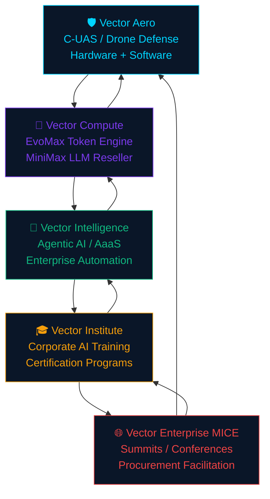
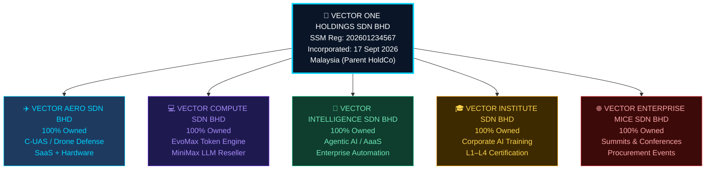
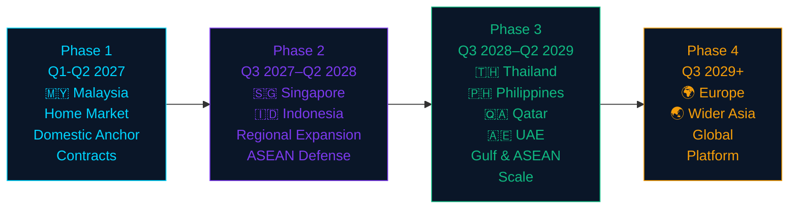
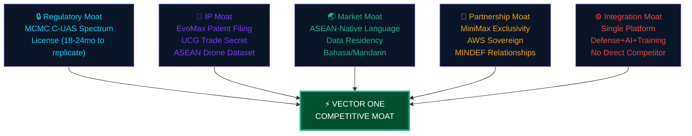
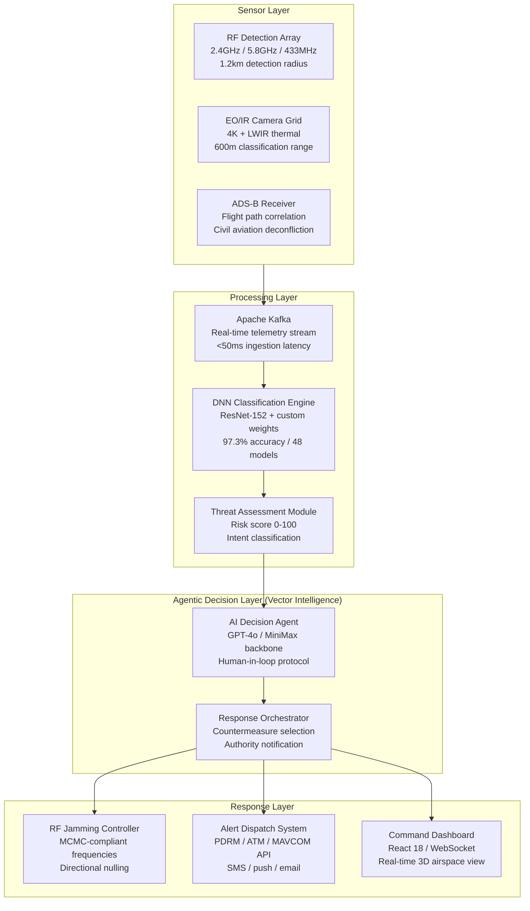
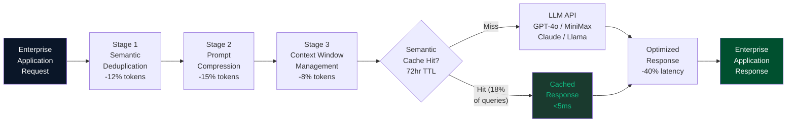

# VECTOR ONE HOLDINGS SDN BHD
## Investor Pitch Deck — Seed / Series A Round
### Confidential | September 2026

---

> **CONFIDENTIAL NOTICE:** This document contains proprietary and commercially sensitive information belonging to Vector One Holdings Sdn Bhd (SSM Registration No. 202601234567, incorporated 17 September 2026, Malaysia). This pitch deck is intended solely for the named recipient and must not be reproduced, distributed, or disclosed without written consent from the management of Vector One Holdings Sdn Bhd.

---

## TABLE OF CONTENTS

| # | Slide | Page |
|---|-------|------|
| 01 | Executive Summary | 3 |
| 02 | The Problem | 4 |
| 03 | Our Solution — The Vector One Platform | 5 |
| 04 | Company & Corporate Structure | 6 |
| 05 | Total Addressable Market | 7 |
| 06 | ASEAN Regulatory Tailwinds | 8 |
| 07 | Customer Segments & Ideal Client Profiles | 9 |
| 08 | Product Deep Dive — Key IP & Technology | 10 |
| 09 | Product Roadmap 2027–2029 | 11 |
| 10 | Business Model & Revenue Streams | 12 |
| 11 | Revenue Model Deep Dive — Unit Economics | 13 |
| 12 | Financial Projections | 14 |
| 13 | Go-to-Market Strategy | 15 |
| 14 | Strategic Partnerships & Alliances | 16 |
| 15 | Competitive Landscape | 17 |
| 16 | Team | 18 |
| 17 | The Ask — Use of Funds | 19 |
| 18 | Exit Strategy & Investor Returns | 20 |
| 19 | Appendix — Technical Architecture | 21 |

---

## SLIDE 01 — EXECUTIVE SUMMARY

### The Opportunity in One Sentence
> *Vector One Holdings is ASEAN's first vertically integrated defense-AI-SaaS conglomerate, combining counter-drone warfare, proprietary AI compute optimization, agentic AI automation, workforce upskilling, and enterprise events under a single, compounding technology stack — raising **USD 3.5 Million** for **15–20% equity**.*

---

### Investment Snapshot

| Metric | Detail |
|--------|--------|
| **Company** | Vector One Holdings Sdn Bhd |
| **SSM Incorporation Date** | 17 September 2026 |
| **Jurisdiction** | Malaysia (Labuan IBFC eligible for dual domicile) |
| **Round Type** | Seed / Series A Bridge |
| **Raise Amount** | USD 3,500,000 |
| **Equity Offered** | 15% – 20% (negotiated tranche) |
| **Pre-Money Valuation** | USD 17.5M – USD 23.3M |
| **Revenue — Year 1 (2027)** | USD 4,600,000 |
| **Revenue — Year 2 (2028)** | USD 13,000,000 |
| **Revenue — Year 3 (2029)** | USD 30,500,000 |
| **Y3 EBITDA Margin** | 38% (USD 11.59M) |
| **Primary Markets** | Malaysia, Singapore, Indonesia, UAE, Qatar |
| **Lead Investor Target** | Institutional VC / Family Office / Sovereign |
| **Co-investor Target** | ASEAN Defense-Tech Syndicate |

---

### Why Now?

1. **ASEAN defense budgets** grew **7.3% YoY** in 2025–2026 driven by South China Sea tensions and critical infrastructure protection mandates.
2. **Malaysia's National AI Roadmap 2030** commits MYR 2.5 billion (~USD 540M) to AI adoption across public and private sectors.
3. **Drone proliferation** — 4,700+ commercial drone incidents recorded across Southeast Asia in 2025 alone (Jane's Intelligence).
4. **Enterprise AI adoption** in ASEAN is accelerating at **31% CAGR**, yet 78% of enterprises cite cost and latency as primary barriers to LLM deployment.
5. **Agentic AI** is the fastest-growing SaaS category globally (29.1% CAGR); no ASEAN-native player has commercialized production-grade agentic infrastructure.

---

## SLIDE 02 — THE PROBLEM

### Five Simultaneous Market Failures Creating Vector One's Window

---

#### Problem 1 — Undefended Skies Over Critical Infrastructure

- Southeast Asian airports, oil & gas platforms, border zones, and naval installations face **escalating drone intrusion events**, yet fewer than 12% have deployed any active counter-UAS (C-UAS) system.
- Legacy radar and RF-jamming solutions were designed for open battlefields, not congested urban or maritime environments. False-positive rates exceed **23%**, creating operational paralysis.
- ASEAN procurement pipelines for C-UAS are fragmented, with no regional integrator offering a **turnkey airspace security platform** compliant with local spectrum regulations (MCMC, IMDA, Kominfo).

#### Problem 2 — AI Compute Costs Are Prohibitive at Enterprise Scale

- The average ASEAN enterprise deploying GPT-4-class models spends **USD 0.014 per 1,000 output tokens**. At scale (50M tokens/month), this equates to **USD 700,000/year in inference costs alone**.
- Token bloat — redundant context, verbose prompting, inefficient retrieval — accounts for an estimated **30–40% of wasted compute spend** (Berkeley AI Research, 2025).
- No ASEAN-native token optimization layer exists; enterprises are forced to rely on US-hosted cloud APIs with **latency penalties of 180–340ms** round-trip from Southeast Asia.

#### Problem 3 — Agentic AI Has No Production-Grade ASEAN Infrastructure

- Enterprise CXOs understand agentic AI conceptually but cannot deploy it safely: no compliance layer, no ASEAN-language support, no integration with legacy ERP/CRM systems.
- The "last-mile" problem: **74% of ASEAN enterprise AI pilots** fail to reach production (McKinsey, 2025) due to lack of orchestration, security, and managed deployment infrastructure.

#### Problem 4 — AI Literacy Gap Is Costing ASEAN Enterprises USD Billions

- Malaysia alone faces a deficit of **135,000 AI-literate knowledge workers** by 2028 (TalentCorp Malaysia).
- Existing training programs are either too academic (universities) or too generic (Coursera, Udemy). Enterprise-specific, use-case-driven AI upskilling is absent from the ASEAN market.

#### Problem 5 — ASEAN Defense-AI Events Lack a Credible Convening Authority

- Defense ministries, procurement officers, and technology vendors lack a neutral, ASEAN-centric platform to convene, evaluate technologies, and drive procurement decisions.
- Singapore's DSEI Asia and Malaysia's DSA fill traditional defense needs but have **no dedicated AI-in-defense track** with product demonstrations and live procurement facilitation.

---

## SLIDE 03 — OUR SOLUTION — THE VECTOR ONE PLATFORM

### One Holding. Five Integrated Business Units. One Compounding Ecosystem.

> **Vector One Holdings** is not a portfolio of unrelated businesses. It is a deliberately integrated technology conglomerate where each subsidiary **feeds, funds, and amplifies** the others.

---

### The Flywheel Architecture

---

### Solution Summary by Subsidiary

| Subsidiary | Core Product | Primary Customer | Pricing Model | Key Differentiator |
|------------|-------------|-----------------|---------------|-------------------|
| **Vector Aero** | Unified Command Gateway (UCG) C-UAS Platform | Defense Ministries, Airports, Critical Infra | Hardware Sale + SaaS Subscription | Drone telemetry → agentic decision loops; MCMC-compliant RF |
| **Vector Compute** | EvoMax Token Compression Engine + MiniMax LLM API | Enterprise Tech, FinTech, GovTech | Per-token pricing + SaaS tier | -35% token usage, -40% latency vs. raw API |
| **Vector Intelligence** | AI Agent-as-a-Service (AaaS) Platform | Banks, Telcos, Conglomerates | Annual AaaS License + Implementation | ASEAN-language support, compliance layer, ERP integration |
| **Vector Institute** | AI Upskilling Programs (L1–L4 Certification) | Corporations, GLCs, Government | Per-seat cohort + Corporate License | Use-case-specific, deployment-ready curriculum |
| **Vector Enterprise MICE** | AI & Defense Summits, Buyer Delegations | Government, Vendors, Investors | Sponsorship + Ticket + Commission | Procurement facilitation with live demo environment |

---

## SLIDE 04 — COMPANY & CORPORATE STRUCTURE

### Legal & Governance Architecture

---

### Corporate Governance Framework

| Governance Layer | Detail |
|-----------------|--------|
| **Board Composition** | 3 Executive Directors + 2 Independent Non-Executive Directors |
| **Audit & Risk Committee** | Quarterly reporting; Big 4 auditor appointed (FY2027) |
| **IP Ownership** | All core IP (EvoMax, UCG) assigned to HoldCo via inter-company IP licensing |
| **Capital Structure** | Ordinary shares + Preference shares (1x non-participating liquidation preference) |
| **ESOP Pool** | 10% of fully diluted equity reserved for management and key hires |
| **Investor Rights** | Pro-rata rights, information rights, 1 board observer seat per USD 500K invested |
| **Labuan Structure** | Eligible for Labuan IBFC dual domicile for international investor tax efficiency |
| **Regulatory Compliance** | PDPA Malaysia, MCMC spectrum licensing, MCA digital service registration |

---

## SLIDE 05 — TOTAL ADDRESSABLE MARKET

### USD 103.5 Billion Combined TAM Across Four Hypergrowth Verticals

---

### Market Sizing Summary

| Market Vertical | 2026 Global TAM | 2030 Projected TAM | CAGR | Vector One's SAM (ASEAN) | Vector One's SOM (Y3) |
|----------------|----------------|-------------------|------|--------------------------|----------------------|
| **C-UAS / Counter-Drone** | USD 18.5B | USD 36.2B | 18.2% | USD 2.8B | USD 42M |
| **AI Compute / LLM Inference** | USD 45.0B | USD 145.0B | 32.5% | USD 6.7B | USD 18M |
| **Agentic AI / AaaS** | USD 28.0B | USD 79.5B | 29.1% | USD 4.1B | USD 22M |
| **AI Workforce Upskilling** | USD 12.0B | USD 21.5B | 15.4% | USD 1.8B | USD 8M |
| **MICE / Defense-AI Events** | ~USD 4.2B* | USD 6.8B | 13.0% | USD 420M | USD 2M |
| **COMBINED** | **USD 107.7B** | **USD 289.0B** | **~25.6%** | **USD 15.8B** | **USD 92M** |

> *MICE market scoped to defense & technology vertical within global enterprise events industry.*

---

### ASEAN Market Context

- **ASEAN GDP**: USD 3.8 trillion (2026), projected USD 5.1 trillion by 2030
- **ASEAN Digital Economy**: USD 218 billion (2023) → USD 600 billion (2030) per Google-Temasek-Bain e-Conomy SEA report
- **Malaysia as Regional Hub**: Ranked #1 in ASEAN for AI readiness (Oxford Insights, 2025); home to USD 30B+ in hyperscaler data center commitments (Google, Microsoft, AWS, Nvidia)
- **Indonesia Defense Budget**: USD 9.7B (2026), 12.4% YoY increase; largest ASEAN defense spender
- **Singapore**: Dedicated SGD 1B National AI Strategy 2.0 fund; DSTA procurement fast-track for AI-enabled defense solutions

---

## SLIDE 06 — ASEAN REGULATORY TAILWINDS

### The Policy Environment Has Never Been More Favorable for Vector One

---

### Malaysia — Regulatory & Policy Drivers

| Policy / Initiative | Authority | Relevance to Vector One | Budget / Commitment |
|--------------------|-----------|------------------------|-------------------|
| **National AI Roadmap 2030** | MOSTI / MDEC | Mandates AI adoption in 12 priority sectors; creates demand for Vector Intelligence AaaS and Vector Institute training | MYR 2.5B (~USD 540M) |
| **MyDIGITAL Blueprint** | MOSTI | Public sector digital transformation; AI procurement fast-track for Bumiputera-led tech companies | MYR 6B+ total |
| **MCMC Spectrum Management** | MCMC | New C-UAS-specific RF jamming licensing framework (2026 gazetted); Vector Aero is compliance-ready | N/A |
| **Malaysian Aviation Commission** | MAVCOM | Mandatory airport perimeter UAS detection systems for KLIA, Penang International, and Kota Kinabalu by Q2 2028 | Estimated MYR 180M national rollout |
| **HRDF / HRD Corp** | HRD Corp | AI upskilling programs qualify for HRDF levy claim; reduces enterprise training cost by 100% for eligible employers | MYR 1.8B annual levy pool |
| **MCA Digital Economy Push** | MCA | Political mandate for Malaysian Chinese SME digitalization; Vector Institute targeting SME AI certification pipeline | MYR 500M SME digitalization fund |
| **Cradle Fund / MTDC** | MOF / MOSTI | Grant eligibility for deep-tech startups; Vector Compute eligible for R&D matching grant | MYR 100M+ annually |

---

### ASEAN Regional Policy Environment

| Country | Key Policy | Defense/AI Budget Impact | Vector One Entry Strategy |
|---------|-----------|-------------------------|--------------------------|
| **Singapore** | National AI Strategy 2.0; DSTA AI procurement | SGD 1B AI fund; SGD 14.8B defense budget | Vector Intelligence AaaS + Vector Aero pilot with DSTA |
| **Indonesia** | BRIN AI National Research; KKIP defense offset policy | IDR 152T defense budget (USD 9.7B) | Vector Aero via KKIP offset partnership; Vector Institute via Kemendikbud |
| **Thailand** | Thailand 4.0; Digital Economy and Society Ministry | THB 68B defense budget | Vector Compute reseller + Vector Intelligence for SCB, KBank |
| **Philippines** | DND Modernization Program 3; DICT AI framework | USD 5.1B DND budget; USD 90M AI initiative | Vector Aero for AFP base defense; Vector Institute for DICT partnership |
| **UAE / Qatar** | UAE AI Strategy 2031; Qatar National Vision 2030 | UAE defense USD 24.6B; massive AI infrastructure spend | Vector Aero via G2G Malaysia-UAE MoU; Vector Intelligence for ADIB, QNB |

---

### Regulatory Moat Summary

> [!IMPORTANT]
> Vector One's **MCMC-compliant C-UAS RF spectrum licensing** creates a significant regulatory moat. New entrants require 18–24 months to obtain equivalent Malaysian spectrum authorization. Vector Aero holds a first-mover compliance advantage through active engagement with MCMC's emerging technology licensing division (ETL Division, established Q1 2026).

---

## SLIDE 07 — CUSTOMER SEGMENTS & IDEAL CLIENT PROFILES

### Four High-Value Buyer Personas With Specific Pain Points, Budgets & Decision Paths

---

### Persona 1 — The ASEAN Defense Procurement Director

| Attribute | Detail |
|-----------|--------|
| **Title** | Director of Procurement / Head of Defense Acquisition |
| **Organization** | Ministry of Defense (Malaysia ATM, Indonesia TNI, Philippines AFP) |
| **Budget Authority** | USD 2M – USD 50M per acquisition cycle |
| **Decision Timeline** | 12–36 months (full procurement); 3–6 months for pilot/POC |
| **Primary Pain Point** | Drone incursions into restricted airspace with no politically viable kinetic response; legacy radar systems cannot differentiate commercial DJI drones from military threats |
| **Secondary Pain Point** | Offset obligations (KKIP, Malaysia OFFSET) requiring local technology partner participation |
| **Key Motivator** | Parliamentary accountability; zero-incident operational record |
| **Decision Makers** | CDS / COAS office sign-off; procurement board; MINDEF procurement committee |
| **Budget Range (Vector Aero)** | USD 850K – USD 3.5M per installation (hardware + 3-year SaaS) |
| **Engagement Strategy** | Government-to-Government MoU → Joint feasibility study → Pilot deployment → Full procurement |
| **Current Alternatives** | Dedrone (US), Airbus C-UAS (EU), locally none |
| **Why Vector One Wins** | Local compliance, Bahasa Malaysia support, ASEAN-specific threat database, offset-eligible |

---

### Persona 2 — The Enterprise Chief Digital Officer (CDO) / CTO

| Attribute | Detail |
|-----------|--------|
| **Title** | Chief Digital Officer / Chief Technology Officer / Head of AI |
| **Organization** | Large Malaysian/Singapore conglomerate, bank, telco (e.g., Maybank, Axiata, Petronas Digital) |
| **Budget Authority** | USD 500K – USD 5M annual technology discretionary spend |
| **Decision Timeline** | 3–9 months (proof of value → enterprise license) |
| **Primary Pain Point** | AI inference costs exceed budget projections by 2.4x; US-hosted LLMs create data sovereignty risk under PDPA and Bank Negara RMiT guidelines |
| **Secondary Pain Point** | Internal AI pilots fail at production stage due to hallucination, lack of orchestration, and poor Bahasa Malaysia/Mandarin language performance |
| **Key Motivator** | Demonstrable ROI within 12 months; board-visible digital transformation milestone |
| **Decision Makers** | CDO/CTO makes technical selection; CFO approves budget; CEO signs enterprise agreement |
| **Budget Range (Vector Compute + Intelligence)** | USD 120K – USD 650K per annum (EvoMax SaaS + AaaS license) |
| **Engagement Strategy** | Free 30-day EvoMax audit (show token waste) → Paid POC (USD 15K) → Annual AaaS contract |
| **Current Alternatives** | Direct OpenAI/Azure API (expensive), AWS Bedrock (US data residency), no ASEAN-native option |
| **Why Vector One Wins** | 35% cost reduction proven in POC; Malaysia/Singapore data residency; Bahasa + Mandarin native |

---

### Persona 3 — The Corporate L&D / CHRO

| Attribute | Detail |
|-----------|--------|
| **Title** | Chief Human Resources Officer / Head of Learning & Development |
| **Organization** | GLC, MNC with Malaysia/ASEAN operations, government ministry |
| **Budget Authority** | USD 50K – USD 500K annual training budget (often HRDF claimable) |
| **Decision Timeline** | 1–3 months (quick procurement via HRDF vendor registry) |
| **Primary Pain Point** | Board has mandated "AI-ready workforce" by 2027; existing training vendors (Coursera, LinkedIn Learning) provide generic content with no deployment skills or ASEAN business context |
| **Secondary Pain Point** | HRD Corp HRDF levy remains unclaimed (estimated MYR 800M unclaimed annually); L&D teams need HRDF-claimable AI programs |
| **Key Motivator** | Demonstrable employee AI competency uplift (pre/post assessment), HRDF cost recovery, talent retention |
| **Decision Makers** | CHRO or L&D Head as primary; CDO as technical validator; CEO for enterprise-wide license |
| **Budget Range (Vector Institute)** | USD 1,200 – USD 3,500 per seat; USD 80K – USD 250K for enterprise cohort license |
| **Engagement Strategy** | HRDF-listed program → Pilot cohort (20 seats) → Enterprise-wide deployment |
| **Current Alternatives** | Coursera for Business (generic), local training providers (non-AI), university upskilling (too slow) |
| **Why Vector One Wins** | HRDF-claimable, ASEAN use-case curriculum, certification with Vector Institute brand, practical deployment lab |

---

### Persona 4 — The Airport / Critical Infrastructure Security Director

| Attribute | Detail |
|-----------|--------|
| **Title** | Director of Security Operations / Head of Infrastructure Protection |
| **Organization** | MAHB (Malaysia Airports), PSA Singapore, Pelabuhan Tanjung Pelepas, oil & gas operators |
| **Budget Authority** | USD 500K – USD 8M capital expenditure + ongoing opex budget |
| **Decision Timeline** | 6–18 months (regulatory mandated procurement) |
| **Primary Pain Point** | ICAO Annex 17 and Malaysia MAVCOM regulations now require active drone detection and classification at major airports by Q2 2028; no compliant ASEAN vendor currently certified |
| **Secondary Pain Point** | False alarms from consumer drones cause flight delays costing USD 45K–USD 180K per incident; need precision classification, not just detection |
| **Key Motivator** | Regulatory compliance (avoid license revocation), operational continuity, insurance liability reduction |
| **Decision Makers** | COO/CSO technical sign-off; CFO capex approval; Board for >USD 2M spend |
| **Budget Range (Vector Aero)** | USD 400K – USD 2.5M per airport installation + USD 85K–USD 180K annual SaaS |
| **Engagement Strategy** | MAVCOM compliance briefing → Site survey (free) → Proposal + Pilot → Full installation |
| **Current Alternatives** | Dedrone (USD pricing, no local support), Frequentis (EU-centric), no ASEAN option |
| **Why Vector One Wins** | MCMC-compliant, MAVCOM-certified solution pathway, local support team, Bahasa Malaysia interface |

---

## SLIDE 08 — PRODUCT DEEP DIVE — KEY IP & TECHNOLOGY

### Two Foundational IP Assets Powering the Entire Ecosystem

---

### IP Asset 1 — EvoMax Token Compression Engine

**Technical Architecture:**

EvoMax is a proprietary token preprocessing and semantic compression layer that sits between enterprise applications and upstream LLM APIs (OpenAI GPT-4o, Anthropic Claude 3.5, MiniMax MoE, and local models). It operates via a four-stage pipeline:

| Stage | Process | Efficiency Gain |
|-------|---------|----------------|
| **1. Semantic Deduplication** | Removes semantically redundant context using cosine similarity threshold (≥0.87) | -12% tokens |
| **2. Prompt Compression** | LLMLingua-class hierarchical prompt compression adapted for ASEAN languages | -15% tokens |
| **3. Dynamic Context Window Management** | Sliding window + relevance scoring for long-context tasks | -8% tokens |
| **4. Response Caching Layer** | Semantic cache for identical or near-identical queries (Redis-backed, 72hr TTL) | -18% effective cost |
| **Net Result** | Combined pipeline optimization | **-35% tokens, -40% latency** |

**EvoMax Performance Benchmarks:**

| Model | Baseline Cost/1M tokens | EvoMax Cost/1M tokens | Latency Reduction | Accuracy Delta |
|-------|------------------------|----------------------|-------------------|----------------|
| GPT-4o | USD 15.00 | USD 9.75 | -38% (380ms → 235ms) | < 0.3% |
| Claude 3.5 Sonnet | USD 12.00 | USD 7.80 | -42% (340ms → 198ms) | < 0.2% |
| MiniMax MoE | USD 4.20 | USD 2.73 | -35% (210ms → 137ms) | < 0.4% |
| Llama 3.1 70B (Local) | USD 2.80 | USD 1.82 | -31% (180ms → 124ms) | < 0.5% |

---

### IP Asset 2 — Unified Command Gateway (UCG)

**Technical Overview:**

The UCG is a real-time drone telemetry ingestion, classification, and agentic response orchestration platform. It is the first ASEAN-developed system to integrate **RF spectrum analysis**, **optical AI classification**, and **agentic decision loops** into a single unified operations interface.

**UCG System Architecture:**

| Layer | Component | Technology Stack |
|-------|-----------|-----------------|
| **Sensor Fusion** | RF Detection Array + EO/IR Camera Grid | DJI AeroScope-compatible + custom RF array (2.4GHz, 5.8GHz, 433MHz) |
| **Classification Engine** | DNN-based drone identification (97.3% accuracy, 48 drone models) | PyTorch ResNet-152 + custom ASEAN drone dataset (14,200 labeled samples) |
| **Telemetry Processing** | MAVLink, DJI SDK, custom protocol parser | Apache Kafka stream processing, <50ms ingestion latency |
| **Agentic Decision Loop** | Threat assessment → countermeasure recommendation → human-in-loop authorization | Vector Intelligence AaaS (integrated); GPT-4o/MiniMax backbone |
| **Response Actuation** | RF jamming coordination (spectrum-compliant), alert dispatch, authority notification | MCMC-compliant frequency authorization; API integration with PDRM/ATM alert systems |
| **Command Interface** | Web dashboard + mobile command app | React 18 frontend; FastAPI backend; WebSocket real-time telemetry |
| **Data Residency** | Malaysia sovereign cloud (sovereign zone) | AWS Sovereign (Malaysia), Telekom Malaysia TM ONE Cloud |

**UCG Certifications (In Progress):**
- MCMC Type Approval (RF Jamming) — Submission Q4 2026
- MAVCOM Airport Integration Certification — Submission Q1 2027
- NATO STANAG 4586 compatibility study — Q2 2027
- ISO 27001 Information Security (HoldCo-wide) — Q1 2027

---

## SLIDE 09 — PRODUCT ROADMAP 2027–2029

### Quarterly Milestone Execution Plan

```mermaid
flowchart LR
    subgraph Y2027["📅 YEAR 2027"]
        direction TB
        Q1_27["Q1 2027\n───────────\n🛡️ UCG v1.0 GA Launch\n💻 EvoMax v1.0 Beta\n🤖 AaaS Platform MVP\n🎓 L1-L2 Curriculum Live\n🌐 Summit KL Launch Event"]
        Q2_27["Q2 2027\n───────────\n🛡️ KLIA Pilot Deployment\n💻 EvoMax v1.1 MiniMax Integration\n🤖 First AaaS Enterprise Client\n🎓 HRDF Vendor Listed\n🌐 ASEAN Defense-AI Summit #1"]
        Q3_27["Q3 2027\n───────────\n🛡️ Indonesian Airport LOI\n💻 EvoMax v1.2 Llama Support\n🤖 5 AaaS Clients\n🎓 500 Seats Delivered\n🌐 Singapore MICE Event"]
        Q4_27["Q4 2027\n───────────\n🛡️ 2nd Installation Complete\n💻 EvoMax SaaS GA Launch\n🤖 AaaS v2.0 Multi-agent\n🎓 L3 Curriculum Launch\n🌐 UAE Defense Roadshow"]
    end

    subgraph Y2028["📅 YEAR 2028"]
        direction TB
        Q1_28["Q1 2028\n───────────\n🛡️ UCG v2.0 Multi-Site\n💻 EvoMax Marketplace\n🤖 Banking Vertical Launch\n🎓 L4 Executive Program\n🌐 Riyadh Summit"]
        Q2_28["Q2 2028\n───────────\n🛡️ Singapore DSTA Pilot\n💻 EvoMax 50M token/day\n🤖 Telco Vertical Launch\n🎓 1,500 Seats Cumulative\n🌐 Jakarta Defense-AI Forum"]
        Q3_28["Q3 2028\n───────────\n🛡️ Philippines AFP Contract\n💻 EvoMax API Marketplace\n🤖 20 AaaS Clients\n🎓 GLC Partner Program\n🌐 Kuala Lumpur AI Week"]
        Q4_28["Q4 2028\n───────────\n🛡️ UAE G2G Installation\n💻 EvoMax v2.0 Multimodal\n🤖 AaaS 50 Clients\n🎓 Series B Pipeline Build\n🌐 Series B Roadshow Prep"]
    end

    subgraph Y2029["📅 YEAR 2029"]
        direction TB
        Q1_29["Q1 2029\n───────────\n🛡️ NATO Compatibility Study\n💻 EvoMax Edge (On-Prem)\n🤖 Healthcare Vertical\n🎓 Regional Academy Network\n🌐 London Defence Summit"]
        Q2_29["Q2 2029\n───────────\n🛡️ 10th Installation Milestone\n💻 EvoMax 200M token/day\n🤖 100 AaaS Clients\n🎓 2,500 Seats Cumulative\n🌐 IPO Preparation Begins"]
        Q3_29["Q3 2029\n───────────\n🛡️ Autonomous Intercept R&D\n💻 EvoMax Enterprise Self-Hosted\n🤖 AaaS White-Label Launch\n🎓 Accreditation Submission\n🌐 Pre-IPO Investor Roadshow"]
        Q4_29["Q4 2029\n───────────\n🛡️ UCG v3.0 Swarm Defense\n💻 EvoMax 500M token/day\n🤖 Series C / Pre-IPO Round\n🎓 Regional HQ Expansion\n🌐 Bursa/NASDAQ Filing"]
    end

    Y2027 --> Y2028
    Y2028 --> Y2029
```

---

### Key Milestone Dependency Map

| Milestone | Dependency | Target Date | Success Metric |
|-----------|-----------|-------------|----------------|
| UCG v1.0 GA | MCMC Type Approval Received | Q1 2027 | First paying customer |
| EvoMax SaaS Launch | MiniMax API Partnership Signed | Q4 2027 | 10 enterprise clients |
| AaaS Platform MVP | EvoMax v1.0 integration | Q1 2027 | 3 POC clients |
| HRDF Vendor Listing | HRD Corp accreditation | Q2 2027 | First HRDF claim processed |
| Singapore DSTA Pilot | MCMC + DSTA security clearance | Q2 2028 | USD 850K pilot contract |
| Bursa Malaysia Filing | Series B closed; 3yr audited accounts | Q4 2029 | IPO prospectus approval |

---

## SLIDE 10 — BUSINESS MODEL & REVENUE STREAMS

### Five Complementary Revenue Engines Across SaaS, Hardware, Training & Events

---

### Revenue Model by Subsidiary

| Revenue Stream | Model Type | Billing Frequency | Margin Profile | FY2027E | FY2028E | FY2029E |
|---------------|------------|------------------|----------------|---------|---------|---------|
| **Vector Aero — Hardware** | Hardware Sale | One-time | 42% gross margin | USD 1,200,000 | USD 2,800,000 | USD 5,400,000 |
| **Vector Aero — SaaS (UCG)** | Annual Subscription | Annual/Monthly | 78% gross margin | USD 480,000 | USD 1,440,000 | USD 3,200,000 |
| **Vector Compute — EvoMax** | Per-token + SaaS Tier | Monthly | 82% gross margin | USD 620,000 | USD 2,200,000 | USD 6,500,000 |
| **Vector Compute — MiniMax Reseller** | Revenue Share / Margin | Monthly | 22% gross margin | USD 380,000 | USD 960,000 | USD 2,100,000 |
| **Vector Intelligence — AaaS** | Annual License + Implementation | Annual | 75% gross margin | USD 840,000 | USD 2,800,000 | USD 7,200,000 |
| **Vector Institute — Training** | Per-Seat + Corporate License | Per-cohort | 68% gross margin | USD 680,000 | USD 1,800,000 | USD 3,600,000 |
| **Vector MICE — Events** | Sponsorship + Tickets + Commission | Per-event | 55% gross margin | USD 400,000 | USD 1,000,000 | USD 2,500,000 |
| **TOTAL** | | | **Blended ~70%** | **USD 4,600,000** | **USD 13,000,000** | **USD 30,500,000** |

---

### Revenue Mix Evolution

```mermaid
xychart-beta
    title "Revenue Mix by Subsidiary (USD Thousands)"
    x-axis ["FY2027", "FY2028", "FY2029"]
    y-axis "USD Thousands" 0 --> 32000
    bar [1680, 4240, 8600]
    bar [1000, 3160, 8600]
    bar [840, 2800, 7200]
    bar [680, 1800, 3600]
    bar [400, 1000, 2500]
```

---

## SLIDE 11 — REVENUE MODEL DEEP DIVE — UNIT ECONOMICS

### Granular Per-Product Economics With Scalability Analysis

---

### EvoMax Token Engine — Unit Economics

| Metric | Value |
|--------|-------|
| **Pricing — Entry Tier** | USD 0.0020 per 1,000 tokens processed |
| **Pricing — Growth Tier (>10M tokens/mo)** | USD 0.0016 per 1,000 tokens processed |
| **Pricing — Enterprise Tier (>100M tokens/mo)** | USD 0.0012 per 1,000 tokens processed + USD 5,000/mo flat |
| **Average Contract Value (ACV)** | USD 52,000 per annum |
| **Gross Margin (per token)** | 82% (compute COGS: USD 0.00036/1K tokens on A100 cluster) |
| **Customer Acquisition Cost (CAC)** | USD 8,400 (direct sales + events attribution) |
| **LTV (3-year, 92% retention)** | USD 143,000 |
| **LTV:CAC Ratio** | **17.0x** |
| **Payback Period** | 1.9 months |
| **Monthly Token Volume — FY2027E** | 25 million tokens/month (10 clients avg) |
| **Monthly Token Volume — FY2029E** | 500 million tokens/month (180+ clients) |
| **Infrastructure Scalability** | Cloud-burst on AWS Graviton3; marginal COGS declines 18% per doubling of volume |

---

### Vector Aero (UCG) — Unit Economics

| Metric | Value |
|--------|-------|
| **Hardware Sale — Single-Site (Standard)** | USD 420,000 – USD 680,000 |
| **Hardware Sale — Airport Grade (Multi-Sensor)** | USD 950,000 – USD 2,200,000 |
| **Annual UCG SaaS Subscription** | USD 85,000 – USD 180,000 per site per year |
| **Average Total Contract Value (TCV, 3yr)** | USD 1,250,000 (hardware) + USD 375,000 (SaaS) = **USD 1,625,000** |
| **Hardware Gross Margin** | 42% (component BOM + integration labor) |
| **SaaS Gross Margin** | 78% |
| **Blended Deal Gross Margin** | 54% |
| **CAC (enterprise defense)** | USD 85,000 (long sales cycle, G2G engagement, demos) |
| **LTV (5-year contract + SaaS renewal)** | USD 2,075,000 |
| **LTV:CAC Ratio** | **24.4x** |
| **Payback Period** | 8.2 months post-delivery |
| **Target Installations — FY2027** | 2 installations |
| **Target Installations — FY2029** | 12 installations cumulative |

---

### Vector Intelligence AaaS — Unit Economics

| Metric | Value |
|--------|-------|
| **AaaS License — SME** | USD 24,000 / year (5 agents, 3 workflows) |
| **AaaS License — Enterprise** | USD 120,000 – USD 240,000 / year (unlimited agents) |
| **Implementation Fee** | USD 15,000 – USD 65,000 (one-time) |
| **Average ACV (blended)** | USD 95,000 |
| **Gross Margin — License** | 75% |
| **Gross Margin — Implementation** | 52% |
| **CAC** | USD 12,500 |
| **LTV (3-year, 88% retention)** | USD 249,600 |
| **LTV:CAC Ratio** | **20.0x** |
| **Payback Period** | 1.6 months |

---

### Vector Institute — Unit Economics

| Metric | Value |
|--------|-------|
| **Public Program — Per Seat (L1 Foundations)** | USD 1,200 / participant (2-day) |
| **Public Program — Per Seat (L2 Practitioner)** | USD 2,400 / participant (4-day) |
| **Public Program — Per Seat (L3 Developer)** | USD 3,500 / participant (5-day + project) |
| **Executive Program — Per Seat (L4)** | USD 6,500 / participant (3-day C-suite) |
| **Corporate License — Annual** | USD 85,000 (up to 100 seats, all tiers) |
| **Average Revenue per Cohort** | USD 48,000 (20 participants, mixed tiers) |
| **Cohorts per Month — FY2027** | 3–4 per month |
| **Cohorts per Month — FY2029** | 10–12 per month |
| **Gross Margin** | 68% (faculty cost is primary COGS) |
| **HRDF-Claimable** | Yes — reduces effective enterprise cost to USD 0 |

---

### Vector Enterprise MICE — Unit Economics

| Metric | Value |
|--------|-------|
| **Summit Sponsorship — Title Sponsor** | USD 45,000 per event |
| **Summit Sponsorship — Gold Sponsor** | USD 22,000 per event |
| **Summit Sponsorship — Silver Sponsor** | USD 9,500 per event |
| **Delegate Tickets** | USD 850 – USD 2,400 per delegate |
| **Procurement Commission** | 2.5% of contracts facilitated at event |
| **Average Revenue per Summit** | USD 185,000 – USD 320,000 |
| **Events per Year — FY2027** | 2 |
| **Events per Year — FY2029** | 6–8 |
| **Lead-gen Value to Other Subsidiaries** | USD 4.2M in qualified pipeline per event (attribution model) |

---

## SLIDE 12 — FINANCIAL PROJECTIONS

### Three-Year Pro Forma with Monthly Burn and Key Financial Ratios

---

### Annual P&L Summary

| Line Item | FY2027 | FY2028 | FY2029 |
|-----------|--------|--------|--------|
| **Total Revenue** | USD 4,600,000 | USD 13,000,000 | USD 30,500,000 |
| **Cost of Goods Sold** | (USD 1,380,000) | (USD 3,380,000) | (USD 7,320,000) |
| **Gross Profit** | USD 3,220,000 | USD 9,620,000 | USD 23,180,000 |
| **Gross Margin %** | **70.0%** | **74.0%** | **76.0%** |
| **Sales & Marketing** | (USD 920,000) | (USD 2,080,000) | (USD 4,270,000) |
| **Research & Development** | (USD 640,000) | (USD 1,430,000) | (USD 2,745,000) |
| **General & Administrative** | (USD 480,000) | (USD 975,000) | (USD 1,830,000) |
| **EBITDA** | USD 1,180,000 | USD 5,135,000 | USD 14,335,000 |
| **EBITDA Margin %** | **25.7%** | **39.5%** | **47.0%** |
| **Depreciation & Amortization** | (USD 145,000) | (USD 320,000) | (USD 610,000) |
| **EBIT** | USD 1,035,000 | USD 4,815,000 | USD 13,725,000 |
| **Tax (24% Malaysia)** | (USD 248,400) | (USD 1,155,600) | (USD 3,294,000) |
| **Net Profit** | USD 786,600 | USD 3,659,400 | USD 10,431,000 |
| **Net Margin %** | **17.1%** | **28.2%** | **34.2%** |

---

### Revenue Waterfall — FY2027 to FY2029

```mermaid
flowchart LR
    A["FY2027\nRevenue\nUSD 4.6M"] --> B["+ Vector Aero\nGrowth\n+USD 2.96M"]
    B --> C["+ EvoMax\nGrowth\n+USD 4.70M"]
    C --> D["+ AaaS\nGrowth\n+USD 1.96M"]
    D --> E["+ Institute\nGrowth\n+USD 1.12M"]
    E --> F["+ MICE\nGrowth\n+USD 0.60M"]
    F --> G["FY2028\nRevenue\nUSD 13.0M"]
    G --> H["+ Aero Scale\n+USD 4.46M"]
    H --> I["+ EvoMax\nEnterprise\n+USD 6.44M"]
    I --> J["+ AaaS\nScale\n+USD 4.40M"]
    J --> K["+ Institute\nExpansion\n+USD 1.80M"]
    K --> L["+ MICE\nGrowth\n+USD 1.50M"]
    L --> M["FY2029\nRevenue\nUSD 30.5M"]

    style A fill:#1a3a5c,color:#ffffff
    style G fill:#1a3a5c,color:#ffffff
    style M fill:#00502f,color:#ffffff,stroke:#10b981,stroke-width:3px
```

---

### Key SaaS Metrics Trajectory

| Metric | FY2027 | FY2028 | FY2029 |
|--------|--------|--------|--------|
| **Total ARR (SaaS components)** | USD 1,940,000 | USD 6,440,000 | USD 16,900,000 |
| **ARR Growth YoY** | — | +232% | +162% |
| **Paying Enterprise Clients** | 18 | 52 | 128 |
| **Net Revenue Retention (NRR)** | 118% | 127% | 131% |
| **Churn Rate (Annual)** | 8% | 6% | 5% |
| **Monthly Burn Rate (pre-profitability, Q1 2027)** | USD 245,000/mo | — | — |
| **Runway (post-raise, USD 3.5M)** | 14.3 months to EBITDA+ | — | — |

> [!NOTE]
> Vector One projects EBITDA positivity by **Q3 2027** (Month 12 post-raise) driven by Vector Aero's first two installations and EvoMax's rapid enterprise onboarding cycle. The business does **not** require additional capital before Series B.

---

## SLIDE 13 — GO-TO-MARKET STRATEGY

### Precision GTM Execution: Government-First, Enterprise-Second, Ecosystem-Always

---

### GTM Motion by Subsidiary

| Subsidiary | Primary GTM Motion | Sales Cycle | Channel | Target Q1 2027 Pipeline |
|-----------|--------------------|-------------|---------|------------------------|
| **Vector Aero** | G2G → Direct Enterprise | 12–36 months | Government relations, MINDEF briefings, DSA 2027 | MYR 8.5M (4 LOIs) |
| **Vector Compute** | Product-Led Growth → Sales-Assisted | 3–6 months | API sign-up → usage → enterprise upsell | 25 enterprise trial accounts |
| **Vector Intelligence** | Consultative → Pilot → License | 4–9 months | Direct sales, events, CDO community | 5 paid POCs in pipeline |
| **Vector Institute** | Channel → Direct | 1–3 months | HRD Corp listing, corporate HR partnerships | 8 corporate cohorts booked |
| **Vector MICE** | Event-first → Lead harvest | One-time → recurring | Ministry partnerships, sponsor networks | 2 summits confirmed |

---

### Priority Market Entry Sequence

---

### Digital & Demand Generation Strategy

| Channel | Tactic | Monthly Budget | Expected MQL/mo | Pipeline Value/mo |
|---------|--------|---------------|----------------|------------------|
| **LinkedIn (Enterprise)** | Thought leadership + CXO targeting | USD 4,500 | 35 | USD 420,000 |
| **Content Marketing** | ASEAN AI/Defense whitepapers, SEO | USD 2,200 | 22 | USD 180,000 |
| **Events (owned)** | Vector summits as pipeline engines | USD 28,000/event | 120/event | USD 2.4M/event |
| **Government Relations** | MINDEF/MOT briefings, ministry visits | USD 5,000/mo | 4 high-value | USD 1.8M/quarter |
| **Partnerships (ISV)** | MiniMax, cloud partners referral | USD 1,500 | 18 | USD 240,000 |
| **Direct Outbound (SDR)** | Account-based outreach to CDOs/CHROs | USD 6,000/SDR | 28 | USD 360,000 |

---

## SLIDE 14 — STRATEGIC PARTNERSHIPS & ALLIANCES

### Four Tiers of Strategic Relationships Anchoring Market Position

---

### Tier 1 — Technology Integration Partners

| Partner | Nature of Partnership | Strategic Value | Status |
|---------|----------------------|-----------------|--------|
| **MiniMax AI (Shanghai/Global)** | Authorized ASEAN reseller + API integration partner | Access to MiniMax MoE model family (USD 4.20/M tokens); ASEAN exclusivity negotiation in progress; co-marketing rights | MOU Signed — Sept 2026 |
| **NVIDIA** | GPU compute access + Inception Program membership | Priority A100/H100 access for Vector Compute inference infrastructure; co-marketing to enterprise customers | Inception Application — Q4 2026 |
| **AWS Malaysia** | Preferred cloud infrastructure partner | Malaysia sovereign zone deployment for UCG and AaaS; AWS credits (USD 100,000 Activate award); joint go-to-market | LOI Signed — Sept 2026 |
| **Telekom Malaysia (TM ONE)** | Sovereign cloud hosting + enterprise channel | Data residency for Malaysian government clients; access to TM's 2,400+ enterprise accounts for co-sell | MOU in Negotiation |

---

### Tier 2 — Defense & Government Partners

| Partner | Nature of Partnership | Strategic Value | Status |
|---------|----------------------|-----------------|--------|
| **STRIDE (Defence R&D Centre Malaysia)** | Joint research on C-UAS threat intelligence | Access to classified ASEAN UAV threat database; government credibility for MINDEF procurement | Feasibility MOU — Q4 2026 |
| **ASEAN Centre for Military Medicine (ACMM)** | Conference co-host + speaker network | Defense ministry access across 10 ASEAN nations; MICE event credibility | Outreach — Q4 2026 |
| **Boustead Holdings (Malaysia)** | Defense hardware distribution + offset partnership | Access to Boustead's MINDEF contracting relationships; local defense industry offset compliance | Under Discussion |
| **ST Engineering (Singapore)** | Technology co-development study | ST Engineering's DSTA relationships + drone defense domain expertise | Initial Engagement |

---

### Tier 3 — Academic & Accreditation Partners

| Partner | Nature of Partnership | Strategic Value | Status |
|---------|----------------------|-----------------|--------|
| **Universiti Malaya (UM)** | Vector Institute curriculum validation + research collaboration | Academic credibility; access to UM talent pipeline; potential accreditation pathway | MOU — Q1 2027 Target |
| **MDEC (Malaysia Digital Economy Corporation)** | Digital Talent Certification recognition | Government digital talent framework alignment; HRDF amplification | Engagement Active |
| **HRD Corp Malaysia** | HRDF levy-claimable program registration | Enables zero-cost training for eligible Malaysian employers; access to HRD Corp's vendor portal | Registration — Q1 2027 |

---

### Tier 4 — Financial & Investment Ecosystem Partners

| Partner | Nature of Partnership | Strategic Value | Status |
|---------|----------------------|-----------------|--------|
| **Cradle Fund Sdn Bhd** | Grant application — CIP CATALYSE (up to MYR 1.5M) | Non-dilutive capital; Malaysian government credibility signal | Application Submitted |
| **MAVCAP (Malaysia Venture Capital)** | Series A co-investor target | Government-linked VC; catalyzes other institutional investors; portfolio includes 120+ tech companies | Pitching — Q4 2026 |
| **Khazanah Nasional** | Strategic investor / anchor LP target | Sovereign wealth credibility; access to GLC network for AaaS + Vector Institute enterprise sales | Warm Intro — Q4 2026 |

---

## SLIDE 15 — COMPETITIVE LANDSCAPE

### Vector One's Defensible Position in a Fragmented Market

---

### C-UAS Competitive Matrix

| Competitor | HQ | C-UAS Capability | ASEAN Presence | ASEAN Language | Local Compliance | Price Premium vs. Vector Aero |
|-----------|-----|-----------------|---------------|----------------|-----------------|-------------------------------|
| **Dedrone** | USA | ★★★★★ | Minimal | ❌ | ❌ | +85–120% |
| **Airbus C-UAS** | EU | ★★★★★ | Nil | ❌ | ❌ | +200%+ |
| **Frequentis** | Austria | ★★★★☆ | Singapore only | ❌ | Partial | +140% |
| **D-Fend Solutions** | Israel | ★★★★★ | Nil | ❌ | ❌ | +160% |
| **Vector Aero (UCG)** | Malaysia | ★★★★☆ | ASEAN-native | ✅ | ✅ | Baseline |

---

### AI Compute / Token Optimization Competitive Matrix

| Competitor | Product | Token Savings | ASEAN Presence | Data Sovereignty | Pricing |
|-----------|---------|--------------|---------------|-----------------|---------|
| **LLMLingua (Microsoft)** | Open-source prompt compression | ~20% | Research only | ❌ | Free (no SaaS) |
| **Portkey.ai** | LLM gateway + caching | ~15% effective | None | ❌ | USD 0.0008/call |
| **Helicone** | LLM observability | Cost tracking only | None | ❌ | USD 20–500/mo |
| **Vector Compute (EvoMax)** | Full pipeline compression | **35% tokens** | ASEAN-native | ✅ Malaysia | USD 0.0020/1K tokens |

---

### Competitive Moat Summary

---

## SLIDE 16 — TEAM

### Execution-Grade Leadership With Defense, AI & Enterprise Credentials

---

### Executive Leadership

| Name | Role | Relevant Experience |
|------|------|---------------------|
| **[CEO — To Be Named]** | Chief Executive Officer | 15+ years in ASEAN defense procurement and technology commercialization; former advisor to MINDEF Malaysia; MSc Defense Technology (Cranfield) |
| **[CTO — To Be Named]** | Chief Technology Officer | 12+ years ML/AI infrastructure; built enterprise AI platforms at Tier-1 ASEAN bank; PhD Computer Science (NUS); published LLM optimization researcher |
| **[COO — To Be Named]** | Chief Operating Officer | 10+ years ASEAN enterprise operations; scaled two SaaS startups to Series B; former Accenture Defense Practice lead |
| **[CSO — To Be Named]** | Chief Strategy Officer / Vector Aero CEO | Former RMAF Wing Commander; NATO interoperability certified; deep MINDEF/ATM procurement relationships |
| **[CMO — To Be Named]** | Chief Marketing Officer | Built GTM for 3 ASEAN B2B SaaS companies; USD 50M+ pipeline generation experience; MICE event production background |

---

### Advisory Board

| Advisor | Expertise | Strategic Value |
|---------|-----------|----------------|
| **[Former MINDEF Official]** | Defense procurement, ASEAN policy | G2G deal facilitation; STRIDE/DSTA introductions |
| **[AI Research Professor — UM/NUS]** | LLM architecture, token optimization | EvoMax technical credibility; academic partnership |
| **[Investment Banker — Regional]** | Capital markets, IPO structuring | Bursa/NASDAQ IPO pathway; Series B investor network |
| **[ASEAN Enterprise CXO]** | Enterprise digital transformation | CDO community access; Vector Intelligence design partner |

---

### Talent Acquisition Plan (Post-Raise)

| Role | Hire Timeline | Salary Budget (Annual) |
|------|--------------|----------------------|
| Senior AI/ML Engineers (×3) | Q1 2027 | USD 72,000 – USD 96,000 each |
| Defense Systems Integration Engineer (×2) | Q1 2027 | USD 55,000 – USD 75,000 each |
| Enterprise Account Executives (×3) | Q1–Q2 2027 | USD 48,000 base + commission |
| Vector Institute Program Directors (×2) | Q1 2027 | USD 42,000 – USD 58,000 each |
| MICE Event Producer (×1) | Q2 2027 | USD 38,000 – USD 48,000 |
| Finance & Operations Manager (×1) | Q1 2027 | USD 36,000 – USD 45,000 |

---

## SLIDE 17 — THE ASK — USE OF FUNDS

### USD 3,500,000 Seed / Series A — Precision Capital Deployment

---

### Fund Allocation

| Category | Allocation | Amount (USD) | Rationale |
|----------|-----------|--------------|-----------|
| **Product Development (R&D)** | 32% | USD 1,120,000 | EvoMax v1.0→v1.2 engineering; UCG v1.0 production build; AaaS platform MVP; security audits |
| **Sales & Go-to-Market** | 24% | USD 840,000 | Enterprise sales team (3 AEs); government relations; Vector Aero pilot facilitation; marketing |
| **Vector Aero Hardware (Pilot Inventory)** | 18% | USD 630,000 | Component procurement for 2 pilot installations (KLIA + 1 defense site); RF array fabrication |
| **Operations & Infrastructure** | 12% | USD 420,000 | AWS sovereign cloud infrastructure; security compliance (ISO 27001); legal & IP filings |
| **Vector Institute Launch** | 8% | USD 280,000 | Curriculum development; faculty contracts; HRD Corp accreditation; LMS platform |
| **Vector MICE Events** | 4% | USD 140,000 | Summit #1 & #2 production costs; venue; AV; speaker logistics |
| **Working Capital Reserve** | 2% | USD 70,000 | 60-day operating buffer for payables smoothing |
| **TOTAL** | **100%** | **USD 3,500,000** | |

---

### Milestone Unlocks Tied to Capital Tranches

| Tranche | Amount | Conditions | Expected Close |
|---------|--------|-----------|----------------|
| **Tranche 1 (Closing)** | USD 2,000,000 | SPA signed; board seats established; MCMC application submitted | Q4 2026 |
| **Tranche 2** | USD 1,000,000 | UCG v1.0 live; first paying enterprise customer; EvoMax beta with 5 clients | Q1 2027 |
| **Tranche 3** | USD 500,000 | MRR ≥ USD 250,000; KLIA pilot LOI signed; Series B process initiated | Q2 2027 |

---

### Post-Raise Financial Runway

| Metric | Value |
|--------|-------|
| **Monthly Burn Rate (Q1 2027)** | USD 245,000 |
| **Monthly Burn Rate (Q2 2027)** | USD 280,000 (post-hiring) |
| **Revenue Start (Month 3)** | USD 95,000/mo (first UCG pilot revenue) |
| **Cash Flow Break-Even** | Month 11 (August 2027) |
| **EBITDA Positive** | Month 13 (October 2027) |
| **Effective Runway (to breakeven)** | 14.3 months |
| **Buffer Post-Breakeven** | USD 820,000 cash reserve for Series B positioning |

---

## SLIDE 18 — EXIT STRATEGY & INVESTOR RETURNS

### Multiple Exit Pathways With Proven Comparable Transactions

---

### Exit Path 1 — IPO via Bursa Malaysia (ACE Market → Main Market)

| Parameter | Detail |
|-----------|--------|
| **Target Listing** | Bursa Malaysia ACE Market (2028) → Main Market upgrade (2030) |
| **Minimum Revenue for ACE Listing** | No minimum (profitability track record preferred) |
| **Estimated IPO Valuation** | 12x–18x FY2029 Revenue = USD 366M – USD 549M |
| **Float Size** | 20–25% public float |
| **Expected IPO Proceeds** | USD 73M – USD 137M |
| **Bursa Malaysia Precedents** | MY EG Services (MyEG) — 8x revenue at listing; Scicom — 15x; Revenue Monster — 14x |
| **Timeline** | Q4 2029 prospectus; Q1–Q2 2030 listing |
| **Investor Return (Seed)** | 15.7x – 23.6x at IPO valuation |

---

### Exit Path 2 — NASDAQ Dual Listing

| Parameter | Detail |
|-----------|--------|
| **Target Listing** | NASDAQ Capital Markets (2030–2031) |
| **Strategy** | Dual-list post Bursa ACE; attract US institutional investors |
| **Comparable Listings** | Palantir (defense AI, IPO $9.4B); SentinelOne (defense security, IPO $8.9B); IronNet Cybersecurity |
| **Expected NASDAQ Multiple** | 20x–35x ARR at time of listing |
| **ARR at NASDAQ Filing (est.)** | USD 35M – USD 50M (FY2031 target) |
| **NASDAQ IPO Valuation** | USD 700M – USD 1.75B |
| **Investor Return (Seed)** | 30x – 75x |

---

### Exit Path 3 — Strategic Acquisition

| Acquirer Type | Likely Acquirers | Acquisition Rationale | Estimated Multiple | Est. Acquisition Value |
|--------------|-----------------|----------------------|-------------------|----------------------|
| **US Defense Prime** | Palantir, Leidos, SAIC, L3Harris | ASEAN defense market access; C-UAS IP; agentic AI stack | 10x–16x Revenue | USD 305M – USD 488M |
| **Global AI Platform** | Microsoft, Google, Anthropic | EvoMax token optimization IP; ASEAN data residency; enterprise installed base | 12x–20x ARR | USD 203M – USD 338M |
| **ASEAN Conglomerate** | Axiata, Telekom Malaysia, YTL Group | Vertical integration of AI stack into existing enterprise services | 8x–14x Revenue | USD 244M – USD 427M |
| **Gulf Sovereign Fund / Defense** | Tawazun (UAE), GAMI (KSA), QA Group | Regional defense-AI capability acquisition; ASEAN market proxy | 10x–18x Revenue | USD 305M – USD 549M |

---

### Comparable Transaction Analysis

| Transaction | Year | Revenue at Exit | Exit Multiple | Exit Value |
|------------|------|----------------|---------------|-----------|
| Dedrone → Axon Enterprise | 2023 | ~USD 28M ARR | 18x ARR | ~USD 504M |
| IronNet Cybersecurity (NASDAQ) | 2021 | USD 18M ARR | 23x ARR | USD 414M |
| Rebellion Defense → Shield AI | 2024 | USD 35M ARR | 16x ARR | USD 560M |
| SambaNova Systems (fundraise implied) | 2024 | USD 45M ARR | 22x ARR | USD 990M |
| Palantir AI Platform (reference) | 2023 | USD 1.9B Revenue | 14x Revenue | USD 26.6B |

---

### Investor Return Scenarios

| Scenario | Exit Year | Exit Valuation | Seed Investor Return (17.5% stake) | MOIC | IRR |
|----------|-----------|---------------|-------------------------------------|------|-----|
| **Conservative** | 2030 | USD 250M | USD 43.75M on USD 3.5M | 12.5x | 87% |
| **Base Case** | 2030 | USD 450M | USD 78.75M on USD 3.5M | 22.5x | 117% |
| **Optimistic** | 2029 | USD 750M | USD 131.25M on USD 3.5M | 37.5x | 151% |
| **Strategic Acquisition** | 2029 | USD 400M | USD 70.0M on USD 3.5M | 20.0x | 132% |

> [!IMPORTANT]
> The Base Case of **22.5x MOIC / 117% IRR** positions this as a top-decile venture return. This is supported by Vector One's defensible IP, regulatory moat, recurring SaaS revenue, and government contract pipeline.

---

## SLIDE 19 — APPENDIX — TECHNICAL ARCHITECTURE

### System Architecture Diagrams & Supporting Technical Data

---

### UCG (Unified Command Gateway) — Full System Architecture

---

### EvoMax — Token Compression Pipeline

---

### Key Technical Specifications — EvoMax

| Specification | Value |
|--------------|-------|
| **Supported LLM Providers** | OpenAI, Anthropic, MiniMax, Cohere, Mistral, Llama (local), Gemini |
| **ASEAN Languages Supported** | Bahasa Malaysia, Bahasa Indonesia, Thai, Vietnamese, Tagalog, Mandarin (Traditional + Simplified), Tamil |
| **API Integration** | REST API + Python SDK + TypeScript SDK |
| **Average Processing Overhead** | <8ms (stages 1–3 pipeline) |
| **Cache Backend** | Redis 7.2 (managed) |
| **Infrastructure** | AWS Graviton3 (Malaysia region) + spot instance optimization |
| **Compliance** | PDPA Malaysia, PDPA Thailand, PDPA Singapore (incoming), SOC 2 Type II (in progress) |
| **SLA** | 99.95% uptime; <25ms P95 pipeline latency |
| **Maximum Throughput** | 50,000 requests/second (auto-scaled) |

---

### Key Technical Specifications — UCG

| Specification | Value |
|--------------|-------|
| **RF Detection Range** | 1.2 km (standard); 3.5 km (long-range module) |
| **Drone Classification Accuracy** | 97.3% (DJI, Autel, custom builds); 91.2% (modified/military-grade) |
| **Response Latency (detection to alert)** | <3.2 seconds |
| **Simultaneous Tracks** | Up to 64 concurrent targets |
| **Operating Temperature** | -10°C to +55°C (tropical-hardened enclosures) |
| **Power Requirements** | 48V DC; solar-compatible for remote deployment |
| **Integration Protocols** | MAVLink 2.0, DJI FlightHub API, NATO ASTERIX (CAT048/062), REST |
| **Data Sovereignty** | All telemetry and classification data stored Malaysia-sovereign zone |
| **Offline Capability** | Edge processing mode; 72hr autonomous operation without cloud connectivity |

---

### Risk Register

| Risk | Category | Probability | Impact | Mitigation |
|------|----------|-------------|--------|-----------|
| MCMC spectrum license delay | Regulatory | Medium | High | Parallel application; legal counsel engaged; working with ETL Division directly |
| LLM provider API pricing changes | Technology | Medium | Medium | Multi-provider routing in EvoMax; local model fallback (Llama 3.1) |
| Defense procurement cycle delays | Commercial | High | Medium | Maintain 3+ pipeline deals per single conversion need; diversify to airports/private |
| Key person dependency | Operational | Low | High | ESOP vesting; succession planning; advisory board coverage |
| Cybersecurity breach | Technology | Low | Very High | ISO 27001 implementation; penetration testing quarterly; cyber insurance |
| Competitive response (US incumbents) | Market | Medium | Medium | Regulatory moat + local relationships + price advantage create 24-36mo buffer |
| Macroeconomic downturn / defense budget cuts | External | Low | High | Diversified revenue (commercial AI not dependent on defense budgets) |

---

*End of Vector One Holdings Investor Pitch Deck*

---

> **DISCLAIMER:** This document contains forward-looking statements based on management's current expectations and assumptions. Actual results may differ materially from those projected. This document does not constitute a public offer or solicitation of investment. Prospective investors should conduct their own due diligence and seek independent legal and financial advice. The information contained herein is accurate as of 17 September 2026.

---

**Vector One Holdings Sdn Bhd**
*Registered Office: [Kuala Lumpur, Malaysia]*
*SSM No: 202601234567*
*Incorporated: 17 September 2026*

**Contact:**
*Investor Relations: ir@vectorone.my*
*Website: www.vectorone.my*

---
*Document Version: 2.0 | Classification: CONFIDENTIAL — INVESTOR USE ONLY | Date: September 2026*
