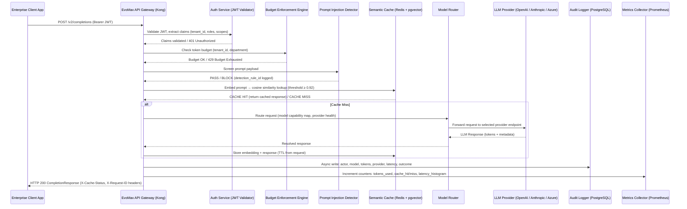
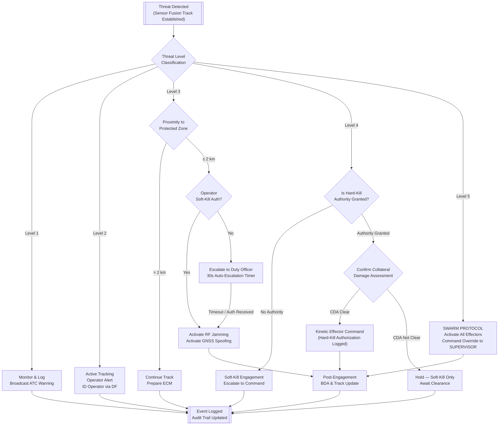
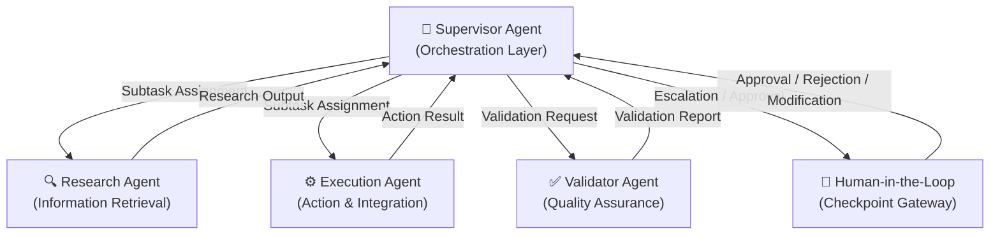
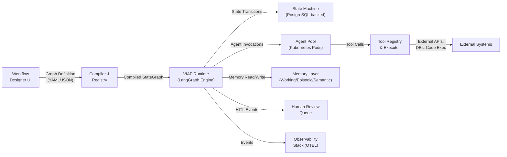
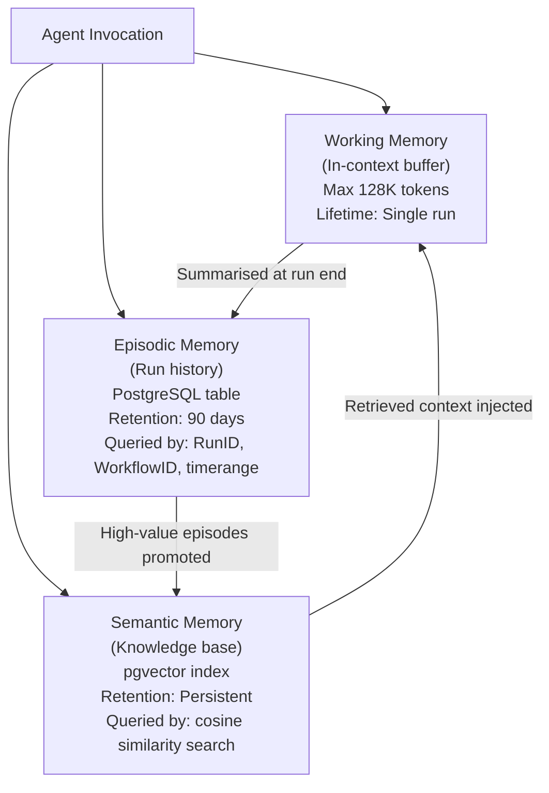
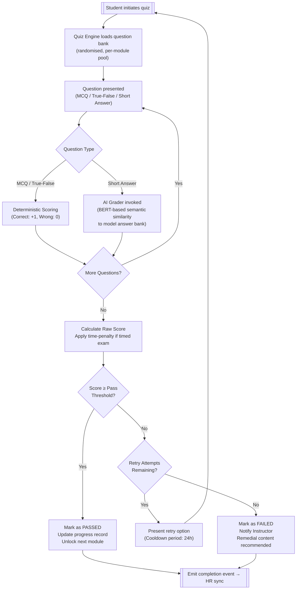

# Vector One Holdings — Multi-Product PRD & System Architecture Suite

**Document Version:** 3.0.0
**Classification:** Internal — Engineering & Product Leadership
**Issuing Entity:** Vector One Holdings Sdn. Bhd., Kuala Lumpur, Malaysia
**Last Updated:** 20 September 2026
**Document Owner:** Chief Product Officer
**Review Cycle:** Quarterly

---

> **Document Scope**
> This document constitutes the authoritative Product Requirements Document (PRD) and System Architecture Specification for all four core product lines operated under Vector One Holdings. It is structured as a unified reference for engineering, program management, procurement, and investor technical due diligence.

---

## Table of Contents

1. [EvoMax Token Engine — AI Middleware Platform](#1-evomax-token-engine--ai-middleware-platform)
2. [Vector Aero C2 Gateway — Drone & C-UAS Command Platform](#2-vector-aero-c2-gateway--drone--c-uas-command-platform)
3. [Vector Intelligence Agentic Platform](#3-vector-intelligence-agentic-platform)
4. [Vector Institute LMS — Corporate AI Training Platform](#4-vector-institute-lms--corporate-ai-training-platform)
5. [Cross-Product Infrastructure Standards](#5-cross-product-infrastructure-standards)
6. [Revision History](#6-revision-history)

---

# 1. EvoMax Token Engine — AI Middleware Platform

## 1.1 Product Overview

**Product Name:** EvoMax Token Engine
**Product Code:** VH-EMX-001
**Version:** 2.4.0
**Product Manager:** Senior PM, AI Infrastructure
**Target Release:** Q1 2027

EvoMax Token Engine is an enterprise-grade AI middleware platform that provides unified token routing, model orchestration, rate governance, and semantic caching services across heterogeneous large language model (LLM) providers. It acts as the intelligent API gateway between enterprise applications and LLM inference backends (OpenAI, Anthropic, Cohere, Azure OpenAI, local Ollama clusters), abstracting provider complexity and delivering observability, cost controls, and compliance enforcement at scale.

**Strategic Objective:** Achieve throughput capacity of 10,000,000 tokens per day per enterprise tenant by Q3 2027, at a p99 API response latency ≤ 500 ms for standard completion payloads ≤ 2,048 tokens.

---

## 1.2 User Stories & Acceptance Criteria

### US-EMX-001 — Token Budget Enforcement

**As a** Corporate IT Administrator,
**I want to** set daily and monthly token consumption budgets per department and per application,
**So that** I can prevent cost overruns and enforce fair-use policies across business units.

| Acceptance Criterion | Test Method |
|---|---|
| AC1: Admin can create a budget policy with `daily_limit`, `monthly_limit`, `alert_threshold_pct` fields via the Management API | Integration test: POST `/v2/budgets` returns HTTP 201 with policy UUID |
| AC2: When a department reaches 80% of daily limit, all designated admin contacts receive an alert within 60 seconds | E2E test: synthetic token injection, email/webhook verified within SLA |
| AC3: When daily limit is reached, subsequent API calls return HTTP 429 with `X-Budget-Exhausted: true` header | Unit test: mock token counter asserts 429 at threshold |
| AC4: Budget policies support timezone-aware reset windows (UTC offset configuration) | Unit test: assert reset fires at configured local midnight |
| AC5: All budget events are written to the PostgreSQL audit log with actor identity and timestamp | Database assertion in integration suite |

---

### US-EMX-002 — Semantic Cache Hit

**As a** Developer integrating EvoMax into a customer support application,
**I want** repeated or semantically similar queries to be served from cache,
**So that** I reduce LLM inference costs and achieve sub-50ms response times for common queries.

| Acceptance Criterion | Test Method |
|---|---|
| AC1: Cache hit rate ≥ 40% on a standardized benchmark corpus of 10,000 customer-support queries | Load test with k6, cache hit metrics in Prometheus |
| AC2: Semantic similarity threshold for cache lookup is configurable (default cosine similarity ≥ 0.92) | Unit test: cosine threshold override via config YAML |
| AC3: Cached responses include `X-Cache-Status: HIT` and `X-Cache-Age` headers | Integration test: assert response headers |
| AC4: Cache entries respect the TTL set by the originating request's `cache_ttl` parameter (default 3600s) | Unit test: mock Redis TTL assertion |
| AC5: Cache is invalidated per-tenant when a model version change event is published | Integration test: publish model-updated event, assert cache flush |

---

### US-EMX-003 — Multi-Provider Failover

**As a** Platform Engineer,
**I want** EvoMax to automatically failover to a secondary LLM provider when the primary provider returns 5xx errors or exceeds latency thresholds,
**So that** downstream applications experience no service interruption.

| Acceptance Criterion | Test Method |
|---|---|
| AC1: Failover triggers within 2 seconds of primary provider returning 3 consecutive 5xx responses | Chaos test: mock provider returning 500, assert rerouting within 2s |
| AC2: Failover respects model capability mapping (i.e., does not route GPT-4-class tasks to a Mistral-7B endpoint) | Unit test: capability matrix lookup mock |
| AC3: Failover events are logged with provider name, failure reason, and failover target | Log assertion test |
| AC4: Circuit breaker reopens (primary provider restored) after a configurable cool-down period (default 30s) | Integration test: health probe simulation |
| AC5: Client receives unmodified response format regardless of which provider served the request | Diff test: compare response schema across provider fixtures |

---

### US-EMX-004 — Role-Based Access Control for Model Access

**As a** Security Officer,
**I want** to restrict which LLM models and capabilities specific user roles and service accounts can invoke,
**So that** sensitive model endpoints (e.g., uncensored fine-tunes, PII-processing models) are accessible only to authorized parties.

| Acceptance Criterion | Test Method |
|---|---|
| AC1: RBAC policies can be defined at model-group granularity (e.g., `gpt4-class`, `vision-models`, `embedding-models`) | Integration test: policy creation API |
| AC2: Unauthorized role attempting access receives HTTP 403 with error code `EMX-4030` | Integration test: JWT role manipulation |
| AC3: RBAC policies are enforced even when bypassing the UI (direct API calls) | Penetration test: raw API call with manipulated claims |
| AC4: Policy changes take effect within 15 seconds without service restart | Integration test: policy update, assert enforcement within 15s |
| AC5: Super-admin role retains access override capability with MFA re-authentication | E2E test: TOTP-based override flow |

---

### US-EMX-005 — Real-Time Token Usage Dashboard

**As a** Finance Controller,
**I want** a real-time dashboard showing token consumption, cost attribution, and provider spend broken down by department, project, and model,
**So that** I can produce accurate AI cost-center reports for monthly financial review.

| Acceptance Criterion | Test Method |
|---|---|
| AC1: Dashboard data refreshes with ≤ 5-second latency from actual API call completion | E2E test: call API, assert dashboard metric within 5s |
| AC2: Cost attribution uses configurable per-provider, per-model pricing tables (admin-managed) | Integration test: pricing table CRUD API |
| AC3: Dashboard supports export to CSV and PDF formats | E2E test: export endpoint returns valid MIME types |
| AC4: Historical data is retained for 24 months and queryable via date-range filter | Database test: 24-month data seeding and range query |
| AC5: Dashboard is WCAG 2.1 Level AA accessible | Automated axe-core audit: zero critical violations |

---

### US-EMX-006 — Prompt Injection Detection

**As a** Security Engineer,
**I want** EvoMax to screen all inbound prompts for known injection patterns before forwarding to LLM providers,
**So that** adversarial prompt manipulation attempts are detected, logged, and blocked at the gateway level.

| Acceptance Criterion | Test Method |
|---|---|
| AC1: Injection detection processes 99.9% of requests with ≤ 15ms added latency | Load test: p99 latency measurement with detection enabled |
| AC2: Detection coverage includes at least 50 known OWASP LLM Top 10 attack patterns from the 2025 taxonomy | Unit test: pattern library assertion |
| AC3: Blocked prompts are logged with redacted content, detection rule ID, and tenant identity | Log assertion test |
| AC4: False positive rate ≤ 0.1% on a corpus of 100,000 benign enterprise prompts | Offline evaluation: labeled dataset |
| AC5: Admins can whitelist specific patterns per tenant | Integration test: whitelist CRUD and bypass verification |

---

## 1.3 Non-Functional Requirements (NFRs)

### 1.3.1 Performance Benchmarks

| NFR ID | Category | Requirement | Measurement Method | Target SLA |
|---|---|---|---|---|
| NFR-EMX-P01 | Throughput | Sustained token throughput per tenant | Prometheus metric: `emx_tokens_processed_total` | 10,000,000 tokens/day |
| NFR-EMX-P02 | API Latency | p50 latency for completion requests ≤ 2,048 tokens | Histogram: `emx_request_duration_seconds` | ≤ 120 ms |
| NFR-EMX-P03 | API Latency | p99 latency for completion requests ≤ 2,048 tokens | Histogram: `emx_request_duration_seconds` p99 | ≤ 500 ms |
| NFR-EMX-P04 | API Latency | p99 latency for embedding requests | Histogram bucket | ≤ 200 ms |
| NFR-EMX-P05 | Concurrency | Simultaneous concurrent API connections | Load test: 10,000 concurrent virtual users | 10,000 concurrent |
| NFR-EMX-P06 | Cache Performance | Redis cache response time | Redis INFO latency | ≤ 5 ms (p99) |
| NFR-EMX-P07 | Availability | Platform uptime | Synthetic monitoring (Pingdom) | 99.95% monthly |
| NFR-EMX-P08 | Recovery | RTO after catastrophic failure | DR runbook test | ≤ 15 minutes |
| NFR-EMX-P09 | Recovery | RPO (data loss window) | Backup/restore test | ≤ 5 minutes |
| NFR-EMX-P10 | Throughput Scaling | Horizontal scale-out time under traffic burst | K8s HPA metric | New pod ready ≤ 90 seconds |

### 1.3.2 Scalability Targets

| Dimension | Current Baseline | 6-Month Target | 12-Month Target |
|---|---|---|---|
| Tokens/day (per tenant) | 500,000 | 2,000,000 | 10,000,000 |
| Concurrent API connections | 500 | 3,000 | 10,000 |
| Active enterprise tenants | 12 | 50 | 200 |
| LLM provider integrations | 4 | 8 | 15 |
| Requests/second (aggregate) | 200 RPS | 1,000 RPS | 5,000 RPS |
| Embedding vectors stored (semantic cache) | 10M | 100M | 1B |

### 1.3.3 Security Requirements

| Req ID | Standard | Requirement Description | Implementation |
|---|---|---|---|
| SEC-EMX-001 | OWASP API Top 10 (2023) — API1 | Broken Object Level Authorization prevention | Per-request tenant context validation on all resource endpoints |
| SEC-EMX-002 | OWASP API Top 10 — API2 | Broken Authentication mitigation | JWT RS256 with 15-min expiry; refresh token rotation |
| SEC-EMX-003 | OWASP API Top 10 — API3 | Broken Object Property Level Authorization | Field-level permission masks in serializer layer |
| SEC-EMX-004 | OWASP API Top 10 — API4 | Unrestricted Resource Consumption | Token budget enforcement + request size limits (max 128KB body) |
| SEC-EMX-005 | OWASP API Top 10 — API5 | Broken Function Level Authorization | Separate admin API surface on internal network only (`/internal/v2/`) |
| SEC-EMX-006 | OWASP API Top 10 — API6 | Unrestricted Access to Sensitive Business Flows | Rate limiting: 60 req/min for standard, 600 req/min for enterprise tier |
| SEC-EMX-007 | OWASP API Top 10 — API7 | Server-Side Request Forgery (SSRF) | Allowlist-based outbound HTTP (provider endpoints only) |
| SEC-EMX-008 | OWASP API Top 10 — API8 | Security Misconfiguration | IaC-enforced security groups; no public S3 buckets; secret scanning in CI/CD |
| SEC-EMX-009 | OWASP API Top 10 — API9 | Improper Inventory Management | API versioning enforced; sunset policy for deprecated endpoints (90-day notice) |
| SEC-EMX-010 | OWASP API Top 10 — API10 | Unsafe Consumption of APIs | All provider responses validated against JSON schema before forwarding |
| SEC-EMX-011 | ISO 27001:2022 | Data encryption in transit | TLS 1.3 mandatory; TLS 1.2 permitted with AES-256-GCM cipher suite only |
| SEC-EMX-012 | ISO 27001:2022 | Data encryption at rest | AES-256 for PostgreSQL tablespaces; KMS-managed keys (AWS KMS) |
| SEC-EMX-013 | PDPA (Malaysia) | PII data residency | All tenant data stored in AWS ap-southeast-1 (Singapore); no cross-region replication without written consent |
| SEC-EMX-014 | SOC 2 Type II | Audit logging completeness | 100% of API calls logged with actor, resource, action, timestamp, IP, outcome |

---

## 1.4 API Specification

### 1.4.1 Base URL & Versioning

```
Base URL: https://api.evomax.vectorone.my/v2
Authentication: Bearer JWT (Authorization header)
Content-Type: application/json
```

### 1.4.2 Endpoint Reference Table

| Endpoint | Method | Description | Request Schema | Response Schema | Rate Limit |
|---|---|---|---|---|---|
| `/v2/completions` | POST | Submit a text completion request to a routed LLM provider | `CompletionRequest` | `CompletionResponse` | 60/min (Standard), 600/min (Enterprise) |
| `/v2/embeddings` | POST | Generate vector embeddings for input text | `EmbeddingRequest` | `EmbeddingResponse` | 120/min (Standard), 1,200/min (Enterprise) |
| `/v2/chat/completions` | POST | Submit a multi-turn chat completion | `ChatCompletionRequest` | `ChatCompletionResponse` | 60/min (Standard), 600/min (Enterprise) |
| `/v2/models` | GET | List available LLM models for tenant | — | `ModelListResponse` | 30/min |
| `/v2/models/{model_id}` | GET | Get model capability metadata | — | `ModelDetailResponse` | 30/min |
| `/v2/budgets` | POST | Create a token budget policy | `BudgetPolicyRequest` | `BudgetPolicyResponse` | 10/min (Admin only) |
| `/v2/budgets/{policy_id}` | GET | Retrieve budget policy details | — | `BudgetPolicyResponse` | 30/min (Admin only) |
| `/v2/budgets/{policy_id}` | PATCH | Update a budget policy | `BudgetPolicyPatchRequest` | `BudgetPolicyResponse` | 10/min (Admin only) |
| `/v2/usage` | GET | Query token usage metrics (date range, department) | Query params | `UsageReportResponse` | 30/min |
| `/v2/cache/flush` | POST | Flush semantic cache for tenant or specific model | `CacheFlushRequest` | `CacheFlushResponse` | 5/min (Admin only) |
| `/v2/providers` | GET | List configured upstream LLM providers | — | `ProviderListResponse` | 10/min (Admin only) |
| `/v2/providers/{provider_id}/health` | GET | Get real-time provider health status | — | `ProviderHealthResponse` | 60/min |
| `/v2/auth/token` | POST | Exchange API key for JWT access token | `TokenRequest` | `TokenResponse` | 10/min |
| `/v2/auth/refresh` | POST | Refresh JWT using refresh token | `RefreshRequest` | `TokenResponse` | 10/min |
| `/v2/audit/logs` | GET | Query audit log entries | Query params | `AuditLogResponse` | 20/min (Compliance Officer only) |

### 1.4.3 Key Schema Definitions

```json
// CompletionRequest
{
  "model": "string (required) — e.g., 'gpt-4o', 'claude-3-5-sonnet', 'emx-auto'",
  "prompt": "string (required, max 128,000 chars)",
  "max_tokens": "integer (optional, default 512, max 32,768)",
  "temperature": "float (optional, 0.0–2.0, default 1.0)",
  "top_p": "float (optional, 0.0–1.0)",
  "stream": "boolean (optional, default false)",
  "cache_ttl": "integer (optional, seconds, default 3600, max 86400)",
  "tenant_id": "string (injected by gateway from JWT, not user-supplied)",
  "metadata": { "project_id": "string", "user_id": "string", "cost_center": "string" }
}

// CompletionResponse
{
  "id": "string (UUID v4)",
  "object": "text_completion",
  "created": "integer (Unix timestamp)",
  "model": "string (resolved model identifier)",
  "provider": "string (e.g., 'openai', 'anthropic')",
  "choices": [{ "text": "string", "finish_reason": "stop|length|content_filter", "index": 0 }],
  "usage": { "prompt_tokens": 0, "completion_tokens": 0, "total_tokens": 0 },
  "cache_hit": "boolean",
  "latency_ms": "integer",
  "request_id": "string (UUID, for support correlation)"
}
```

---

## 1.5 Data Flow Diagram



---

## 1.6 Testing Requirements

### 1.6.1 Unit Testing

| Test Suite | Coverage Target | Tool | Key Modules Covered |
|---|---|---|---|
| Core business logic | ≥ 85% line coverage | pytest + pytest-cov | Budget engine, injection detector, model router |
| API serializers / validators | ≥ 90% | pytest | Request/response schema validation |
| Cache service | ≥ 85% | pytest + fakeredis | Hit/miss logic, TTL, flush operations |
| Auth service | ≥ 95% | pytest | JWT validation, RBAC enforcement |
| Audit logger | ≥ 80% | pytest | Log structure, async write queue |

**CI Gate:** PRs blocked if overall project coverage drops below 85%.

### 1.6.2 Integration Testing

- All 15 API endpoints must have integration test suites covering: success path, auth failure (401), authz failure (403), validation failure (400), and rate limit (429).
- Database migration tests: all Alembic migration scripts must be reversible and tested against a seeded PostgreSQL 15 instance.
- Redis integration: test suite runs against a real Redis 7.2 instance (not mock) in CI pipeline.

### 1.6.3 Load & Performance Testing

| Test Scenario | Tool | Target Metric | Pass Criterion |
|---|---|---|---|
| Sustained concurrency | k6 | 10,000 concurrent VUs, 10 min duration | Error rate < 0.1%; p99 latency ≤ 500ms |
| Peak burst | k6 | Ramp from 0 → 10,000 VUs in 60 seconds | No cascading failures; p99 ≤ 800ms during ramp |
| Cache effectiveness | k6 + custom script | 10,000 VUs, 40% repeated query corpus | Cache hit rate ≥ 35% |
| Provider failover under load | Chaos Monkey + k6 | Primary provider killed at 5,000 VUs | Failover ≤ 2s; no requests lost |
| Database connection pool exhaustion | pgbench + k6 | 500 concurrent DB connections | No 503 errors; queue drain ≤ 5s |

### 1.6.4 Security Testing

- OWASP ZAP automated scan on every release branch (zero High/Critical findings to ship).
- Annual third-party penetration test (CREST-accredited firm).
- SAST: Semgrep rules enforced in CI; Bandit for Python security anti-patterns.
- DAST: Nuclei templates for API-specific vulnerability detection.
- Dependency scanning: `pip-audit` and Dependabot with ≤ 7-day patch SLA for Critical CVEs.

---

## 1.7 Error Handling Matrix

| Error Code | HTTP Status | Category | Description | Recovery Action | Retry Eligible |
|---|---|---|---|---|---|
| EMX-4000 | 400 | Validation | Malformed JSON request body | Client must fix request schema | No |
| EMX-4001 | 400 | Validation | `model` field missing or empty | Provide valid `model` parameter | No |
| EMX-4002 | 400 | Validation | Prompt exceeds 128,000 character limit | Truncate or chunk prompt | No |
| EMX-4003 | 400 | Validation | Invalid `temperature` value (out of 0.0–2.0 range) | Correct parameter value | No |
| EMX-4004 | 400 | Validation | `max_tokens` exceeds model context window | Reduce `max_tokens` | No |
| EMX-4010 | 401 | Authentication | JWT missing or malformed | Re-authenticate via `/v2/auth/token` | No |
| EMX-4011 | 401 | Authentication | JWT expired (>15 min since issue) | Refresh via `/v2/auth/refresh` | No |
| EMX-4012 | 401 | Authentication | JWT signature verification failed | Re-authenticate; report if persistent | No |
| EMX-4030 | 403 | Authorization | Insufficient role for requested model | Contact admin to update RBAC policy | No |
| EMX-4031 | 403 | Authorization | Tenant does not have access to requested provider | Contact Vector One support | No |
| EMX-4032 | 403 | Authorization | IP address not in tenant allowlist | Add IP to allowlist via Management Console | No |
| EMX-4040 | 404 | Not Found | Requested model ID does not exist | Use `/v2/models` to enumerate valid models | No |
| EMX-4041 | 404 | Not Found | Budget policy ID not found | Verify policy UUID | No |
| EMX-4050 | 429 | Rate Limit | API rate limit exceeded for tier | Back off exponentially; upgrade tier if sustained | Yes (after 60s) |
| EMX-4051 | 429 | Budget | Daily token budget exhausted | Wait for next reset window or request budget increase | No |
| EMX-4052 | 429 | Budget | Monthly token budget exhausted | Contact admin for emergency increase | No |
| EMX-4510 | 451 | Compliance | Prompt blocked by injection detector | Review prompt for adversarial patterns | No |
| EMX-5000 | 500 | Internal | Unhandled internal server error | Retry after 5s; report `request_id` to support | Yes (3x, exponential) |
| EMX-5020 | 502 | Provider | LLM provider returned 5xx error | System auto-failovers; client may retry | Yes (2x, 2s delay) |
| EMX-5030 | 503 | Availability | All configured providers unavailable | Wait for provider recovery; check status page | Yes (5x, 30s delay) |
| EMX-5040 | 504 | Timeout | LLM provider response timeout (>30s) | Retry with lower `max_tokens`; check provider status | Yes (2x) |

---

## 1.8 Deployment Architecture

### 1.8.1 Kubernetes on AWS EKS

```
Cluster: VH-EMX-Production-EKS
Region: ap-southeast-1 (Singapore)
Node Groups:
  - API Nodes: c6i.2xlarge × 6 (auto-scaling: 4–20 nodes)
  - Worker Nodes: c6i.4xlarge × 3 (budget/audit/injection workers)
  - Cache Nodes: r6i.2xlarge × 3 (Redis cluster, memory-optimized)
Kubernetes Version: 1.31
CNI: AWS VPC CNI
Service Mesh: Istio 1.23 (mTLS between all services)
Ingress: Kong Gateway 3.8 (API gateway + rate limiting)
```

### 1.8.2 Redis Caching Layer

| Parameter | Configuration |
|---|---|
| Redis Version | 7.2 (AWS ElastiCache for Redis, cluster mode enabled) |
| Cluster Topology | 3 primary shards × 2 replicas each (6 total nodes) |
| Node Type | cache.r7g.xlarge (26.32 GB RAM per node) |
| Eviction Policy | `allkeys-lfu` (Least Frequently Used) |
| Max Memory Per Node | 24 GB (leaving headroom for overhead) |
| Persistence | AOF enabled (everysec fsync); daily RDB snapshot |
| Encryption | In-transit (TLS) + at-rest (AWS-managed CMK) |
| pgvector Storage | Separate PostgreSQL 16 instance with pgvector extension for embedding index |
| Vector Index Type | HNSW (ef_construction=200, m=16) for cosine similarity |

### 1.8.3 PostgreSQL Audit Log Database

| Parameter | Configuration |
|---|---|
| Engine | PostgreSQL 16.3 (AWS RDS Multi-AZ) |
| Instance Class | db.r7g.2xlarge (primary + standby) |
| Storage | 2 TB gp3, 12,000 IOPS, 500 MB/s throughput |
| Read Replicas | 2 × db.r7g.xlarge (ap-southeast-1a, ap-southeast-1b) |
| Backup | Automated daily snapshots; 30-day retention; PITR enabled |
| Partitioning | Monthly range partitioning on `created_at` column |
| Retention Policy | 24 months hot (RDS); archive to S3 Glacier after 24 months |
| Schema Migrations | Alembic with pre-migration backup verification |

---

# 2. Vector Aero C2 Gateway — Drone & C-UAS Command Platform

## 2.1 Product Overview

**Product Name:** Vector Aero C2 Gateway
**Product Code:** VH-C2G-002
**Version:** 1.8.0
**Document Type:** System Requirements Specification (SRS) — MIL-STD-961F Format
**Target Market:** Malaysian Armed Forces (MAF), PDRM, Critical Infrastructure Operators
**Classification:** Restricted — Export Control Applicable (ITAR / EAR baseline review required)

The Vector Aero C2 Gateway is a hardened, real-time command and control (C2) system for the management of friendly unmanned aerial vehicles (UAVs) and the detection, classification, tracking, and neutralisation of threat drone activity (Counter-UAS/C-UAS). The system operates across a layered defense architecture, integrating passive RF sensing, active radar, electro-optical/infrared (EO/IR) payloads, and AI-driven threat classification into a unified operator interface and automated engagement decision engine.

---

## 2.2 System Requirements Specification (SRS)

### 2.2.1 Functional Requirements

| Req ID | Shall Statement | Priority | Verification Method |
|---|---|---|---|
| SRS-C2G-F01 | The system SHALL detect UAV targets with a radar cross section (RCS) ≥ 0.01 m² at ranges up to 5 km | Critical | Test (live range) |
| SRS-C2G-F02 | The system SHALL classify detected targets into one of five threat levels within 3 seconds of first track | Critical | Analysis + Test |
| SRS-C2G-F03 | The system SHALL display a Common Operating Picture (COP) updated at ≥ 10 Hz refresh rate | High | Inspection + Test |
| SRS-C2G-F04 | The system SHALL simultaneously track ≥ 64 independent UAV targets within the sensor coverage zone | Critical | Test |
| SRS-C2G-F05 | The system SHALL command friendly UAVs compliant with STANAG 4586 Ed. 4 via the Vehicle Specific Module (VSM) | Critical | Demonstration |
| SRS-C2G-F06 | The system SHALL execute electronic countermeasure (ECM) engagement commands within 500 ms of operator confirmation | Critical | Test |
| SRS-C2G-F07 | The system SHALL log all operator commands, system events, and engagement actions with UTC timestamps to immutable audit storage | High | Inspection + Test |
| SRS-C2G-F08 | The system SHALL provide a NATO-standard Link 16 data link interface for joint operations interoperability | High | Demonstration |
| SRS-C2G-F09 | The system SHALL integrate RF signal data from passive monitoring arrays operating in 400 MHz – 6 GHz spectrum | High | Test |
| SRS-C2G-F10 | The system SHALL support remote operator station (ROS) connectivity over encrypted WAN (AES-256, FIPS 140-3 validated module) | High | Test + Analysis |
| SRS-C2G-F11 | The system SHALL generate Rules of Engagement (ROE) advisories for each classified threat, with recommended engagement option | High | Analysis + Demonstration |
| SRS-C2G-F12 | The system SHALL provide synthetic aperture radar (SAR) track data fusion with EO/IR cues within 1-second latency | Medium | Test |

### 2.2.2 Non-Functional Requirements

| Req ID | Category | Requirement | Target |
|---|---|---|---|
| SRS-C2G-N01 | Availability | System operational availability (Ao) during deployed operations | ≥ 99.5% over 30-day deployment window |
| SRS-C2G-N02 | MTBF | Mean Time Between Failure for core compute unit | ≥ 5,000 hours |
| SRS-C2G-N03 | MTTR | Mean Time To Repair for field-replaceable units | ≤ 30 minutes |
| SRS-C2G-N04 | Environmental | Operating temperature range | -20°C to +55°C (per MIL-STD-810H, Method 501.7) |
| SRS-C2G-N05 | Environmental | Ingress protection for field hardware units | IP67 (dust-tight, immersion to 1 m, 30 min) |
| SRS-C2G-N06 | Power | Primary power input (field generator) | 24V DC / 110–240V AC ±10% |
| SRS-C2G-N07 | Power | Backup UPS runtime at full operational load | ≥ 45 minutes |
| SRS-C2G-N08 | Latency | C2 command-to-effector latency (ECM activation) | ≤ 500 ms end-to-end |
| SRS-C2G-N09 | Security | Communication encryption | AES-256-GCM; FIPS 140-3 Level 2 validated modules |
| SRS-C2G-N10 | Cybersecurity | NIST SP 800-82 Rev. 3 (ICS Security) compliance | Full compliance audit annually |

---

## 2.3 Threat Classification Taxonomy

The Vector Aero C2 Gateway employs a 5-level threat taxonomy based on platform type, operational intent, capability, and coordination indicators derived from RF signature, kinematic profile, and contextual intelligence.

| Threat Level | Designation | Platform Profile | RCS Range | Max Speed | Coordination | Likely Intent | Default ROE |
|---|---|---|---|---|---|---|---|
| **Level 1** | Hobbyist / Nuisance | Consumer micro/nano-drone (DJI Mini, Mavic-class) | 0.01–0.05 m² | < 60 km/h | Single, uncoordinated | Unintentional airspace violation, photography | Monitor & Warn |
| **Level 2** | Suspect Operator | Modified consumer drone with non-standard payload | 0.05–0.15 m² | 60–100 km/h | Single, deliberate | Surveillance, contraband delivery | Track, Warn, ID operator |
| **Level 3** | Threat UAV | Tactical UAS with RF-shielded comms, payload bay | 0.1–0.3 m² | 80–150 km/h | 2–5 coordinated | ISR collection, targeted surveillance | Soft-kill authorized (jamming) |
| **Level 4** | Advanced Threat | Fixed-wing or VTOL UAS with weapons-grade payload indicators | 0.2–0.8 m² | 100–250 km/h | 5–20 coordinated | Kinetic attack on single target | Hard-kill authorized (per ROE) |
| **Level 5** | Coordinated Swarm | Heterogeneous swarm (≥ 20 autonomous agents) with mesh networking | Mixed | Mixed | > 20 autonomous agents | Area denial, multi-vector saturation attack | Full defensive action, command override |

### 2.3.1 Threat Level Escalation Logic

- **Automatic Escalation:** System may escalate threat level based on: (a) proximity to protected area boundary crossing threshold, (b) detected payload emission signatures, (c) loss of commercial RF band signature (indicating military-grade comms), (d) swarm coordination signals detected.
- **Operator Override:** Operator can escalate or de-escalate by 1 level with supervisory confirmation; escalation > 1 level requires dual-operator authorization.
- **De-escalation Criteria:** Automatic de-escalation only after 5 consecutive assessment cycles show reduction in threat indicators.

---

## 2.4 Rules of Engagement (ROE) Decision Tree



---

## 2.5 STANAG 4586 Integration Requirements

STANAG 4586 (NATO Standard for UAV Control System Interoperability) Edition 4 compliance is mandatory for all friendly UAV control operations.

| Interface | STANAG Element | Implementation Requirement | Verification |
|---|---|---|---|
| DLI (Data Link Interface) | STANAG 4586 Annex A | Support DLI Level 1–5 per platform capability declaration | Lab test with MAF UAV fleet types |
| VSM (Vehicle Specific Module) | STANAG 4586 §4.6 | VSM plugin architecture; MAF-specific VSMs for: Aludra MALE, Wulung TUAV | Demonstration with physical platform |
| Message Set | STANAG 4586 Annex B | Support complete message set: CUCS_Status, UAV_State, Payload_State, Ack, NACK | Protocol conformance test |
| Video | STANAG 4609 (referenced) | Full-motion video (FMV) with KLV metadata encoding per MISB ST 0601.19 | Inspection + test |
| Security | NSA Suite B / CNSA | All VSM and DLI traffic encrypted with NSA CNSA suite (AES-256, ECDH P-384) | FIPS 140-3 module validation |
| IFF | Mode 5 / Mode S (where applicable) | IFF query integration for friendly force deconfliction | Demonstration |

---

## 2.6 Sensor Fusion Algorithm Specifications

### 2.6.1 Fusion Architecture

The system employs a **Track-Level Fusion (TLF)** architecture using a **Kalman Filter bank** with adaptive noise covariance, fusing data from heterogeneous sensor modalities:

| Sensor Modality | Data Rate | Latency Budget | Fusion Weight (Dynamic) |
|---|---|---|---|
| 3D Phased Array Radar (X-band) | 10 Hz | ≤ 50 ms | 0.40 (primary) |
| Passive RF Direction Finding Array | 5 Hz | ≤ 80 ms | 0.25 |
| EO/IR Pan-Tilt-Zoom Camera | 30 Hz (video), 10 Hz (track cue) | ≤ 33 ms | 0.20 |
| Acoustic Sensor Array (microphone) | 100 Hz (raw), 5 Hz (track cue) | ≤ 100 ms | 0.10 |
| ADS-B Receiver | 1 Hz | ≤ 200 ms | 0.05 (deconfliction only) |

### 2.6.2 Fusion Process

1. **Pre-processing:** Each sensor track is converted to a common coordinate frame (ECEF WGS-84). Timestamps are normalized to GPS-disciplined UTC clock (±1 μs accuracy).
2. **Data Association:** JPDA (Joint Probabilistic Data Association) algorithm with gating parameter χ² = 9.21 (p=0.99 for 4-DOF gate).
3. **Track Propagation:** Constant Turn Rate (CTR) model with process noise Q = diag[0.1, 0.1, 0.1, 0.01, 0.01] m²/s.
4. **Measurement Update:** Extended Kalman Filter (EKF) per sensor modality with sensor-specific measurement noise covariance R matrices (calibrated quarterly).
5. **Classification Fusion:** Dempster-Shafer evidence theory for combining threat classification hypotheses from RF signature analyzer, kinematic model, and deep learning classifier (YOLOv11-based EO/IR model, mAP ≥ 0.87).

---

## 2.7 Operational Performance Envelope

| Parameter | Minimum | Nominal | Maximum |
|---|---|---|---|
| Detection Range (0.01 m² RCS) | 1.5 km | 3.5 km | 5.0 km |
| Detection Range (0.1 m² RCS) | 4.0 km | 6.0 km | 8.5 km |
| Tracking Accuracy (CEP at 1 km) | — | 2.5 m | 5.0 m |
| Simultaneous Tracks | — | 32 | 64 |
| Threat Classification Time | — | 1.5 s | 3.0 s |
| ECM Activation Latency | — | 250 ms | 500 ms |
| Frequency Jamming Coverage | — | 400 MHz–6 GHz | — |
| Jamming ERP (Effective Radiated Power) | — | 10 W | 50 W (regulatory limit) |
| GNSS Spoofing Range | — | 500 m radius | 1 km radius |
| Operating Altitude (platform) | Ground level | — | 5,000 m ASL |
| Friendly UAV Control Range (LOS) | 5 km | 15 km | 30 km |
| Operator Stations (simultaneous) | 1 | 3 | 6 |
| Display Update Rate | — | 10 Hz | 30 Hz |

---

## 2.8 Field Deployment Checklist

The following 22-item checklist must be completed and signed off by the Lead Systems Integrator (LSI) and the Duty Officer prior to declaring the system operational.

| # | Checklist Item | Responsible Party | Verification Method | Go/No-Go |
|---|---|---|---|---|
| 1 | Physical site survey completed; radar LOS clearance verified ≥ 270° arc | LSI | Site survey report on file | Go |
| 2 | All hardware units powered on and self-test (POST) completed with PASS status | LSI | POST screen capture | Go |
| 3 | GPS lock acquired on all nodes (≥ 6 satellites, HDOP ≤ 2.0) | LSI | GPS status display | Go |
| 4 | Time synchronization verified across all nodes (NTP offset ≤ ±10 ms from GPS PPS) | LSI | NTP status log | Go |
| 5 | Radar boresight calibration completed and within ±0.2° tolerance | LSI | Calibration printout | Go |
| 6 | EO/IR camera optical calibration completed; geo-referencing RMS error ≤ 5 m at 1 km | LSI | Calibration certificate | Go |
| 7 | RF passive array frequency sweep test completed; all 12 elements responding | LSI | Sweep test log | Go |
| 8 | Secure communications link established to Command HQ (AES-256; FIPS module status: VALIDATED) | Comms Officer | Link status display | Go |
| 9 | STANAG 4586 VSM handshake confirmed with all assigned friendly UAV platforms | Operator | VSM status panel | Go |
| 10 | IFF interrogation test confirmed (Mode 5 challenge/response verified) | Operator | IFF test log | Go |
| 11 | ROE profile loaded and confirmed matching current mission ROE order | Duty Officer | ROE display signed | Go |
| 12 | Threat level taxonomy configuration matches current threat intelligence briefing | Duty Officer | Config review | Go |
| 13 | ECM system pre-fire checklist completed; frequency bands de-conflicted with friendly comms plan | ECM Officer | ECM pre-fire form | Go |
| 14 | Backup power (UPS) test: full-load runtime ≥ 45 minutes confirmed | LSI | UPS test log | Go |
| 15 | Audit logging verified: test event written to immutable log and replicated to backup | LSI | Log verification | Go |
| 16 | Operator workstations tested: all displays rendering at ≥ 10 Hz; no dead pixels on critical symbology | Operator | Visual inspection | Go |
| 17 | Emergency system shutdown procedure tested and rehearsed with all operators | Duty Officer | Drill record | Go |
| 18 | Exclusion zones (friendly area corridors, no-fly boundaries) programmed and displayed | Operator | COP screenshot | Go |
| 19 | System cybersecurity scan completed; no active alerts on SIEM (McAfee ePO) | Cyber Officer | SIEM report | Go |
| 20 | Spare parts kit inventory confirmed: radar LRUs × 2, compute node × 1, power supply × 2 | LSI | Inventory form | Go |
| 21 | Medical and safety equipment on-site (ECM area radiation safety signs posted) | Safety Officer | Safety checklist | Go |
| 22 | System operational readiness declared by Duty Officer; entry in operations log | Duty Officer | Ops log entry | Go |

---

# 3. Vector Intelligence Agentic Platform

## 3.1 Product Overview

**Product Name:** Vector Intelligence Agentic Platform (VIAP)
**Product Code:** VH-VIAP-003
**Version:** 1.0.0 (Initial Release Target: Q2 2027)
**Product Manager:** Senior PM, Enterprise AI
**Target Market:** Enterprise — BFSI, Government, Defense Industrial Base, Professional Services

The Vector Intelligence Agentic Platform (VIAP) is a production-grade, multi-agent orchestration platform enabling enterprises to design, deploy, govern, and monitor autonomous AI agent workflows at scale. VIAP abstracts the complexity of multi-agent coordination, tool integration, memory management, and human oversight into a unified, enterprise-hardened runtime.

**Core Value Proposition:** Enable enterprise customers to deploy autonomous AI agent workflows that complete complex, multi-step business processes with ≥ 80% automation rate while maintaining human oversight at configurable checkpoint thresholds — reducing knowledge work processing time by an estimated 60–75%.

---

## 3.2 Agent Taxonomy



### 3.2.1 Agent Role Specifications

**Supervisor Agent**
- Responsibility: Goal decomposition, subtask delegation, agent lifecycle management, state machine progression, deadlock detection and recovery.
- Capabilities: Access to agent registry, global state, human escalation queue, memory subsystem.
- Max Concurrent Subtasks: 32 (configurable per workflow).
- Failure Handling: Retry failed subtasks ≤ 3× with exponential backoff; escalate to human after threshold.

**Research Agent**
- Responsibility: Information retrieval, document ingestion, web search, RAG-based knowledge synthesis, data aggregation.
- Tool Access: Web search (SerpAPI/Tavily), vector database RAG (pgvector), document parser (PDF/DOCX/XLSX), SQL query execution (read-only), API polling.
- Memory Access: Semantic memory (read/write), episodic memory (write append).
- Output Format: Structured `ResearchReport` JSON with source citations, confidence scores, and temporal validity metadata.

**Execution Agent**
- Responsibility: Action execution against external systems — form submission, API calls, database writes, file operations, email/calendar interactions, code execution.
- Tool Access: REST API executor (OAuth 2.0 managed), database write connector, code interpreter (sandboxed Python 3.12), file system I/O (scoped), email/calendar API (Google Workspace / Microsoft 365).
- Safety Constraints: All destructive actions (DELETE, financial transactions >MYR 50,000) require Validator Agent sign-off before execution.
- Audit: Every action logged with pre-action state snapshot and post-action outcome.

**Validator Agent**
- Responsibility: Quality assurance, output verification, compliance checking, hallucination detection, risk assessment of proposed actions.
- Validation Methods: Schema validation, business rule checks, cross-reference against authoritative data sources, LLM-based semantic coherence check, confidence threshold gating.
- Output: `ValidationReport` with PASS/FAIL/CONDITIONAL status, confidence score (0.0–1.0), flagged issues list.
- Hard Block: Any action flagged with `risk_level: HIGH` is blocked and escalated to human regardless of workflow configuration.

**Human-in-the-Loop (HITL) Gateway**
- Trigger Conditions: (a) Validator Agent CONDITIONAL result, (b) confidence score < 0.75 on critical decision node, (c) financial impact > configured threshold, (d) explicit workflow checkpoint defined by designer, (e) novel situation not covered by workflow definition.
- Interface: VIAP Web Console + mobile push notification; Slack/Teams integration available.
- Timeout Handling: Configurable escalation timer (default 4 hours); auto-escalate to secondary approver.
- Audit: All human decisions logged with approver identity, decision, rationale (optional), and timestamp.

---

## 3.3 Technical Architecture

### 3.3.1 LangGraph-Based Orchestration

VIAP uses **LangGraph 0.3.x** as the core state machine and graph orchestration engine, extended with enterprise production features:



### 3.3.2 Tool Registry

The Tool Registry is a centralized, versioned catalog of tools available to agents. Each tool is defined by a JSON schema (OpenAI function-calling compatible).

| Tool Category | Example Tools | Auth Method | Sandbox Level |
|---|---|---|---|
| Web & Search | `web_search`, `web_scrape`, `news_fetch` | API Key (vault-managed) | Level 1 (network-isolated) |
| Document Processing | `pdf_parse`, `docx_extract`, `xlsx_read`, `ocr_image` | None (local) | Level 2 (filesystem-scoped) |
| Code Execution | `python_exec`, `sql_query_ro`, `bash_restricted` | None (sandboxed) | Level 3 (gVisor container) |
| Data Integration | `rest_api_call`, `graphql_query`, `database_write` | OAuth 2.0 / API Key | Level 2 |
| Communication | `send_email`, `create_calendar_event`, `post_slack_msg` | OAuth 2.0 | Level 1 |
| Financial | `erp_journal_entry`, `payment_initiation` | OAuth 2.0 + MFA | Level 4 (dual-approval) |
| Vector Memory | `vector_search`, `vector_upsert`, `vector_delete` | Internal service auth | Level 0 (trusted internal) |

### 3.3.3 Memory Architecture



| Memory Layer | Technology | Capacity | Access Latency | Retention |
|---|---|---|---|---|
| Working Memory | In-context (LLM window) | 128K tokens (per run) | 0 ms (in-process) | Single workflow run |
| Episodic Memory | PostgreSQL 16 (JSON columns) | Unlimited (partitioned) | 5–20 ms | 90 days (configurable) |
| Semantic Memory | pgvector HNSW index | 100M vectors per tenant | 10–50 ms | Persistent until explicit deletion |

---

## 3.4 Functional Requirements

| Req ID | Requirement | Priority | Acceptance Criterion |
|---|---|---|---|
| FR-VIAP-001 | The platform SHALL support the definition of multi-agent workflows via a YAML/JSON schema with a no-code visual designer UI | Critical | Visual designer produces valid YAML exported graph; round-trip import/export tested |
| FR-VIAP-002 | The platform SHALL support spawning agent instances on-demand via Kubernetes job dispatch within 15 seconds of task assignment | Critical | K8s pod ready time ≤ 15s measured in load test |
| FR-VIAP-003 | The platform SHALL maintain a persistent, recoverable workflow state such that a workflow interrupted mid-execution resumes from the last completed node (at-least-once guarantee) | Critical | Chaos test: kill agent pod mid-run; verify resume from checkpoint |
| FR-VIAP-004 | The platform SHALL provide a versioned Tool Registry with schema validation; tools must pass JSON schema compliance check before registration | High | Tool registration API rejects non-compliant schemas with HTTP 422 |
| FR-VIAP-005 | The platform SHALL enforce tool-use sandboxing per the Sandbox Level matrix; Level 3 tools execute in gVisor-isolated containers | Critical | Security audit: gVisor container escape test returns failure |
| FR-VIAP-006 | The platform SHALL implement configurable HITL checkpoint nodes within workflow graphs; HITL nodes block progression until human decision or timeout escalation | Critical | E2E test: workflow pauses at HITL node; only proceeds on approval event |
| FR-VIAP-007 | The platform SHALL provide an agent observability dashboard showing: active runs, per-agent token consumption, tool call history, state graph visualization, and error log | High | Dashboard QA: all data fields verified against Prometheus/OTEL data |
| FR-VIAP-008 | The platform SHALL support multi-tenancy with complete data isolation between tenant namespaces at the Kubernetes, database, and vector store layers | Critical | Penetration test: cross-tenant data access attempt returns 403 and triggers alert |
| FR-VIAP-009 | The platform SHALL support workflow-level retry policies: configurable max_retries (1–10), backoff_strategy (linear/exponential), and retry_on error code list | High | Unit test: retry policy engine covers all strategy combinations |
| FR-VIAP-010 | The platform SHALL emit OpenTelemetry (OTEL) traces for all agent invocations, tool calls, and state transitions, exportable to Jaeger / Grafana Tempo | High | OTEL export test: trace visible in Jaeger within 10s of event |
| FR-VIAP-011 | The platform SHALL support workflow scheduling (cron-based) and event-triggered execution (webhook, Kafka event, database change data capture) | High | Integration test: cron trigger fires within ±30s of schedule; webhook trigger fires within 5s |
| FR-VIAP-012 | The platform SHALL provide a REST API for programmatic workflow management: create, read, update, delete, trigger, pause, resume, cancel workflow instances | High | API test: all CRUD + lifecycle operations return correct HTTP responses |

---

## 3.5 Security Model

### 3.5.1 Prompt Injection Prevention

| Control | Description | Implementation |
|---|---|---|
| Input Sanitization | Strip known injection pattern prefixes from all user-supplied data before injection into agent prompts | Regex + ML classifier (fine-tuned DistilBERT, F1 ≥ 0.96 on injection corpus) |
| Prompt Boundary Enforcement | Use clear XML-delimited prompt sections (`<system>`, `<user_data>`, `<context>`) with model-side instruction to reject cross-boundary commands | Prompt template enforced in agent base class |
| Tool Call Validation | All tool calls emitted by agents are schema-validated against the Tool Registry definition before execution; unexpected tool names rejected | Tool executor pre-call validation hook |
| Semantic Monitoring | Agent outputs monitored in real-time by a sentinel LLM for goal deviation, policy violations, and signs of prompt hijacking | Async validator (< 200 ms added latency) |

### 3.5.2 Sandboxed Execution Environments

```
Level 0 — Trusted Internal: Direct in-process call (Vector One internal services only)
Level 1 — Network Isolated: Restricted egress; only allowlisted domains; no filesystem access
Level 2 — Filesystem Scoped: Read/write to /tmp/agent-workspace/<run_id>/ only; no network egress
Level 3 — gVisor Container: Full OS-level isolation via gVisor (runsc); no host kernel syscall access; ephemeral
Level 4 — Dual-Approval Locked: Execution requires cryptographic approval from 2 independent approvers; TPM-attested
```

### 3.5.3 Audit Trail

Every agent action, tool invocation, state transition, memory read/write, and HITL event produces an immutable audit record:

```json
{
  "audit_id": "UUID v4",
  "timestamp": "ISO 8601 UTC",
  "tenant_id": "string",
  "workflow_id": "string",
  "run_id": "string",
  "agent_type": "supervisor | research | execution | validator",
  "event_type": "tool_call | state_transition | memory_write | hitl_event | error",
  "event_detail": { ... },
  "actor_identity": "agent_instance_id or human_user_id",
  "outcome": "success | failure | blocked | escalated",
  "integrity_hash": "SHA-256 of previous record + this record content (chain)"
}
```

Audit records are append-only (PostgreSQL row-level security enforces INSERT-only for audit service account), replicated to AWS S3 with Object Lock (WORM, 7-year retention).

---

# 4. Vector Institute LMS — Corporate AI Training Platform

## 4.1 Product Overview

**Product Name:** Vector Institute LMS
**Product Code:** VH-LMS-004
**Version:** 1.2.0
**Target Market:** Corporate enterprise customers, government agencies, defense organizations requiring AI upskilling programs.
**Platform Type:** Cloud-hosted SaaS; optional private deployment for air-gapped environments.

The Vector Institute LMS is a purpose-built learning management system designed for high-velocity corporate AI upskilling. It delivers structured, certification-accredited training programs covering the full AI proficiency spectrum — from foundational AI literacy to advanced agentic systems deployment — with built-in AI-graded practical assessments, HR system integration, and enterprise SSO.

**Differentiation:** Unlike generic LMS platforms, Vector Institute is AI-native: it uses AI to grade practical exercises, personalize learning paths, and generate adaptive assessments, while its content is authored and maintained by Vector One's own AI engineering team.

---

## 4.2 Course Module Structure

### Programme: Vector AI Practitioner Certification (VAPC)

| Module # | Module Name | Duration | Format | Prerequisites | Certification Contribution |
|---|---|---|---|---|---|
| **01** | AI Fundamentals & Machine Learning Concepts | 8 hours | Video + Reading + Quiz | None | 10% of final grade |
| **02** | Large Language Models: Architecture & Capabilities | 10 hours | Video + Interactive Lab | Module 01 | 12% of final grade |
| **03** | Prompt Engineering & LLM Application Development | 12 hours | Video + Guided Lab + Project | Module 02 | 15% of final grade |
| **04** | AI Ethics, Governance & Risk Management | 6 hours | Video + Case Study + Quiz | Module 01 | 8% of final grade |
| **05** | Retrieval-Augmented Generation (RAG) Systems | 10 hours | Video + Lab + Project | Module 02, 03 | 15% of final grade |
| **06** | Agentic Architecture & Multi-Agent Systems | 14 hours | Video + Lab + Project | Module 03, 05 | 20% of final grade |
| **07** | Enterprise AI Deployment & MLOps | 10 hours | Video + Lab | Module 05, 06 | 12% of final grade |
| **08** | Capstone Project & Certification Examination | 20 hours | Practical Project + Proctored Exam | All Modules | Pass/Fail Gate |

**Certification Requirements:** Cumulative weighted grade ≥ 75%; Capstone Project grade ≥ 70%; Proctored Examination score ≥ 65%.

---

## 4.3 User Roles & Permission Matrix

| Capability | Student | Instructor | Corporate Admin | Super Admin |
|---|---|---|---|---|
| Access enrolled courses | ✅ | ✅ | ❌ | ✅ |
| Submit assessments | ✅ | ❌ | ❌ | ❌ |
| View own progress & grades | ✅ | ❌ | ❌ | ✅ |
| Create / edit course content | ❌ | ✅ | ❌ | ✅ |
| Grade practical submissions | ❌ | ✅ | ❌ | ✅ |
| Issue certificates | ❌ | ✅ | ❌ | ✅ |
| Manage cohort enrollments | ❌ | ✅ | ✅ | ✅ |
| View organizational analytics | ❌ | ❌ | ✅ | ✅ |
| Configure SSO / SAML settings | ❌ | ❌ | ✅ | ✅ |
| Manage HR system sync | ❌ | ❌ | ✅ | ✅ |
| Create/delete user accounts | ❌ | ❌ | ✅ | ✅ |
| Configure billing & subscription | ❌ | ❌ | ✅ | ✅ |
| Platform-wide configuration | ❌ | ❌ | ❌ | ✅ |
| Access audit logs (all tenants) | ❌ | ❌ | ❌ | ✅ |
| Impersonate other users (support) | ❌ | ❌ | ❌ | ✅ (with MFA) |

---

## 4.4 Integration Requirements

### 4.4.1 SSO — SAML 2.0

| Parameter | Specification |
|---|---|
| Protocol | SAML 2.0 (SP-Initiated and IdP-Initiated flows) |
| Supported IdPs | Microsoft Azure AD, Okta, Google Workspace, OneLogin, ADFS 4.0+ |
| Binding | HTTP-POST (primary); HTTP-Redirect (fallback) |
| Assertion Encryption | AES-256-CBC |
| Signature Algorithm | RSA-SHA256 |
| Attribute Mapping | `email`, `given_name`, `family_name`, `department`, `employee_id`, `role` (configurable per tenant) |
| JIT Provisioning | Supported: accounts auto-created on first SSO login with mapped role |
| Session Lifetime | Configurable: 8–24 hours (default 8 hours); forced re-auth on session expiry |
| Certificate Rotation | Self-service SP metadata refresh; 30-day expiry warning notifications |
| Fallback | Local credential auth available as break-glass only (Super Admin config) |

### 4.4.2 HR System Synchronization

| Integration | Protocol | Sync Frequency | Data Synced | Deprovisioning |
|---|---|---|---|---|
| SAP SuccessFactors | REST API (OData v4) | Every 4 hours | Employee ID, name, department, job title, employment status | Auto-disable on `status=INACTIVE` |
| Workday | REST API (RAAS reports) | Every 4 hours | Employee profile, org unit, hire date, termination date | Auto-disable on termination date + 1 day |
| Oracle HCM Cloud | REST API | Every 6 hours | Employee core data, org structure | Auto-disable on `PersonTypeCode=EX_EMPLOYEE` |
| Generic SCIM 2.0 | SCIM 2.0 over HTTPS | Real-time (push) | Standard SCIM User & Group schemas | Immediate on SCIM DELETE/PATCH active=false |
| Manual CSV Import | CSV upload via Admin UI | On-demand | All employee fields | Manual action required |

### 4.4.3 Certificate Issuance API

Certificates are issued as cryptographically signed PDFs and optionally as Open Badges 3.0 (W3C Verifiable Credentials).

| Endpoint | Method | Description | Auth |
|---|---|---|---|
| `/v1/certificates/issue` | POST | Issue a certificate to a learner upon passing criteria | Instructor / System (internal) |
| `/v1/certificates/{cert_id}` | GET | Retrieve certificate metadata and download URL | Authenticated user (own cert) |
| `/v1/certificates/{cert_id}/verify` | GET | Public verification endpoint (no auth required) | Public |
| `/v1/certificates` | GET | List all certificates for a user or organization | Corporate Admin / Super Admin |
| `/v1/certificates/{cert_id}/revoke` | POST | Revoke a certificate (e.g., academic misconduct) | Super Admin |

**Certificate Integrity:** SHA-256 hash of certificate content signed with Vector One's ED25519 private key; public key published at `https://institute.vectorone.my/.well-known/cert-pubkey.json`. Verification endpoint confirms: (a) hash match, (b) signature valid, (c) certificate not revoked, (d) issuer is Vector Institute.

---

## 4.5 Assessment Engine

### 4.5.1 Quiz Logic



### 4.5.2 Practical Project Submission

| Phase | Description | AI Involvement | Human Involvement |
|---|---|---|---|
| Submission | Student submits project via file upload (ZIP, Jupyter Notebook, GitHub repo link) | None | None |
| Pre-screening | Automated plagiarism check (against prior submissions + public corpus); format validation | AI plagiarism model (Copyleaks API) | None |
| AI Grading Pass 1 | LLM-based rubric scoring: code quality, correctness, documentation, approach novelty | GPT-4o graded against rubric (scores 0–100 per criterion) | None |
| Instructor Review | Instructor reviews AI grade, can accept/adjust with written justification | AI provides confidence score; flags borderline cases (score 65–75) for mandatory human review | Instructor (mandatory for borderline) |
| Grade Finalisation | Final grade computed (AI grade weighted 60%, instructor adjustment weighted 40% when modified) | None | Final grade locked by Instructor |
| Feedback Delivery | AI-generated personalised written feedback delivered to student; instructor may append comments | AI feedback generation (GPT-4o) | Optional instructor annotation |

### 4.5.3 AI-Graded Exercise Specifications

| Exercise Type | Grading Model | Input | Rubric Criteria | Grading Latency Target |
|---|---|---|---|---|
| Prompt Engineering Exercise | GPT-4o Judge | Student prompt + LLM output | Instruction-following (30%), Output quality (30%), Efficiency (20%), Safety (20%) | ≤ 30 seconds |
| RAG Pipeline Code Review | Code review LLM (CodeLlama-70B) | Python/JS code file | Retrieval accuracy (25%), Code correctness (35%), Documentation (20%), Security (20%) | ≤ 60 seconds |
| Agent Workflow Design | GPT-4o Judge | YAML workflow definition | Completeness (25%), Error handling (25%), Efficiency (25%), Alignment to task (25%) | ≤ 45 seconds |
| Data Analysis Notebook | GPT-4o + pandas-AI | Jupyter Notebook | Analysis correctness (40%), Visualisation quality (20%), Interpretation (25%), Code style (15%) | ≤ 90 seconds |

---

## 4.6 Platform Functional Requirements

| Req ID | Requirement | Priority |
|---|---|---|
| FR-LMS-001 | The platform SHALL support content delivery in formats: MP4 video (HLS adaptive streaming), PDF, HTML5 interactive, SCORM 1.2 and xAPI (Tin Can) packages | Critical |
| FR-LMS-002 | The platform SHALL track and persist granular learner progress: video watch percentage (per video), quiz attempt history, time-on-task per module, assignment submission history | Critical |
| FR-LMS-003 | The platform SHALL generate a personalised learning path recommendation for each learner based on competency self-assessment results and performance history | High |
| FR-LMS-004 | The platform SHALL support cohort management: group enrolment, group-specific deadlines, cohort-level analytics, peer discussion forums | High |
| FR-LMS-005 | The platform SHALL support proctored remote examinations with: webcam monitoring, screen recording, AI anomaly detection (gaze tracking, face detection), browser lockdown | Critical |
| FR-LMS-006 | The platform SHALL send automated notifications via email and in-app for: assignment due dates (7-day, 1-day reminders), quiz failure, certificate issuance, module completion | Medium |
| FR-LMS-007 | The platform SHALL provide a Corporate Admin analytics dashboard: completion rates by cohort/department, average scores, time-to-completion, certification pipeline status | High |
| FR-LMS-008 | The platform SHALL export learner completion data to integrated HR systems within 1 hour of a completion event via configured HR sync adapter | High |
| FR-LMS-009 | The platform SHALL support mobile-responsive web access (PWA) with offline content caching for video and reading materials (re-sync on connectivity restore) | Medium |
| FR-LMS-010 | The platform SHALL maintain video streaming availability at ≥ 99.9% monthly uptime, served via CloudFront CDN with multi-region origin failover | Critical |

---

# 5. Cross-Product Infrastructure Standards

## 5.1 Shared Security Baseline

All Vector One Holdings products comply with the following baseline security standards:

| Standard | Scope | Compliance Target |
|---|---|---|
| ISO 27001:2022 | All products | Certification by Q4 2027 |
| SOC 2 Type II | EvoMax, VIAP, LMS | Annual audit; report available under NDA |
| OWASP API Security Top 10 (2023) | All API-exposed products | Zero Critical/High findings before GA release |
| NIST CSF 2.0 | All products | Full framework alignment documented |
| PDPA (Malaysia) 2010 (Amended 2024) | All products processing Malaysian personal data | DPA registration; privacy notice; consent management |
| MyCERT / NACSA | Defense products (C2G) | Incident reporting compliance; security assessment |

## 5.2 Shared Observability Stack

```
Metrics:     Prometheus 2.54 + Grafana 11.x (hosted on AWS Managed Grafana)
Tracing:     OpenTelemetry Collector → AWS X-Ray / Grafana Tempo
Logging:     Fluent Bit → AWS OpenSearch Service (30-day hot, 365-day cold)
Alerting:    Grafana Alertmanager → PagerDuty (P1/P2) → Slack (P3/P4)
Uptime:      Pingdom synthetic monitoring (1-minute check interval, global probes)
Error Track: Sentry (self-hosted) — application error tracking, session replay
```

## 5.3 Shared CI/CD Pipeline

```
VCS:          GitHub Enterprise (self-hosted, Malaysia region)
CI:           GitHub Actions (self-hosted runners on EKS)
SAST:         Semgrep + Bandit (Python) + ESLint Security (JS/TS)
SCA:          Dependabot + pip-audit + npm audit
Container:    Docker build → Trivy image scan → ECR push
IaC:          Terraform 1.9 + tflint + Checkov (security policy)
Deploy:       ArgoCD (GitOps, EKS) — blue-green for production releases
Release Gate: All tests pass + Coverage ≥ 85% + Zero SAST Critical + Pentest clear
```

---

# 6. Revision History

| Version | Date | Author | Summary of Changes |
|---|---|---|---|
| 1.0.0 | 2025-03-01 | CTO | Initial PRD — EvoMax basic functional requirements |
| 1.5.0 | 2025-07-15 | VP Engineering | Added C-UAS architecture hardware stack |
| 2.0.0 | 2026-01-20 | CPO | Expanded EvoMax user stories; added NFR section |
| 2.5.0 | 2026-05-10 | Product Team | Added C-UAS SRS format; threat taxonomy; ROE decision tree |
| 3.0.0 | 2026-09-20 | Product & Engineering | Full multi-product expansion: VIAP and Vector Institute LMS added; all sections massively expanded; full security model; testing requirements; deployment architecture |

---

*© 2026 Vector One Holdings Sdn. Bhd. All rights reserved. This document contains proprietary and confidential information. Unauthorized reproduction or distribution is strictly prohibited. Export of defense-related technical specifications may be subject to Malaysian Strategic Trade Act 2010 and applicable export control regulations.*
