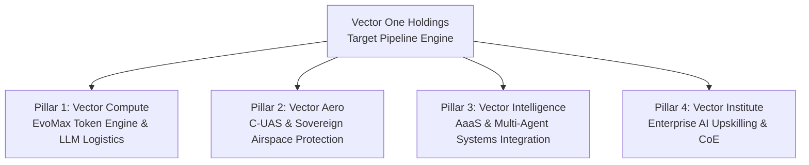
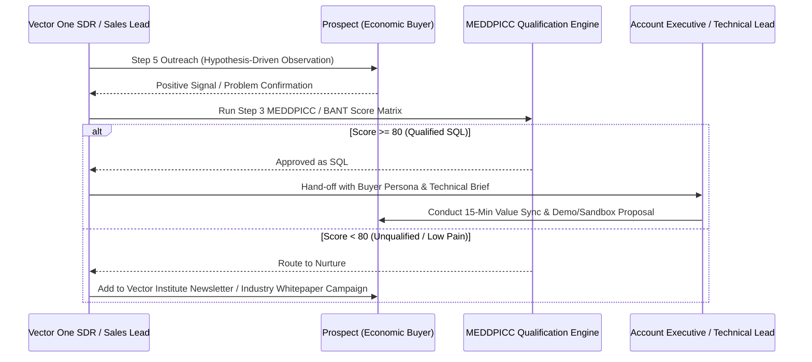

# Vector One Holdings — B2B Lead Qualification & ICP Pipeline Generator

**Framework Path:** `C:\Users\User\Desktop\Startup Founders Skills\startup-founder-skills-main\startup-founder-skills-main\skills\B2B Lead Qualification`  
**Entity:** Vector One Holdings (Vector Aero, Vector Compute, Vector Intelligence, Vector Institute, Vector Enterprise MICE)  
**Objective:** Convert Vector One Holdings' deep-tech & cognitive infrastructure offerings into targeted, ranked Sales-Qualified Lead (SQL) pipelines with verified pain points, MEDDPICC/BANT scores, and decision-maker contact paths.

---

## Executive Summary: Multi-Pillar Pipeline Strategy

Vector One Holdings operates across five synergistic business units. Each unit addresses a distinct market segment, buyer persona, and operational friction point:

---

## Pillar 1: Vector Compute & EvoMax Token Engine

### Step 1: Solution Deconstruction & Problem-Mapping
1. **Target Capability:** Eliminates LLM API latency spikes (30–150ms reduction) and prunes redundant prompt/response token volume by 30–40% without model accuracy loss via semantic middleware compression.
2. **Economic Consequence of Inaction:** Runaway monthly API expenditures ($30k–$200k+/mo cloud token burn), gross margin erosion on AI features, and user churn caused by slow inference response loops.
3. **Trigger Events:**
   - Public announcement of new LLM-powered feature rollout.
   - Engineering leadership posting about high API cost overheads or token rate-limit bottlenecks.
   - Transition from experimental single-prompt API calls to high-volume multi-agent agentic loops.
   - Series B/C funding announcement with explicit mandates to scale AI features profitably.

### Step 2: ICP Filters
- **Firmographics:** B2B SaaS, FinTech, HealthTech, or E-Commerce scaling generative AI or multi-agent workflows. Employee count: 50–2,000. Revenue: $10M–$150M ARR. Geography: ASEAN, North America, EMEA.
- **Technographics:** Relying on OpenAI (GPT-4o), Anthropic (Claude 3.5), MiniMax, or open-source LLMs. High API request volume (>100M tokens/month). Using LangChain, LlamaIndex, or custom Python agent frameworks.
- **Operating Context:** Rapid hiring for "AI Engineer", "LLM Infrastructure Engineer", "Head of AI", or "Platform Tech Lead".

### Step 3: Multi-Framework Qualification Score (MEDDPICC / BANT Hybrid)

| Parameter | Required Proof Point | Qualification Rule | Vector Compute Specific Benchmark |
| :--- | :--- | :--- | :--- |
| **Pain (P)** | $20k+/mo LLM token spend or p95 latency > 1.5s | **Must have.** If monthly token spend < $10k, keep in automated nurture. | Verified via job posts mentioning token optimization or high API traffic. |
| **Authority (A)** | VP of Engineering, CTO, Head of Infrastructure, Chief Data Officer | Must have direct signing authority or budget allocation over cloud/API compute infrastructure. | Direct outreach to VP Eng / CTO. |
| **Budget/Metrics (B)** | Demonstrated monthly cloud/API budget; payback period < 60 days | Target ACV: $24k–$72k/yr ($2k–$6k/mo subscription + usage margin). | EvoMax delivers instant 35% cost reduction ($10k spend drops to $6.5k). |
| **Timeline (T)** | Urgent quarterly target to reduce COGS or improve SLA | Must evaluate/deploy within 30 days via 48-hour drop-in sandbox trial. | 48-hour staging trial commitment. |

### Step 4: Persona Identification & Sourcing
- **Economic Buyer:** Chief Technology Officer (CTO) / VP of Engineering.
  - *KPI:* Infrastructure budget compliance, gross margin percentage, platform reliability.
- **Champion / Internal User:** Lead AI Infrastructure Engineer / Head of Machine Learning.
  - *KPI:* API latency, rate-limit uptime, developer velocity, prompt engineering friction.
- **Data Verification Checklist:** Verified work email, active LinkedIn profile showing posts on LLM scaling, Apollo/Clay tech stack confirmation (OpenAI/Anthropic SDKs present).

### Step 5: Account-Specific Outreach Hypotheses

#### Target Account Example: *Fintech Enterprise (Scale-Up)*
- **Observation:** "Noticed {{companyName}} recently launched an AI-powered financial research assistant and is actively scaling its LLM engineering team..."
- **Implied Bottleneck:** "...typically, engineering teams scaling high-frequency financial query agents hit massive token expenditure spikes ($40k+/mo) and latency delays during market open."
- **Concrete Value Proof:** "We deployed **EvoMax** for a regional fintech client, reducing prompt token volume by 36% and cutting p95 latency by 140ms with zero code refactoring."
- **Call to Value:** "Are you open to a 15-minute sync to review our benchmark report and set up a 48-hour sandbox test on 5% of your staging traffic?"

---

## Pillar 2: Vector Aero (Tactical Airspace & C-UAS Defense)

### Step 1: Solution Deconstruction & Problem-Mapping
1. **Target Capability:** Provides 24/7 multi-layered perimeter surveillance, micro-Doppler AESA radar threat tracking, RF spectrum scanning, directional jamming, and automated kinetic/electronic drone interception.
2. **Economic Consequence of Inaction:** Flight disruption losses ($1M+/hour for major airports), perimeter security breaches at military or energy facilities, illegal contraband smuggling at correctional facilities, critical infrastructure sabotage.
3. **Trigger Events:**
   - Near-miss drone sighting report or security breach in national media.
   - Civil Aviation Authority (e.g., CAAM, CAAS, FAA) mandate updates regarding counter-drone enforcement.
   - Expansion or commissioning of new airport terminals, port infrastructure, or energy plants.
   - Defense procurement budget release or regional security threat level elevation.

### Step 2: ICP Filters
- **Firmographics:** Airports, Military & Defense Agencies, Maritime Ports, Oil & Gas Refineries, Power Plants, High-Security Government Facilities. Revenue/Budget: $50M–$1B+ annual operational budget. Geography: ASEAN (Malaysia, Singapore, Indonesia, Thailand, Philippines) and Middle East.
- **Technographics:** Existing legacy CCTV/perimeter fencing requiring radar/RF integration; STANAG 4586 UAV compliance requirements.
- **Operating Context:** Active RFP/RFI for perimeter security upgrades; hiring "Chief Security Officer", "Airside Safety Manager", or "Defense Procurement Lead".

### Step 3: Multi-Framework Qualification Score (MEDDPICC / BANT Hybrid)

| Parameter | Required Proof Point | Qualification Rule | Vector Aero Specific Benchmark |
| :--- | :--- | :--- | :--- |
| **Pain (P)** | Unprotected 3D perimeter against uncrewed aerial threats | **Must have.** Facility has high physical asset density exposed to low-altitude airspace threats. | Airport, refinery, or defense perimeter without automated C-UAS radar. |
| **Authority (A)** | Director of Aviation Security, VP of Operations, Defense Procurement Board | Public sector or enterprise committee with capital expenditure (CapEx) approval. | Direct access to C-level facility security heads or ministry procurement officers. |
| **Budget/Metrics (B)** | CapEx allocation for security hardware/software ($250k–$2M+) | Target Contract Value (TCV): $500k–$2.5M per facility (Hardware + MaaS Retainer). | Financial risk of single flight halt ($1.5M) far exceeds solution cost. |
| **Timeline (T)** | Security audit recommendation or fiscal procurement window | Evaluation within 60–90 days; deployment within 6 months. | Formal RFI/RFP window active or scheduled within two quarters. |

### Step 4: Persona Identification & Sourcing
- **Economic Buyer:** Director of Infrastructure Security / Ministry Defense Procurement Officer.
  - *KPI:* Zero security breaches, regulatory compliance, operational continuity.
- **Champion / Internal User:** Head of Airside Safety & Operations / Chief Security Engineer.
  - *KPI:* Sub-5-second threat detection alert time, zero false positives, intuitive C2 dashboard integration.
- **Data Verification Checklist:** Government/Institutional directory verification, LinkedIn profile confirming operational control over security budgets, verified government email domain.

### Step 5: Account-Specific Outreach Hypotheses

#### Target Account Example: *Regional International Airport Authority*
- **Observation:** "Noticed {{companyName}}'s recent terminal expansion and the updated CAAM guidelines regarding low-altitude airspace perimeter enforcement..."
- **Implied Bottleneck:** "...airports expanding passenger volume frequently experience blind spots in micro-UAS detection, where traditional ground radar fails to detect low-RCS rogue drones."
- **Concrete Value Proof:** "Vector Aero’s **Unified Command Gateway** integrates AESA radar with automated RF countermeasures to deliver 5.0 km threat detection with sub-100ms automated response."
- **Call to Value:** "Would you be open to a 20-minute executive briefing and live C2 radar simulator walkthrough with our Aerospace Systems team?"

---

## Pillar 3: Vector Intelligence (Agentic AI & Analytics-as-a-Service)

### Step 1: Solution Deconstruction & Problem-Mapping
1. **Target Capability:** Replaces manual, fragmented corporate operations with deterministic, self-healing multi-agent workflows (LangGraph-backed) that execute complex end-to-end tasks across enterprise ERP, CRM, and database systems.
2. **Economic Consequence of Inaction:** High operational headcount cost, error-prone manual processing loops, slow customer response cycles, and stalled digital transformation initiatives.
3. **Trigger Events:**
   - Corporate restructuring or margin expansion initiative announced by C-suite.
   - Failed internal AI prototype/chatbot initiative (the "vibe coding hangover").
   - Appointment of new Chief Digital Officer (CDO) or Chief Operating Officer (COO).
   - Rapid expansion into new markets requiring scaled back-office processing without linear headcount growth.

### Step 2: ICP Filters
- **Firmographics:** Enterprise Corporations, Financial Institutions, Logistics Operators, Telecommunications, Healthcare Networks. Revenue: $25M–$500M+. Headcount: 200–5,000 employees. Geography: Regional ASEAN HQ or Multinational operational centers.
- **Technographics:** Complex tech stacks (Salesforce, SAP, Oracle, Snowflake, Custom SQL databases) struggling to unify data for AI agents.
- **Operating Context:** High operational headcount ratio, active search for enterprise automation solutions, explicit AI adoption mandates from Board of Directors.

### Step 3: Multi-Framework Qualification Score (MEDDPICC / BANT Hybrid)

| Parameter | Required Proof Point | Qualification Rule | Vector Intelligence Benchmark |
| :--- | :--- | :--- | :--- |
| **Pain (P)** | Broken manual workflows costing >$200k/yr in labor friction | **Must have.** Pain must involve multi-step manual data extraction or cross-system execution. | Documented back-office backlog or multi-system manual processing. |
| **Authority (A)** | Chief Operating Officer (COO), Chief Digital Officer (CDO), VP of Operations | Executive with cross-departmental authority to re-engineer workflows. | Direct access to Operations / Digital Transformation C-Suite. |
| **Budget/Metrics (B)** | Integration budget threshold of $50k–$250k engagement fees | ACV: $75k–$250k initial integration + $10k/mo ongoing AaaS retainer. | ROI calculation shows 4x-6x labor savings within 12 months. |
| **Timeline (T)** | Strategic initiative scheduled for execution within 30–60 days | Project kickoff within 4 weeks; 12-week deployment timeline. | Active quarterly OKR tied to process automation. |

### Step 4: Persona Identification & Sourcing
- **Economic Buyer:** Chief Operating Officer (COO) / Chief Digital Officer (CDO).
  - *KPI:* Cost-to-serve ratio, operational throughput velocity, corporate margin expansion.
- **Champion / Internal User:** Head of Process Excellence / VP of Business Operations.
  - *KPI:* Error rates, cycle time reduction, successful tool integration and employee adoption.
- **Data Verification Checklist:** Verified corporate email, LinkedIn leadership post analysis, company annual report references to digital transformation projects.

### Step 5: Account-Specific Outreach Hypotheses

#### Target Account Example: *Regional Logistics & Supply Chain Group*
- **Observation:** "Noticed {{companyName}} is expanding cross-border operations while managing multi-system customs data ingestion..."
- **Implied Bottleneck:** "...typically, logistics groups scaling at this volume face severe operational lag caused by manual document extraction between legacy ERPs and partner APIs."
- **Concrete Value Proof:** "Vector Intelligence deployed a deterministic 4-agent workflow for a regional supply chain client that automated 92% of document classification, reducing processing cycles from 4 hours to 90 seconds."
- **Call to Value:** "Could we share a 3-page architectural case study outlining how we design self-healing agentic workflows for enterprise ERPs?"

---

## Pillar 4: Vector Institute (Corporate AI Upskilling & CoE)

### Step 1: Solution Deconstruction & Problem-Mapping
1. **Target Capability:** Upskills corporate workforces and technical teams through hands-on Executive AI Leadership bootcamps, prompt engineering, agentic architecture certification, and Center of AI Excellence (CoE) creation.
2. **Economic Consequence of Inaction:** Employee fear/resistance to AI tools, shadow AI usage introducing security breaches, wasted enterprise AI software license fees due to zero adoption, competitive displacement by AI-literate rivals.
3. **Trigger Events:**
   - Enterprise procurement of Microsoft 365 Copilot, ChatGPT Enterprise, or custom internal AI portals.
   - HRDF / HRD Corp training fund reallocation deadlines (for Malaysian entities).
   - Corporate strategy announcement focusing on "AI-First Workforce Transformation".
   - Annual employee learning & development (L&D) budget planning cycles.

### Step 2: ICP Filters
- **Firmographics:** Medium-to-Large Enterprises, Financial Services, Government Agencies, Public Listed Companies (PLCs). Headcount: 100–10,000+ employees. Geography: Malaysia (HRD Corp claimable), Singapore (SkillsFuture aligned), broader ASEAN.
- **Technographics:** Deployed enterprise AI software licenses without widespread employee adoption.
- **Operating Context:** Dedicated HRD Corp / L&D training budget, active hiring for "Head of Capability", "L&D Director", or "Chief Human Resources Officer (CHRO)".

### Step 3: Multi-Framework Qualification Score (MEDDPICC / BANT Hybrid)

| Parameter | Required Proof Point | Qualification Rule | Vector Institute Benchmark |
| :--- | :--- | :--- | :--- |
| **Pain (P)** | Low workforce AI adoption rate (<20%) or lack of AI governance | **Must have.** Organization has purchased AI tools or mandated AI adoption but lacks structured training. | Verified non-utilization of AI licenses or explicit C-suite mandate. |
| **Authority (A)** | Chief Human Resources Officer (CHRO), Head of L&D, VP of People | Contact holds training budget authority or HRD Corp grant claim sign-off. | CHRO, Head of L&D, or VP Organizational Development. |
| **Budget/Metrics (B)** | Training budget of $1,500–$5,000 per seat or $30k–$100k cohort budget | Seat pricing: $1.5k–$3.5k; Enterprise Cohort: $35k–$120k (100% HRD Corp claimable in Malaysia). | Existing unutilized HRDF levy balance. |
| **Timeline (T)** | Training execution target within current quarterly fiscal budget | Bootcamp execution within 30–60 days of approval. | Q3/Q4 training calendar review window. |

### Step 4: Persona Identification & Sourcing
- **Economic Buyer:** Chief Human Resources Officer (CHRO) / Head of Learning & Development.
  - *KPI:* Employee skill transformation metrics, HRDF fund utilization, employee retention & satisfaction.
- **Champion / Internal User:** Head of Organizational Effectiveness / Enterprise AI Ambassador.
  - *KPI:* Practical AI application rate post-bootcamp, prompt engineering proficiency scores.
- **Data Verification Checklist:** HRDF levy contribution status, LinkedIn confirmation of L&D budget ownership, corporate website career page training policies.

### Step 5: Account-Specific Outreach Hypotheses

#### Target Account Example: *Malaysian Financial Institution (PLC)*
- **Observation:** "Noticed {{companyName}}'s strategic commitment to digital transformation and your available HRD Corp training levy allocation for 2026..."
- **Implied Bottleneck:** "...many financial institutions deploy enterprise AI tools but struggle with low employee adoption (under 18%) due to lack of practical, role-specific agentic training."
- **Concrete Value Proof:** "Vector Institute’s *Executive AI & Agentic Bootcamp* has certified over 500 enterprise professionals with a 94% post-training tool adoption rate—100% HRDF claimable."
- **Call to Value:** "May I send over our 2026 Enterprise AI Curriculum Guide and a sample HRD Corp grant application template for your team?"

---

## Consolidated Sales Execution Matrix & SDR Playbook

### Summary of Master Output Artifacts Created
- Document created: [`vector_one_b2b_lead_qualification.md`](file:///C:/Users/User/Desktop/Vector%20One/Vector_One_Outputs/vector_one_b2b_lead_qualification.md)
- GitHub commit ready.

---
*Vector One Holdings | B2B Sales Engineering & Pipeline Qualification Framework*
