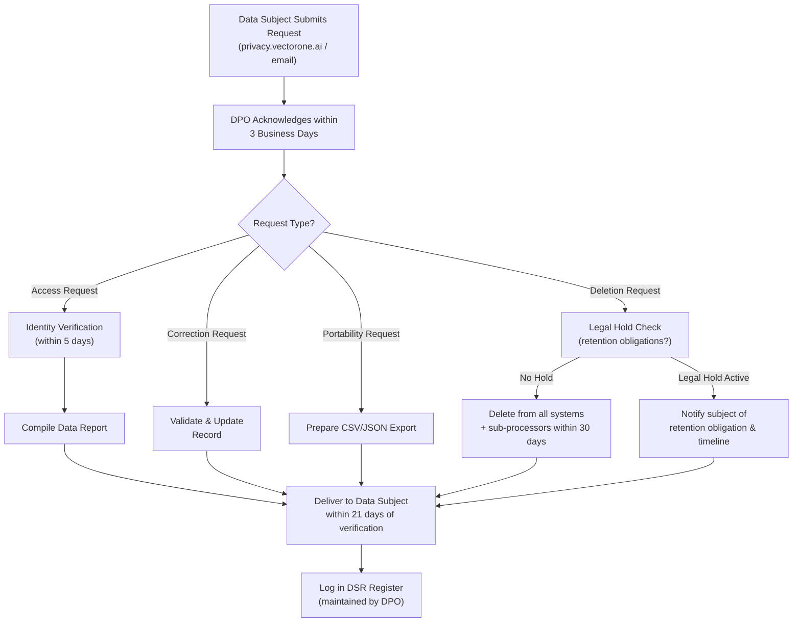
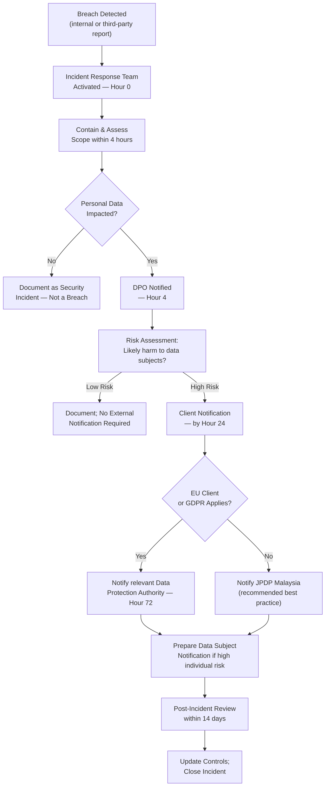

# VECTOR ONE HOLDINGS SDN BHD
## Legal, Compliance & Security Suite — Master Document
### Classification: CONFIDENTIAL — ATTORNEY-CLIENT PRIVILEGED

> **Document Control**
> | Field | Detail |
> |---|---|
> | Entity | Vector One Holdings Sdn Bhd (SSM No. pending — incorporated 17 September 2026) |
> | Operating Brand | Vector One Enterprise |
> | Jurisdiction | Malaysia (primary), Singapore, Indonesia, EU (GDPR-scoped) |
> | Document Version | v1.0 |
> | Effective Date | 17 September 2026 |
> | Document Owner | General Counsel / Chief Compliance Officer |
> | Review Cycle | Annually, or within 30 days of material regulatory change |
> | Classification | Confidential — Internal & Authorized External Use Only |

---

## TABLE OF CONTENTS

1. [Master Services Agreement (MSA) — Full Clause Template](#1-master-services-agreement)
2. [Defense Contract Addendum — Vector Aero Engagements](#2-defense-contract-addendum)
3. [Software License Agreement — EvoMax SaaS](#3-software-license-agreement-evomax)
4. [Malaysia PDPA Compliance Framework](#4-malaysia-pdpa-compliance-framework)
5. [GDPR Article 28 Data Processing Agreement](#5-gdpr-article-28-data-processing-agreement)
6. [Aviation & Defense Regulatory Compliance](#6-aviation--defense-regulatory-compliance)
7. [Corporate Governance Documents](#7-corporate-governance-documents)
8. [SOC 2 Type II & ISO 27001 Security Framework](#8-soc-2-type-ii--iso-27001-security-framework)
9. [MSA Redlining Guide — High-Risk Clause Matrix](#9-msa-redlining-guide)
10. [Data SLA & Uptime Commitments](#10-data-sla--uptime-commitments)
11. [IP Ownership & Notice Framework](#11-ip-ownership--notice-framework)

---

## 1. MASTER SERVICES AGREEMENT

### VECTOR ONE ENTERPRISE — MASTER SERVICES AGREEMENT TEMPLATE

**THIS MASTER SERVICES AGREEMENT** ("Agreement") is entered into as of the Effective Date set forth in the applicable Order Form, by and between:

**Vector One Holdings Sdn Bhd**, a company incorporated in Malaysia under the Companies Act 2016 (SSM Registration No. [●]), having its registered office at [Registered Address], Malaysia, operating under the trade name **Vector One Enterprise** ("**Service Provider**" or "**Vector One**");

— AND —

**[CLIENT FULL LEGAL NAME]**, a [company type] incorporated in [jurisdiction] (Registration No. [●]), having its principal place of business at [Address] ("**Client**").

---

### CLAUSE 1 — DEFINITIONS

| Term | Definition |
|---|---|
| **Affiliate** | Any entity that directly or indirectly controls, is controlled by, or is under common control with a Party, where "control" means ownership of more than 50% of the voting securities. |
| **Authorized User** | Any employee, contractor, or agent of Client who is permitted by Client to access and use the Services under this Agreement. |
| **Confidential Information** | Any non-public information disclosed by one Party ("Disclosing Party") to the other ("Receiving Party") that is designated as confidential or that reasonably should be understood to be confidential given the nature of the information and circumstances of disclosure. |
| **Data Processing Agreement (DPA)** | The data processing agreement incorporated herein by reference as Exhibit C, governing the processing of Personal Data. |
| **Deliverable** | Any work product, report, software, documentation, design, or other output created by Vector One specifically for Client pursuant to a Statement of Work. |
| **Documentation** | Vector One's then-current technical and functional specifications, user manuals, and help files made available to Client. |
| **EvoMax Platform** | Vector One's proprietary AI/LLM middleware and inference optimization platform, including all associated APIs, SDKs, models, and infrastructure. |
| **Force Majeure Event** | Any cause beyond a Party's reasonable control, including acts of God, natural disasters, war, terrorism, government action, cyberattacks attributable to a state actor, epidemics, or failures of third-party telecommunications infrastructure. |
| **Intellectual Property Rights** | All patents, copyrights, trademarks, trade secrets, moral rights, database rights, and all other intellectual and industrial property rights of any nature, whether registered or unregistered, worldwide. |
| **Order Form** | A written or electronic order document that references this Agreement and specifies the Services, fees, and other commercial terms. |
| **Personal Data** | Any information relating to an identified or identifiable natural person as defined under the Malaysian Personal Data Protection Act 2010 and, where applicable, the EU General Data Protection Regulation 2016/679. |
| **Services** | The software-as-a-service products, professional services, consulting, training, and managed services described in an Order Form or Statement of Work. |
| **Statement of Work (SOW)** | A document agreed to by the Parties that describes specific Deliverables, timelines, resource commitments, and acceptance criteria for professional services engagements. |
| **Subscription Term** | The period during which Client is licensed to access the SaaS Services, as specified in the Order Form. |
| **Vector Compute** | Vector One's distributed GPU inference compute orchestration layer. |

---

### CLAUSE 2 — SCOPE OF SERVICES

**2.1 Service Categories.** Vector One shall provide Services across the following business units as elected in an Order Form:

| Business Unit | Service Description | Delivery Model |
|---|---|---|
| Vector Compute | AI/LLM inference compute orchestration, model hosting, API gateway | SaaS / Managed Cloud |
| EvoMax | Enterprise LLM middleware, RAG pipeline, fine-tuning, agent orchestration | SaaS / On-Premise |
| Vector Aero | C-UAS detection, classification, interdiction systems; drone defense consulting | Hardware + Services |
| Vector Intelligence | Agentic AI strategy consulting, AI implementation, workforce automation | Professional Services |
| Vector Institute | Corporate AI literacy training, custom curriculum, LMS delivery | Training / Licensing |
| MICE & Events | Managed conference, summit, and event production with AI-integrated AV | Event Services |

**2.2 Order of Precedence.** In the event of conflict, the order of precedence shall be: (1) Defense Contract Addendum (if applicable); (2) Data Processing Agreement; (3) Order Form / SOW; (4) this Master Services Agreement; (5) Documentation.

**2.3 Changes to Services.** Vector One may update, modify, or discontinue any feature or component of the Services with thirty (30) days' written notice. Discontinuation of a material feature entitles Client to terminate the affected Order Form without early termination fees.

**2.4 Subcontractors.** Vector One may engage subcontractors to perform portions of the Services, provided that Vector One remains fully responsible for the acts and omissions of its subcontractors and ensures that subcontractors are bound by confidentiality and data protection obligations no less protective than those in this Agreement.

---

### CLAUSE 3 — FEES & PAYMENT TERMS

**3.1 Fees.** Client shall pay Vector One the fees set forth in each Order Form. All fees are quoted in Malaysian Ringgit (MYR) unless otherwise specified. For international clients, fees may be quoted in USD or SGD as agreed in the Order Form.

**3.2 Invoicing.** Vector One shall issue invoices:
- SaaS Subscriptions: Monthly in advance, on the first business day of each calendar month.
- Professional Services: Monthly in arrears, based on hours delivered per agreed rate card.
- Hardware (Vector Aero): Per milestone payment schedule in the relevant SOW.

**3.3 Payment Terms.** Invoices are due and payable within **thirty (30) days** of invoice date ("Due Date").

**3.4 Late Payment.** Undisputed amounts not paid by the Due Date shall accrue interest at the rate of **1.5% per month** (or the maximum rate permitted by applicable law, whichever is lower), compounded monthly.

**3.5 Disputed Invoices.** Client shall notify Vector One in writing of any disputed invoice amount within **fifteen (15) days** of receipt, specifying the basis of dispute. Undisputed portions of any invoice must be paid by the Due Date.

**3.6 Taxes.** All fees are exclusive of applicable taxes, including Malaysian Service Tax (SST), Goods and Services Tax (GST) where applicable, withholding taxes, and any other governmental charges. Client is responsible for all such taxes, except taxes on Vector One's net income.

**3.7 Suspension for Non-Payment.** Vector One may suspend access to SaaS Services upon **ten (10) business days'** written notice if undisputed fees remain unpaid more than **45 days** after the Due Date.

---

### CLAUSE 4 — INTELLECTUAL PROPERTY OWNERSHIP

**4.1 Vector One IP.** All Intellectual Property Rights in and to the Services, EvoMax Platform, Vector Compute infrastructure, proprietary AI models, underlying software, Documentation, and any pre-existing works or methodologies used in delivering the Services ("**Vector One IP**") are and shall remain the sole and exclusive property of Vector One. Client receives no ownership rights in Vector One IP.

**4.2 Client Data.** All data, content, and materials provided by Client to Vector One in connection with the Services ("**Client Data**") remain the sole and exclusive property of Client. Vector One acquires no ownership rights in Client Data. Client grants Vector One a limited, non-exclusive, royalty-free license to use Client Data solely to deliver the Services and fulfill its obligations under this Agreement.

**4.3 Deliverables.** Subject to full payment of all applicable fees, Vector One hereby assigns to Client all right, title, and interest in and to Deliverables specifically created for Client under an SOW, **excluding**:
- (a) any Vector One IP embedded in or underlying such Deliverables;
- (b) any open-source software components;
- (c) any general methodologies, tools, or know-how developed by Vector One.

Vector One grants Client a perpetual, royalty-free, non-exclusive license to use any retained Vector One IP embedded in Deliverables solely for Client's internal business purposes.

**4.4 Feedback.** If Client provides suggestions, ideas, or feedback regarding the Services, Vector One may freely use such feedback to improve its products and services without obligation or restriction.

**4.5 Model Training Prohibition.** Vector One shall not use Client Data to train, fine-tune, or improve any AI/ML model that will be made available to third parties, without Client's prior written consent.

---

### CLAUSE 5 — CONFIDENTIALITY & NON-DISCLOSURE

**5.1 Obligations.** Each Party ("Receiving Party") agrees to: (a) hold the other Party's ("Disclosing Party's") Confidential Information in strict confidence; (b) use such Confidential Information only for the purpose of performing its obligations or exercising its rights under this Agreement; and (c) disclose such Confidential Information only to its employees, contractors, and professional advisors who have a legitimate need to know and who are bound by written confidentiality obligations no less protective than those in this Agreement.

**5.2 Standard of Care.** The Receiving Party shall protect Confidential Information using at least the same degree of care it uses to protect its own confidential information, and in no event less than **reasonable care**.

**5.3 Exclusions.** Confidentiality obligations do not apply to information that: (a) is or becomes publicly available through no fault of the Receiving Party; (b) was rightfully known to the Receiving Party prior to disclosure; (c) is received from a third party without restriction; or (d) was independently developed by the Receiving Party without use of or reference to the Disclosing Party's Confidential Information.

**5.4 Compelled Disclosure.** If legally compelled to disclose Confidential Information, the Receiving Party shall: (a) give the Disclosing Party prompt written notice (to the extent legally permitted); (b) cooperate with the Disclosing Party's efforts to seek a protective order; and (c) disclose only the minimum information legally required.

**5.5 Duration.** Confidentiality obligations survive termination or expiration of this Agreement for a period of **five (5) years**, except for trade secrets, which shall be protected for as long as such information constitutes a trade secret under applicable law.

**5.6 Defense Information.** Notwithstanding the above, any information classified by the Government of Malaysia or a foreign government shared under a Vector Aero engagement shall be subject to applicable security protocols and Official Secrets Act obligations, which supersede this clause.

---

### CLAUSE 6 — DATA PROCESSING

**6.1 Roles.** For the purposes of Malaysian PDPA 2010 and where applicable EU GDPR, the Parties agree that:
- Client is the **Data User** (PDPA) / **Controller** (GDPR).
- Vector One is the **Data Processor** (both frameworks).

**6.2 Processing Instructions.** Vector One shall process Personal Data only on documented instructions from Client, unless required to do so by applicable law.

**6.3 Data Processing Agreement.** The parties shall execute Vector One's standard Data Processing Agreement (Exhibit C / Section 5 of this document) prior to Vector One processing any Personal Data on Client's behalf.

**6.4 Security Measures.** Vector One shall implement and maintain appropriate technical and organizational measures to protect Personal Data against unauthorized or unlawful processing, accidental loss, destruction, or damage, as further described in the Technical & Organizational Measures annex.

**6.5 Sub-processors.** Vector One shall not engage sub-processors to process Personal Data without Client's prior written consent (general written authorization is acceptable for the approved sub-processor list in Exhibit D).

**6.6 Return and Deletion.** Upon termination or expiration of this Agreement, Vector One shall, at Client's written election, return or securely delete all Personal Data within **30 days**, except to the extent retention is required by applicable law.

---

### CLAUSE 7 — WARRANTIES & REPRESENTATIONS

**7.1 Mutual Warranties.** Each Party represents and warrants that: (a) it is duly organized and validly existing under applicable law; (b) it has full authority to enter into and perform this Agreement; and (c) its execution and performance does not violate any applicable law, regulation, court order, or third-party agreement.

**7.2 Vector One Service Warranties.** Vector One warrants that:
- (a) Services will perform materially in accordance with the Documentation;
- (b) Vector One will provide Services in a professional and workmanlike manner, consistent with industry standards;
- (c) to Vector One's knowledge, the Services do not infringe any third party's Intellectual Property Rights;
- (d) Vector One maintains and complies with a written information security program that includes the controls described in Section 8;
- (e) Vector One complies with all applicable Malaysian laws and regulations relevant to its provision of Services.

**7.3 Disclaimer.** EXCEPT AS EXPRESSLY SET FORTH IN CLAUSE 7.2, THE SERVICES ARE PROVIDED "AS IS." VECTOR ONE DISCLAIMS ALL IMPLIED WARRANTIES, INCLUDING IMPLIED WARRANTIES OF MERCHANTABILITY, FITNESS FOR A PARTICULAR PURPOSE, AND NON-INFRINGEMENT. VECTOR ONE DOES NOT WARRANT THAT THE SERVICES WILL BE ERROR-FREE OR UNINTERRUPTED.

**7.4 AI Output Disclaimer.** Client acknowledges that AI-generated outputs (including from EvoMax and Vector Compute) are probabilistic in nature and may contain inaccuracies. Client is responsible for independently validating any AI-generated outputs before using them for business decisions, legal, medical, financial, or safety-critical purposes.

---

### CLAUSE 8 — INDEMNIFICATION

**8.1 Indemnification by Vector One.** Vector One shall defend, indemnify, and hold harmless Client and its officers, directors, employees, and agents from and against any third-party claims, losses, damages, liabilities, and expenses (including reasonable legal fees) arising from: (a) Vector One's material breach of this Agreement; (b) Vector One's gross negligence or willful misconduct; or (c) infringement of a third party's Intellectual Property Rights by the Services (excluding infringement resulting from Client's customization or misuse).

**8.2 Indemnification by Client.** Client shall defend, indemnify, and hold harmless Vector One from and against any third-party claims arising from: (a) Client's use of the Services in violation of this Agreement or applicable law; (b) Client Data infringing any third party's rights; or (c) Client's breach of any representation or warranty in this Agreement.

**8.3 Indemnification Procedure.** The indemnified Party shall: (a) promptly notify the indemnifying Party in writing of any claim; (b) grant the indemnifying Party sole control of the defense and settlement (provided no settlement imposes liability on the indemnified Party without its consent); and (c) cooperate reasonably with the indemnifying Party's defense.

**8.4 IP Remediation.** If the Services or any component becomes or is likely to become the subject of an infringement claim, Vector One may, at its option and expense: (a) obtain the right for Client to continue using the affected Services; (b) replace or modify the affected component; or (c) terminate the affected Order Form and refund prepaid unused fees.

---

### CLAUSE 9 — LIMITATION OF LIABILITY

**9.1 Exclusion of Consequential Damages.** IN NO EVENT SHALL EITHER PARTY BE LIABLE TO THE OTHER FOR ANY INDIRECT, INCIDENTAL, SPECIAL, CONSEQUENTIAL, EXEMPLARY, OR PUNITIVE DAMAGES, OR DAMAGES FOR LOSS OF PROFITS, REVENUE, DATA, GOODWILL, OR BUSINESS OPPORTUNITIES, EVEN IF SUCH PARTY HAS BEEN ADVISED OF THE POSSIBILITY OF SUCH DAMAGES.

**9.2 Cap on Liability.** EACH PARTY'S TOTAL AGGREGATE LIABILITY ARISING OUT OF OR RELATED TO THIS AGREEMENT, WHETHER IN CONTRACT, TORT, STATUTE, OR OTHERWISE, SHALL NOT EXCEED THE GREATER OF: (A) THE TOTAL FEES PAID OR PAYABLE BY CLIENT TO VECTOR ONE IN THE **TWELVE (12) MONTHS** IMMEDIATELY PRECEDING THE EVENT GIVING RISE TO THE CLAIM; OR (B) MYR 500,000 (FIVE HUNDRED THOUSAND MALAYSIAN RINGGIT).

**9.3 Exceptions to Cap.** The limitations in Clauses 9.1 and 9.2 shall not apply to: (a) a Party's indemnification obligations for third-party IP claims; (b) breaches of confidentiality obligations; (c) a Party's gross negligence or willful misconduct; (d) death or personal injury caused by a Party's negligence; or (e) liability that cannot be excluded under applicable law.

**9.4 Defense Engagements.** For Vector Aero hardware and C-UAS deployments where product failure could result in property damage, bodily injury, or national security implications, the limitation of liability shall be governed by the **Defense Contract Addendum** (Section 2), which supersedes this Clause 9.

---

### CLAUSE 10 — FORCE MAJEURE

**10.1 Suspension of Obligations.** Neither Party shall be in breach of this Agreement, nor liable for any failure or delay in performance, to the extent caused by a Force Majeure Event, provided the affected Party: (a) gives prompt written notice to the other Party describing the Force Majeure Event; (b) uses commercially reasonable efforts to mitigate the effects of such event; and (c) resumes performance as soon as reasonably practicable.

**10.2 Duration.** If a Force Majeure Event continues for more than **60 consecutive days**, either Party may terminate the affected Order Form upon written notice, without penalty, with a pro-rata refund of prepaid fees for undelivered Services.

**10.3 Financial Hardship Exclusion.** Economic downturns, fluctuations in exchange rates, or a Party's inability to pay fees shall not constitute a Force Majeure Event.

---

### CLAUSE 11 — TERM & TERMINATION

**11.1 Agreement Term.** This Agreement commences on the Effective Date and continues until terminated in accordance with this Clause 11. Individual Order Forms specify their own Subscription Terms.

**11.2 Termination for Convenience.** Either Party may terminate this Agreement (or any Order Form) for convenience upon **ninety (90) days'** written notice, provided no active Order Forms are outstanding (or simultaneously providing notice of termination of all active Order Forms).

**11.3 Termination for Cause.** Either Party may terminate this Agreement (or any Order Form) immediately upon written notice if the other Party: (a) materially breaches this Agreement and fails to cure such breach within **thirty (30) days** of receiving written notice describing the breach in reasonable detail; (b) becomes insolvent, makes a general assignment for the benefit of creditors, or becomes subject to insolvency, winding-up, or similar proceedings; or (c) commits a material breach that is incapable of remedy.

**11.4 Termination for Regulatory Cause.** Vector One may terminate any Order Form immediately if continued performance would cause Vector One to violate applicable Malaysian law, a CAAM directive, MCMC order, or other binding regulatory requirement.

**11.5 Effect of Termination.** Upon termination or expiration: (a) all licenses granted hereunder shall immediately terminate; (b) Client shall cease all use of the Services; (c) each Party shall return or destroy the other's Confidential Information; and (d) Client shall pay all fees accrued through the termination date.

**11.6 Survival.** Clauses 4 (IP Ownership), 5 (Confidentiality), 8 (Indemnification), 9 (Limitation of Liability), 12 (Governing Law), and any accrued payment obligations survive termination.

---

### CLAUSE 12 — GOVERNING LAW & DISPUTE RESOLUTION

**12.1 Governing Law.** This Agreement shall be governed by and construed in accordance with the laws of Malaysia, without regard to its conflict of law principles.

**12.2 Negotiation.** In the event of any dispute, the Parties shall first attempt to resolve the dispute through good-faith negotiation between senior representatives within **30 days** of written notice of the dispute.

**12.3 Mediation.** If negotiation fails, the Parties shall attempt to resolve the dispute through mediation administered by the **Asian International Arbitration Centre (AIAC)** in Kuala Lumpur, Malaysia.

**12.4 Arbitration.** If mediation fails within **60 days**, the dispute shall be finally resolved by binding arbitration under the **AIAC Arbitration Rules**, with the seat of arbitration in Kuala Lumpur, Malaysia. The arbitral tribunal shall consist of one (1) arbitrator for disputes below MYR 1,000,000, and three (3) arbitrators for disputes at or above that threshold. The language of arbitration shall be English.

**12.5 Injunctive Relief.** Nothing in this Clause shall prevent either Party from seeking urgent interim injunctive or equitable relief from a court of competent jurisdiction to prevent imminent irreparable harm.

---

### CLAUSE 13 — ACCEPTABLE USE POLICY

**13.1 Prohibited Uses.** Client shall not, and shall ensure its Authorized Users do not, use the Services to: (a) violate any applicable law or regulation; (b) transmit malware, viruses, or malicious code; (c) conduct unauthorized penetration testing or security vulnerability scanning; (d) train competing AI models using Vector One's outputs, documentation, or APIs; (e) use the Services for any application involving autonomous lethal decision-making without human-in-the-loop oversight; or (f) violate any third party's Intellectual Property Rights.

**13.2 Defense Application Restrictions.** Vector Aero C-UAS systems shall only be used for authorized defensive operations within lawfully approved operational zones and in compliance with CAAM, RMAF, and applicable international law. Offensive weaponization of Vector Aero platforms for purposes beyond C-UAS interdiction is strictly prohibited.

---

### CLAUSE 14 — PUBLICITY & REFERENCE

**14.1** Neither Party shall issue press releases or marketing materials identifying the other Party without prior written approval, except that Vector One may identify Client's name (but not contract details) in its client list and investor materials after 90 days of Service commencement, unless Client provides written objection.

---

### CLAUSE 15 — AUDIT RIGHTS

**15.1** Upon **30 days'** advance written notice and no more than once per calendar year (unless there is a reasonable suspicion of material breach), Client may audit Vector One's records related to: (a) fee calculations; (b) data processing activities; and (c) security controls. Audits shall be conducted during normal business hours and at Client's expense, using auditors bound by confidentiality obligations.

---

### CLAUSE 16 — INSURANCE

Vector One shall maintain, at its own expense, during the term of this Agreement:

| Insurance Type | Minimum Coverage |
|---|---|
| Commercial General Liability | MYR 5,000,000 per occurrence |
| Professional Indemnity (E&O) | MYR 5,000,000 per claim / MYR 10,000,000 aggregate |
| Cyber Liability | MYR 5,000,000 per incident |
| Product Liability (Vector Aero) | MYR 20,000,000 per occurrence |
| Workers' Compensation | As required by Malaysian law (SOCSO) |

---

### CLAUSE 17 — NOTICES

All notices shall be in writing, delivered by: (a) email with confirmed delivery receipt; (b) registered mail; or (c) recognized courier service. Notices to Vector One shall be addressed to: **legal@vectorone.ai** and physical registered office. Notices to Client at the address specified in the Order Form.

---

### CLAUSE 18 — ENTIRE AGREEMENT & AMENDMENTS

This Agreement (including all Exhibits, Order Forms, SOWs, and incorporated addenda) constitutes the entire agreement between the Parties with respect to its subject matter and supersedes all prior agreements, understandings, and negotiations. Amendments require written agreement signed by authorized representatives of both Parties.

---

### CLAUSE 19 — WAIVER & SEVERABILITY

Failure to exercise any right under this Agreement shall not constitute waiver. If any provision is found unenforceable, it shall be modified to the minimum extent necessary to make it enforceable, and all other provisions shall remain in full force.

---

### CLAUSE 20 — ANTI-BRIBERY & ETHICS

Both Parties represent and warrant compliance with: (a) Malaysia's Anti-Corruption Commission Act 2009 (MACC Act); (b) applicable anti-bribery laws in jurisdictions of operation; and (c) Vector One's Code of Business Ethics. Neither Party shall make or accept any improper payment in connection with this Agreement.

---

## 2. DEFENSE CONTRACT ADDENDUM — VECTOR AERO ENGAGEMENTS

> [!IMPORTANT]
> This Addendum applies exclusively to procurement, deployment, and maintenance of Vector Aero C-UAS hardware, software, and services by defense ministries, law enforcement agencies, or government-authorized security contractors. It supplements and, in cases of conflict, supersedes the MSA.

### 2.1 Parties & Classification

| Field | Detail |
|---|---|
| Effective Date | As stated in Defense Order Form |
| Client Classification | Government Entity / Authorized Defense Contractor |
| Security Classification Level | [TBD per engagement: Unclassified / Restricted / Confidential] |
| Applicable Frameworks | Malaysian Official Secrets Act 1972, CAAM ANO 2016, RMAF ROE |

### 2.2 Government Contracting Terms

**2.2.1 Right to Audit (Government).** The Malaysian Government (or authorized representative) reserves the right to audit all records relevant to contract performance upon 5 business days' notice.

**2.2.2 Performance Bonds.** For contracts exceeding MYR 2,000,000, Vector One shall provide a performance bond equal to 5% of contract value from a licensed Malaysian financial institution.

**2.2.3 Local Content Requirements.** Vector One commits to a minimum of 60% Malaysian local content (labor, components, subcontracting) for government contracts under CIDB and MOF requirements.

**2.2.4 Step-in Rights.** The Government Client reserves the right to step in and assume direct operational control of any Vector Aero system during a declared national security emergency, with 24-hour notice.

### 2.3 Security Clearance Requirements

| Requirement | Standard |
|---|---|
| Personnel Security Clearance | All Vector Aero personnel with system access must hold valid Malaysian Government security vetting ("Pengitipan") at level commensurate with data classification |
| Facility Clearance | Vector One's primary operations facility must meet physical security standards prescribed by the relevant ministry |
| Foreign National Restrictions | Foreign nationals shall not have unsupervised access to classified C-UAS systems or associated data |
| Background Checks | Pre-deployment criminal record check (Suruhanjaya Polis Di Raja Malaysia) mandatory for all field technicians |

### 2.4 Rules of Engagement (ROE) Liability Policy

**2.4.1 Authorization Chain.** Vector Aero C-UAS interdiction actions (jamming, spoofing, kinetic defeat of authorized UAVs) shall only be initiated upon authorization from designated Client Authorized Personnel according to the approved ROE matrix.

**2.4.2 Human-in-the-Loop Requirement.** All lethal or destructive interdiction modes MUST require explicit human authorization. Vector One prohibits fully autonomous lethal interdiction without human approval in any configuration it ships.

**2.4.3 ROE Policy Template.**

```
VECTOR AERO — C-UAS RULES OF ENGAGEMENT POLICY
Deployment Site: [SITE NAME]
Effective Date: [DATE]
Authorizing Authority: [RANK/NAME/UNIT]

THREAT CLASSIFICATION TABLE:
Level 1 — Nuisance (hobbyist, <250g, no payload): Monitor only, no action
Level 2 — Suspicious (unidentified, >250g, within restricted airspace): Alert + track
Level 3 — Hostile (confirmed threat vector, armed or CBRN payload indicators): Interdiction authorized
Level 4 — Critical Infrastructure Attack: Immediate interdiction, escalation to RMAF

INTERDICTION AUTHORIZATION:
Soft kill (RF jamming / GPS spoofing): Authorized by Site Commander (Level 2+)
Hard kill (kinetic defeat): Authorized by [Senior Commander] only (Level 3+)
RMAF Escalation: Mandatory at Level 4

LIABILITY ALLOCATION:
Vector One: Responsible for system performance per SLA specifications
Client: Responsible for ROE authorization decisions and engagement outcomes
All interdiction outcomes subject to post-action review within 4 hours
```

**2.4.4 Liability for Engagement Outcomes.** Vector One's liability for damages resulting from authorized C-UAS interdiction operations is LIMITED TO system malfunction attributable to defects in Vector Aero hardware or software. Vector One assumes NO liability for consequences of Client's ROE authorization decisions, collateral damage, or misidentification of targets by Client operators.

### 2.5 Export Control Compliance

**2.5.1 ITAR Awareness.** Vector Aero hardware components, software, and technical data may be subject to the U.S. International Traffic in Arms Regulations (ITAR, 22 C.F.R. Parts 120–130) or Export Administration Regulations (EAR, 15 C.F.R. Parts 730–774) if they contain U.S.-origin technology. Vector One shall conduct an export classification review prior to any international transfer.

**2.5.2 Malaysian Strategic Trade Act (STA 2010).** All exports of Vector Aero systems shall comply with Malaysia's Strategic Trade Act 2010 and regulations promulgated thereunder. Client shall not re-export or re-transfer Vector Aero systems without Vector One's prior written consent and applicable export licenses.

**2.5.3 End-User Undertaking.** Client shall execute an End-User Certificate confirming the systems will be used only for the stated purpose and location, and will not be diverted to prohibited end-users or jurisdictions.

---

## 3. SOFTWARE LICENSE AGREEMENT — EVOMAX SAAS

### VECTOR ONE ENTERPRISE — EVOMAX PLATFORM LICENSE AGREEMENT

**3.1 License Grant.** Subject to the terms of this Agreement and timely payment of all fees, Vector One grants Client a non-exclusive, non-transferable, limited license to access and use the EvoMax Platform during the Subscription Term solely for Client's internal business operations.

**3.2 License Restrictions.** Client shall NOT:

| Prohibited Action | Rationale |
|---|---|
| Sublicense, resell, or white-label EvoMax | Protects Vector One's commercial model |
| Reverse engineer, decompile, or disassemble | Protects Vector One's IP |
| Use output to train competing AI models | Prevents IP leakage |
| Exceed API rate limits or usage quotas | Ensures platform stability |
| Bypass authentication or security controls | Security obligation |
| Access EvoMax from embargoed jurisdictions | Export control compliance |

**3.3 EvoMax Subscription Tiers.**

| Tier | API Calls/Month | Models Available | SLA Uptime | Support |
|---|---|---|---|---|
| Starter | 500,000 | GPT-4o, Claude 3.5, Llama 3.3 | 99.5% | Email (48h) |
| Professional | 5,000,000 | All Starter + Gemini 1.5 Pro, Mistral Large | 99.7% | Slack + Email (24h) |
| Enterprise | Unlimited | All + Custom Fine-tuned Models | 99.9% | Dedicated CSM + 4h phone |
| Government | Custom | All + Air-gapped deployment option | 99.95% | 24/7 NOC + on-site |

**3.4 Proprietary Model IP.** Any custom fine-tuned models developed by Vector One using Client's proprietary data are owned by Client (subject to full payment) but the underlying model architecture, weights of base models, and fine-tuning methodology remain Vector One IP.

**3.5 Open Source Compliance.** EvoMax integrates open-source components as listed in the FOSS Notice (Exhibit E). Vector One warrants compliance with all applicable open-source licenses. No copyleft-licensed component is embedded in a manner that would require Client to open-source its proprietary code.

**3.6 Benchmarks & Performance Disclosure.** Client may publish benchmark results of EvoMax if: (a) benchmarks are conducted using production API endpoints; (b) results are accompanied by the testing methodology; and (c) Vector One is provided 10 business days to review prior to publication.

---

## 4. MALAYSIA PDPA COMPLIANCE FRAMEWORK

### 4.1 Overview — Personal Data Protection Act 2010 (Act 709)

Vector One Holdings Sdn Bhd is registered as a Data User under the Malaysian Personal Data Protection Act 2010 (PDPA) and complies with all applicable classes of data user registration as prescribed by the Minister.

### 4.2 The Seven Data Protection Principles — Vector One Mapping

| # | Principle | PDPA Requirement | Vector One Implementation |
|---|---|---|---|
| 1 | **General Principle** | Personal data shall only be processed for the purpose it was collected or a directly related purpose, with data subject consent | Consent captured at onboarding; purpose limitation enforced in data classification policy |
| 2 | **Notice & Choice Principle** | Data subject must be informed of the purpose of collection, rights, and third-party disclosure | Privacy Notice published on vectorone.ai; updated within 30 days of material change |
| 3 | **Disclosure Principle** | Personal data shall not be disclosed without consent except under legal obligation | Data sharing agreements with all sub-processors; no commercial sale of personal data |
| 4 | **Security Principle** | Practical steps to protect personal data against loss, misuse, modification, unauthorized access | AES-256 encryption at rest; TLS 1.3 in transit; SOC 2 Type II controls (see Section 8) |
| 5 | **Retention Principle** | Personal data shall not be retained longer than necessary | Retention schedule enforced (see matrix below); auto-deletion workflows implemented |
| 6 | **Data Integrity Principle** | Personal data shall be accurate, complete, not misleading, and kept up-to-date | Data quality validation at ingestion; correction mechanism for data subjects |
| 7 | **Access Principle** | Data subjects shall have rights of access and correction | DSR portal at privacy.vectorone.ai; 21-day response SLA |

### 4.3 Data Inventory Matrix

| Data Category | Systems Containing Data | Collection Purpose | Legal Basis | Retention Period | Storage Location | Cross-Border Transfer |
|---|---|---|---|---|---|---|
| Client Contact Data (Name, Email, Phone) | CRM (HubSpot), EvoMax tenant DB | Service delivery, billing, communications | Consent / Contract | Duration of contract + 7 years (tax) | Malaysia (AWS ap-southeast-1) | Singapore (AWS ap-southeast-1) — adequacy |
| EvoMax API Usage Logs | Vector Compute logging platform | Billing, debugging, abuse prevention | Contract / Legitimate Interest | 13 months rolling | Malaysia | None |
| AI Prompt & Response Data | EvoMax inference engine | Service delivery | Contract | Session + 30 days (unless retention enabled) | Malaysia | None (unless Client enables cross-region) |
| Employee HR Data | Payroll (QuickBooks), HRMS | Employment contract | Contract / Legal Obligation | Employment + 7 years | Malaysia | None |
| Vendor/Contractor PII | Accounts payable system | Procurement, payment | Contract | Contract + 7 years | Malaysia | Singapore (for SG-domiciled contractors) |
| Event Attendee Data (MICE) | Event management platform | Event delivery, networking | Consent | Event date + 2 years | Malaysia | None |
| Biometric/Security Data (Vector Aero sites) | Access control systems | Physical security | Legitimate Interest / Legal | 90 days rolling | On-premise (Client facility) | None |
| Website Analytics | Google Analytics 4 | Product improvement | Consent (cookie banner) | 26 months | EU (Google) | EU — SCC executed |

### 4.4 Data Subject Rights Procedures



**4.4.1 Response SLAs:**

| Right | Response Deadline | Fee |
|---|---|---|
| Access | 21 days from identity verification | First request free; MYR 50 thereafter |
| Correction | 21 days | Free |
| Deletion | 30 days | Free |
| Portability | 21 days | Free |
| Objection to Processing | 14 days (decision); immediate suspension pending | Free |

### 4.5 Cross-Border Data Transfer Rules

| Transfer Route | Legal Mechanism | Conditions |
|---|---|---|
| Malaysia → Singapore | PDPA Section 129 (substantially similar protection) | AWS Singapore certified; DPA executed with AWS |
| Malaysia → EU | GDPR Article 46 SCC (Module 2: C to P) | SCCs executed; TOMs annex attached |
| Malaysia → USA | PDPA Section 129 assessment + contractual safeguards | Assessed case-by-case; additional contractual protections required |
| Malaysia → Indonesia | Government whitelist assessment (pending PDPA amendments 2025) | Data localization requirements in Indonesia noted; mirrored locally |
| Any → China | Prohibited without express written DPO approval | China's PIPL creates regulatory conflict |

### 4.6 Data Breach Notification Procedure

> [!CAUTION]
> Malaysia's PDPA 2010 does not currently mandate breach notification timelines. However, Vector One adopts the GDPR 72-hour standard as best practice for all clients, and EU clients contractually require it under GDPR Article 33.



**4.6.1 Breach Notification Template (Client-Facing):**

```
SUBJECT: Security Incident Notification — Vector One Holdings Sdn Bhd — [DATE]

Dear [Client DPO / Security Contact],

Vector One Holdings Sdn Bhd ("Vector One") is writing to notify you, pursuant 
to our Data Processing Agreement, of a security incident that may have affected 
Personal Data processed on your behalf.

INCIDENT SUMMARY
Date/Time of Discovery: [DATE TIME MYT]
Nature of Incident: [Unauthorized access / Data exfiltration / Ransomware / 
                     System misconfiguration / Other]
Systems Affected: [System names]
Data Categories Affected: [Categories]
Estimated Records Affected: [Number or range]
Approximate Data Subjects: [Number or range]
Geographic Scope: [Regions]

IMMEDIATE ACTIONS TAKEN
[List of containment and remediation steps]

ONGOING INVESTIGATION
[Description of investigation status]

RECOMMENDED CLIENT ACTIONS
[Steps Client should take]

REGULATORY NOTIFICATION
[Whether Vector One has notified or will notify relevant authorities]

Vector One has designated [DPO Name] as the primary point of contact 
for this incident. Please contact: dpo@vectorone.ai | +60 [number]

We will provide a full incident report within 14 calendar days.

[Signature]
```

### 4.7 Data Protection Officer (DPO) Role

| Element | Detail |
|---|---|
| **Appointment Basis** | Voluntarily appointed (PDPA does not mandate DPO); mandatory for GDPR-scoped processing per Article 37 |
| **Reporting Line** | Reports directly to Board of Directors; operationally supported by CTO and General Counsel |
| **Independence** | Cannot receive instructions from management on performance of DPO tasks |
| **Core Responsibilities** | Monitor PDPA/GDPR compliance; conduct DPIAs; manage DSR process; serve as DPA authority contact; maintain ROPA; train staff |
| **Qualifications** | Certified Information Privacy Professional/Asia (CIPP/A) or equivalent; minimum 5 years data governance experience |
| **Contact** | dpo@vectorone.ai (publicly listed for data subject contacts) |

---

## 5. GDPR ARTICLE 28 DATA PROCESSING AGREEMENT

### DATA PROCESSING AGREEMENT
**Between:** [EU Client/Controller] ("Controller") **and** Vector One Holdings Sdn Bhd ("Processor")

### 5.1 Subject Matter and Duration

This DPA governs the processing of personal data by Vector One (Processor) on behalf of the Controller in connection with the delivery of EvoMax Platform services and Vector Compute API services. This DPA shall remain in effect for the duration of the MSA.

### 5.2 Nature and Purpose of Processing

| Field | Detail |
|---|---|
| **Nature** | Automated processing via API; storage; retrieval; transmission; deletion |
| **Purpose** | Provision of AI/LLM inference services; RAG pipeline operation; model fine-tuning |
| **Types of Personal Data** | Name, email, professional information, usage data, content submitted via prompts |
| **Categories of Data Subjects** | Client employees, Client's end-users, individuals referenced in prompts |
| **Transfer Mechanism** | EU Standard Contractual Clauses (2021/914/EU), Module 2 (Controller-to-Processor) |

### 5.3 Processor Obligations (Article 28(3))

Vector One, as Processor, shall:

| Obligation | Vector One Commitment |
|---|---|
| Process only on documented instructions | Implemented via API configuration; no purpose deviation |
| Ensure personnel confidentiality | All staff bound by written confidentiality agreements |
| Implement Article 32 security measures | See TOMs Annex (Section 5.6) |
| Respect sub-processor conditions | Sub-processor list maintained; Controller consent obtained |
| Assist with data subject rights | DSR assistance within 5 business days of Controller request |
| Assist with security obligations | Security incident reporting within 24 hours |
| Delete or return data on instruction | Data deletion within 30 days of contract end |
| Provide audit assistance | Annual audit access; SOC 2 report sharing |

### 5.4 Sub-Processor List

| Sub-Processor | Entity Location | Processing Purpose | Data Categories |
|---|---|---|---|
| Amazon Web Services (AWS) | USA (ap-southeast-1 Singapore, eu-west-1 Ireland) | Cloud infrastructure, storage, compute | All categories |
| Anthropic (Claude API) | USA | LLM inference for EvoMax | Prompt/response data (no PII retention per Anthropic DPA) |
| OpenAI | USA | GPT model inference (optional, client-configurable) | Prompt/response data (no training retention per OpenAI enterprise DPA) |
| HubSpot | USA | CRM, client communications | Contact data |
| Stripe | USA/Ireland | Payment processing | Billing data (PCI DSS compliant; no PII beyond transaction) |
| Datadog | USA | Infrastructure monitoring, logging | Usage logs (pseudonymized) |
| Atlassian (Jira/Confluence) | Australia | Project management, support ticketing | Support ticket data |

**Controller Authorization for Sub-Processors:** Controller provides general written authorization for the above sub-processors. Vector One shall notify Controller at least **30 days** in advance of any intended addition or replacement of sub-processors, allowing Controller to object on reasonable grounds.

### 5.5 Standard Contractual Clauses (SCC) Reference

This DPA incorporates the European Commission's Standard Contractual Clauses for the transfer of personal data to third countries, as set out in Commission Implementing Decision 2021/914/EU of 4 June 2021, **Module 2 (Controller to Processor)**. The SCCs are incorporated by reference and, in case of conflict with this DPA, the SCCs shall prevail.

**Optional Clauses Selected:**
- Clause 7 (Docking Clause): **Not selected**
- Clause 11 (Redress): **Optional language not included**
- Clause 17 (Governing Law): **Republic of Ireland** (EU member state)
- Clause 18 (Choice of Forum): **Courts of the Republic of Ireland**

### 5.6 Technical & Organizational Measures (TOMs) Annex

| Control Domain | Specific Measures |
|---|---|
| **Access Control** | Multi-factor authentication (MFA) mandatory for all staff; role-based access control (RBAC); privileged access management (PAM) with just-in-time access; quarterly access review |
| **Encryption** | AES-256 encryption for data at rest; TLS 1.3 for data in transit; hardware security modules (HSMs) for key management; customer-managed encryption keys (CMEK) available for Enterprise tier |
| **Pseudonymization** | API logs pseudonymized within 24 hours; PII tokenization in analytics pipelines |
| **Resilience** | Multi-AZ deployment (AWS); RPO 4 hours / RTO 8 hours; automated failover; monthly DR drills |
| **Incident Response** | 24/7 SOC monitoring; SIEM (Datadog); incident response plan tested semi-annually; 24-hour breach notification SLA |
| **Physical Security** | AWS data centers (ISO 27001, SOC 2 certified); no personal data stored on portable media without encryption; clean desk policy |
| **Vendor Management** | Third-party risk assessments for all sub-processors; annual security questionnaire; contract security requirements |
| **Personnel Security** | Background checks on hire; security awareness training (annual + phishing simulations quarterly); role-specific security training |
| **Vulnerability Management** | Monthly automated vulnerability scanning; annual penetration testing; critical patch SLA 48 hours; high patch SLA 7 days |
| **Audit Logging** | All access to personal data logged with immutable audit trail; logs retained 13 months |
| **Data Minimization** | Privacy by design review in SDLC; purpose limitation enforced by architecture; data minimization review in annual DPIA |

---

## 6. AVIATION & DEFENSE REGULATORY COMPLIANCE

### 6.1 CAAM Regulatory Requirements for C-UAS Operations

The Civil Aviation Authority of Malaysia (CAAM) regulates unmanned aircraft systems (UAS) under the **Malaysian Aviation Consumer Protection Code** and **Aviation (Amendment) Regulations 2020**, as well as **Air Navigation Order (ANO) 2016**.

| Requirement | CAAM Standard | Vector Aero Compliance Status |
|---|---|---|
| UAS Operator Registration | All commercial UAS operators must register with CAAM (RPAS Operator Certificate) | Required for Vector Aero operators; Client responsible for Government site exemptions |
| Remote Pilot License (RPL) | Commercial UAS pilots require RPL-C or RPL-S from CAAM | All Vector Aero field operators hold valid CAAM RPL |
| Operational Authorization | Flights in restricted/controlled airspace require prior CAAM authorization (NOTAM) | Engagement-specific authorization obtained pre-deployment |
| C-UAS Interdiction | RF jamming and GPS spoofing classified as spectrum interference under MCMC; special authorization required | Vector Aero obtains joint CAAM/MCMC authorization per deployment |
| Incident Reporting | Any UAS incident must be reported to CAAM within 72 hours | Automated incident reporting integrated into Vector Aero operations protocol |
| Foreign UAS Equipment | Import of specialized C-UAS equipment subject to CAAM import approval | Import licenses maintained; equipment registered with CAAM |

### 6.2 MCMC Type Acceptance Certificate — RF Equipment

RF jamming and signal disruption equipment used by Vector Aero systems must obtain **Type Acceptance Certificates (TAC)** from the Malaysian Communications and Multimedia Commission (MCMC) under the **Communications and Multimedia Act 1998 (CMA98)**.

| Step | Process | Timeline |
|---|---|---|
| 1 | Submit TAC Application Form with technical specifications (frequency bands, power output, modulation type) | Day 0 |
| 2 | Laboratory testing at MCMC-accredited test lab (e.g., SIRIM QAS International) | 30–60 days |
| 3 | MCMC technical review and assessment | 30 days |
| 4 | TAC issued (valid 3 years; renewable) | Day 60–90 |
| 5 | Annual compliance declaration | Annually |

**Key Technical Parameters for C-UAS RF Systems:**

| Parameter | Specification |
|---|---|
| Frequency Coverage | 433 MHz, 868 MHz, 915 MHz, 2.4 GHz, 5.8 GHz, GPS L1/L2 |
| Maximum EIRP | Per MCMC spectrum assignment; typically up to 30 dBm in most bands |
| Jamming Mode | Directional preferred (reduces collateral interference) |
| Geofencing | Electronic geofencing to prevent beyond-site operation |
| Kill Switch | Remote disable capability mandatory |

### 6.3 Export Control Compliance — ITAR/EAR Framework

> [!WARNING]
> Vector Aero technology may qualify as a "defense article" under ITAR Category XII (Fire Control, Range Finder, Optical & Guidance & Control Equipment) or EAR-controlled dual-use technology. Export without proper license is a federal crime under U.S. law.

**Vector One Export Control Policy:**

| Control | Requirement |
|---|---|
| Classification Review | All Vector Aero products undergo ITAR/EAR classification before any export or foreign person disclosure |
| Export Control Officer | Designated Export Control Officer (ECO) responsible for license applications and compliance |
| License Requirements | Any export to non-Five Eyes countries of C-UAS systems requires DSP-5 (ITAR) or EAR license (as applicable) |
| Deemed Export | Disclosure of controlled technical data to foreign nationals (even within Malaysia) may constitute a "deemed export" — managed by need-to-know protocol |
| Re-export Prohibition | End-user certificates required from all government clients prohibiting re-export without U.S. Government approval |
| Training Records | All export control training documented; refreshed annually |

### 6.4 Insurance Requirements — Vector Aero Deployments

| Insurance Line | Minimum Requirement | Rationale |
|---|---|---|
| Product Liability | MYR 20,000,000 per occurrence | C-UAS hardware failure; collateral damage from interdiction |
| Professional Indemnity | MYR 10,000,000 per claim | Consulting advice; system design errors |
| Cyber Liability | MYR 5,000,000 per incident | System hack; C2 compromise; data breach |
| Aviation Liability | MYR 50,000,000 (for any aviation-adjacent deployment) | CAAM requirement for operations adjacent to controlled airspace |
| Public Liability | MYR 5,000,000 | Third-party bodily injury/property damage during deployment |
| Employer's Liability | MYR 1,000,000 per employee | SOCSO + additional coverage for field operations |

---

## 7. CORPORATE GOVERNANCE DOCUMENTS

### 7.1 Shareholders Agreement — Key Terms Summary

> [!NOTE]
> This is a summary of key commercial terms for the Shareholders Agreement of Vector One Holdings Sdn Bhd. Full legal drafting requires engagement with qualified Malaysian corporate counsel. This summary is intended to guide negotiation with prospective investors.

#### 7.1.1 Board Composition

| Class | Director Appointment Rights |
|---|---|
| Founder Shares (Class A) | Founders collectively appoint 3 directors; no dilution of voting rights below 10% ownership |
| Series A Preferred (Class B) | Lead investor appoints 1 director if holding 10% or more fully diluted equity |
| Series B Preferred (Class C) | Lead investor appoints 1 director if holding 10% or more fully diluted equity |
| Independent | Board may appoint 1–2 independent directors by majority resolution |
| Maximum Board Size | 7 directors |

#### 7.1.2 Key Protective Provisions

The following actions require approval of holders of 75% or more of Preferred Shares (or applicable threshold):

- Amendment to Constitution that adversely affects Preferred Shareholders
- Issuance of new share classes with superior rights
- Any sale, merger, or change of control transaction
- Declaration of dividends on Ordinary Shares prior to Preferred liquidation preference
- Commencement of any insolvency or winding-up proceedings
- Capital expenditure exceeding MYR 2,000,000 in a single transaction
- Entry into any related-party transaction above MYR 500,000
- Changes to the company's core business scope

#### 7.1.3 Anti-Dilution Protection

**Mechanism:** Broad-based weighted-average anti-dilution.

**Formula:** CP2 = CP1 x (A + B) / (A + C), where:
- CP1 = Current Conversion Price before new issuance
- A = Total fully diluted shares outstanding immediately before new issuance
- B = Aggregate consideration received / CP1
- C = Number of new shares issued

**Exceptions (carve-outs from anti-dilution):** Employee option pool (up to 15% fully diluted); options or warrants issued in connection with strategic partnerships approved by the Board; shares issued as consideration for acquisitions.

#### 7.1.4 Drag-Along Rights

If shareholders holding 75% or more of all issued shares (on an as-converted basis) wish to approve a Sale Transaction, they may compel all remaining shareholders to vote in favor of and sell their shares in such transaction, provided:
- Each shareholder receives at least the liquidation preference on their shares;
- The consideration is cash or publicly traded securities;
- No shareholder is required to give warranties or indemnities beyond title and capacity.

#### 7.1.5 Tag-Along Rights

If any shareholder(s) holding 5% or more of shares propose to sell shares to a third party in a single transaction or series of related transactions representing 20% or more of total issued shares, all other shareholders have the right (but not obligation) to sell their pro-rata portion of shares to the same buyer on the same terms.

#### 7.1.6 Right of First Refusal (ROFR)

Before any shareholder transfers shares to a third party, the Company (first) and other shareholders (second) have a right of first refusal to purchase such shares at the proposed transfer price, exercisable within 20 business days.

#### 7.1.7 Liquidation Preference

**Series B Preferred:** 2x non-participating liquidation preference. Converts to pro-rata participation if conversion is superior.
**Series A Preferred:** 1x non-participating liquidation preference. Converts to pro-rata participation if conversion is superior.
**Ordinary Shares (Founders):** Residual after satisfaction of liquidation preferences.

---

### 7.2 Employee IP Assignment Agreement

**INTELLECTUAL PROPERTY ASSIGNMENT AND CONFIDENTIALITY AGREEMENT**

This Agreement is entered into between **Vector One Holdings Sdn Bhd** ("Company") and **[Employee Full Name]** ("Employee") as a condition of employment.

**ASSIGNMENT OF INVENTIONS**

Employee hereby irrevocably assigns to the Company all right, title, and interest in and to any and all Inventions (defined below) that Employee, alone or jointly with others, conceives, develops, reduces to practice, or creates during the period of Employee's employment with the Company and for **12 months** thereafter, that either:
- (a) Relate to the Company's actual or demonstrably anticipated business, research, or development;
- (b) Result from work performed by Employee for the Company; or
- (c) Are developed using the Company's equipment, facilities, Confidential Information, or trade secrets.

**"Invention"** means any invention, discovery, design, development, improvement, software, algorithm, AI model, database, documentation, or other work of authorship, whether or not patentable.

**EXCLUDED INVENTIONS**

The following categories are excluded from assignment: Inventions developed entirely on Employee's own time and resources, that do not relate to the Company's business and do not result from Company work (Employee must disclose such inventions on Schedule A, updated within 30 days of this Agreement).

**AI TRAINING DATA ASSIGNMENT**

To the extent Employee creates training data, RLHF feedback, prompt datasets, or fine-tuning datasets as part of their role, all such data and associated labels are works for hire and shall be the Company's property.

**MORAL RIGHTS WAIVER**

To the fullest extent permitted by applicable law, Employee irrevocably waives all moral rights in assigned Inventions.

**NON-SOLICITATION**

For **12 months** following termination of employment, Employee shall not solicit, recruit, or hire any Company employee, or solicit the business of any Company client with whom Employee had material contact during the 12 months preceding termination.

---

### 7.3 Consultant/Contractor NDA Template

**NON-DISCLOSURE AND IP ASSIGNMENT AGREEMENT FOR CONSULTANTS & CONTRACTORS**

This Agreement is between **Vector One Holdings Sdn Bhd** ("Vector One") and **[Consultant/Company Name]** ("Consultant").

**CONFIDENTIALITY.** Consultant shall hold all Vector One Confidential Information (defined as all non-public information relating to Vector One's technology, business, clients, and operations) in strict confidence and shall not use it for any purpose other than performing services under the applicable SOW. This obligation survives termination for **5 years**.

**IP OWNERSHIP.** All work product, inventions, designs, code, models, and deliverables created by Consultant in the course of providing services to Vector One shall be considered works made for hire to the maximum extent permitted by law. To the extent they do not qualify as works made for hire, Consultant hereby assigns all right, title, and interest thereto to Vector One, including all IP rights worldwide. Consultant retains a license to its own pre-existing tools and methodologies used in delivery, but not to deliverables as a whole.

**NO CONFLICT.** Consultant represents that it is not party to any agreement that would restrict its ability to perform services for Vector One.

**TERM.** This Agreement commences on the signing date and continues until the later of: (a) termination of all active SOWs; or (b) expiration of all confidentiality obligations.

---

### 7.4 Whistleblower Policy

**VECTOR ONE HOLDINGS — WHISTLEBLOWER POLICY**

**Purpose.** Vector One is committed to ethical conduct and compliance with applicable laws. This Policy provides a mechanism for employees, contractors, and business partners to report concerns about illegal activity, safety violations, financial fraud, regulatory non-compliance, or violations of company policy — without fear of retaliation.

**Reporting Channels:**

| Channel | Contact | Confidentiality |
|---|---|---|
| Internal — Direct Manager | Direct reporting relationship | Disclosed internally |
| Internal — HR Director | hr@vectorone.ai | Confidential |
| Internal — General Counsel | legal@vectorone.ai | Confidential |
| Anonymous Hotline | ethics.vectorone.ai | Anonymous |
| External — MACC | 1-800-88-6000 / www.macc.gov.my | As per MACC process |

**Protection Against Retaliation.** Vector One strictly prohibits retaliation against any person who reports concerns in good faith. Retaliation constitutes a disciplinary offense up to and including termination. Any person who believes they have experienced retaliation should immediately report to the General Counsel or Board.

**Investigation.** All reports will be investigated promptly, impartially, and confidentially. The General Counsel shall oversee investigations, escalating to the Audit Committee for matters involving senior management.

**False Reports.** Reports made in bad faith, knowingly containing false information, may subject the reporter to disciplinary action.

---

## 8. SOC 2 TYPE II & ISO 27001 SECURITY FRAMEWORK

### 8.1 SOC 2 Trust Service Criteria — Control Evidence Examples

#### 8.1.1 Security (CC Series)

| Control ID | Criterion | Vector One Control | Evidence Example |
|---|---|---|---|
| CC1.1 | COSO Principle 1: Commitment to integrity and ethical values | Code of Ethics policy; annual employee acknowledgment | Signed employee acknowledgments on file; Q3 2026 training completion records |
| CC2.2 | Internal communication of control responsibilities | Security awareness training program | LMS training completion reports; phishing simulation results |
| CC3.2 | Risk identification and analysis | Annual risk assessment | Risk register (updated Q1/Q3); CISO risk assessment report |
| CC6.1 | Logical access security | MFA enforced; RBAC; quarterly access review | Okta MFA enforcement logs; access review sign-off sheets |
| CC6.2 | New user access registration | Joiner/Mover/Leaver process; HRMS integration with IAM | ServiceNow provisioning tickets; automated deprovisioning logs |
| CC6.6 | Security threats from outside the system | WAF (AWS WAF); IDS/IPS; DDoS protection (Cloudflare) | WAF event logs; Cloudflare monthly security reports |
| CC6.7 | Transmission of data | TLS 1.3 enforced; no unencrypted transmission | SSL Labs A+ rating; network traffic analysis reports |
| CC7.2 | System monitoring | SIEM (Datadog); 24/7 SOC alerts | Datadog dashboard screenshots; SOC escalation records |
| CC7.3 | Evaluation of security events | Incident triage SLA; playbooks per incident type | Incident tickets with triage timestamps; playbook versioning |
| CC8.1 | Change management | GitOps; mandatory code review; change approval board | GitHub PRs with required reviewers; CAB meeting minutes |
| CC9.1 | Risk identification and mitigation — vendor | Vendor risk assessment; SOC 2 reports from sub-processors | Vendor assessment questionnaires; AWS SOC 2 report |

#### 8.1.2 Availability (A Series)

| Control ID | Criterion | Vector One Control | Evidence Example |
|---|---|---|---|
| A1.1 | Performance monitoring | Real-time uptime monitoring (Datadog Synthetics) | 99.97% uptime report Q3 2026; Synthetics alert history |
| A1.2 | Environmental and infrastructure protection | Multi-AZ AWS deployment; redundant ISP | AWS architecture diagram; failover test records |
| A1.3 | Backup and recovery | Daily encrypted backups; monthly DR tests | Backup completion logs; DR test report with RTO/RPO results |

#### 8.1.3 Confidentiality (C Series)

| Control ID | Criterion | Vector One Control | Evidence Example |
|---|---|---|---|
| C1.1 | Identification and maintenance of confidential information | Data classification policy; automated DLP | DLP policy configuration; data classification labels in S3 |
| C1.2 | Disposal of confidential information | Secure deletion policy; certificate of destruction | AWS data deletion receipts; NIST 800-88 compliant wipe certificates |

#### 8.1.4 Processing Integrity (PI Series)

| Control ID | Criterion | Vector One Control | Evidence Example |
|---|---|---|---|
| PI1.2 | Complete and accurate system inputs | Input validation; API schema enforcement | Automated test reports; schema validation error logs |
| PI1.4 | Timely, authorized system outputs | Output validation checks; audit logging | API response audit logs; accuracy benchmark reports |

### 8.2 ISO 27001:2022 Domain Alignment Mapping

| ISO 27001 Clause | Domain | Vector One Control | SOC 2 Mapping |
|---|---|---|---|
| 5.1 | Leadership & Commitment | ISMS policy signed by CEO; security steering committee | CC1.1, CC1.2 |
| 6.1.2 | Information Security Risk Assessment | Annual risk assessment + threat modeling | CC3.1, CC3.2 |
| 6.1.3 | Risk Treatment | Risk register with treatment plans; residual risk acceptance | CC3.3, CC3.4 |
| 7.2 | Competence | Role-specific security training; CIPP/A for DPO | CC2.2 |
| 8.1 | Operational Planning | Change management; SDLC security gates | CC8.1 |
| 9.1 | Monitoring & Measurement | KPI dashboard; monthly security metrics reporting | CC7.2 |
| 9.3 | Management Review | Quarterly ISMS review; Board security briefing | CC1.4 |
| 10.1 | Nonconformity & Corrective Action | Incident-to-CAR workflow in Jira | CC7.3, CC4.1 |
| A.5.1 | Policies | Information security policy suite (11 policies) | CC1.1 |
| A.5.15 | Access Control | RBAC; PAM; IAM (Okta, AWS IAM) | CC6.1, CC6.2 |
| A.5.23 | Cloud Services Security | Cloud security policy; CASB implementation | CC6.6 |
| A.7.1 | Physical Security | AWS data center physical controls; office access control | CC6.4 |
| A.8.8 | Vulnerability Management | Monthly scanning; annual pentest; CVE tracking | CC7.1 |
| A.8.24 | Cryptography | Encryption standard (AES-256; TLS 1.3); KMS | CC6.7 |

**Target ISO 27001 Certification Timeline:**

| Milestone | Target Date |
|---|---|
| ISMS Gap Assessment | Q4 2026 |
| ISMS Policy Suite Development | Q1 2027 |
| ISMS Implementation & Internal Audit | Q2 2027 |
| Stage 1 Certification Audit (Document Review) | Q3 2027 |
| Stage 2 Certification Audit (Site Audit) | Q3 2027 |
| ISO 27001:2022 Certificate Issued | Q4 2027 |

### 8.3 Penetration Testing Requirements & Schedule

**8.3.1 Penetration Testing Policy**

Vector One conducts penetration testing in accordance with the following policy:

| Parameter | Standard |
|---|---|
| Frequency | Annual comprehensive pentest; quarterly targeted scans of critical systems |
| Scope | External perimeter, web applications, APIs (EvoMax, Vector Compute), internal network, social engineering (phishing simulation) |
| Methodology | OWASP Testing Guide v4.2; PTES (Penetration Testing Execution Standard); NIST SP 800-115 |
| Provider | Qualified third-party security firm (CREST or OSCP-certified) |
| Reporting | Full report within 5 business days of test completion; executive summary + technical findings |
| Remediation SLA | Critical: 48 hours; High: 7 days; Medium: 30 days; Low: 90 days |
| Retest | Mandatory retest of Critical and High findings within 30 days of remediation |
| Client Sharing | Sanitized executive summary available to Enterprise and Government clients upon request |

**8.3.2 Annual Penetration Testing Calendar:**

| Quarter | Activity | Target Systems |
|---|---|---|
| Q1 | External Network Pentest | Perimeter, VPN endpoints, cloud infrastructure |
| Q2 | Web Application Pentest | EvoMax API, Vector Compute dashboard, client portal |
| Q3 | Internal Network + Social Engineering | Internal infrastructure; phishing simulation for all staff |
| Q4 | Red Team Exercise | Comprehensive adversarial simulation; incident response test |

---

## 9. MSA REDLINING GUIDE — HIGH-RISK CLAUSE MATRIX

### 9.1 Intellectual Property — Clause 4 Redline

| Version | Text |
|---|---|
| **CLIENT DRAFT** | "All work product, deliverables, and inventions created by Service Provider in connection with this Agreement shall be the sole property of Client, including all associated intellectual property rights." |
| **VECTOR ONE REDLINE** | "Subject to full payment of all fees, Vector One assigns to Client all right, title, and interest in and to Deliverables specifically created for Client under a Statement of Work, excluding (i) Vector One's pre-existing IP, (ii) Vector One IP embedded in Deliverables, (iii) general methodologies and know-how, and (iv) open-source components. Vector One grants Client a perpetual, non-exclusive, royalty-free license to use Vector One IP embedded in Deliverables for Client's internal business purposes." |
| **RATIONALE** | Client's draft would transfer ownership of EvoMax platform, underlying models, and core Vector One technology — effectively giving Client access to proprietary tech at no additional cost. Our redline preserves the distinction between bespoke deliverables (assigned) and platform IP (licensed). This is a firm position. |

### 9.2 Limitation of Liability — Clause 9 Redline

| Version | Text |
|---|---|
| **CLIENT DRAFT** | "Service Provider's liability shall be unlimited for any breach of this Agreement." |
| **VECTOR ONE REDLINE** | "Each Party's aggregate liability shall not exceed the greater of (a) fees paid in the preceding 12 months or (b) MYR 500,000, except for: (i) death/personal injury; (ii) gross negligence/willful misconduct; (iii) IP indemnification obligations; (iv) breach of confidentiality." |
| **RATIONALE** | Unlimited liability is commercially uninsurable. Our cap aligns with our professional indemnity policy limits. The carve-outs address legitimate concerns around egregious conduct. For Vector Aero engagements, product liability insurance of MYR 20M provides the financial backstop. |

### 9.3 Data Processing — Clause 6 Redline

| Version | Text |
|---|---|
| **CLIENT DRAFT** | "Service Provider shall not process any personal data unless Client provides explicit written approval for each processing activity." |
| **VECTOR ONE REDLINE** | "Vector One shall process Personal Data only in accordance with Client's documented instructions, as set forth in the Data Processing Agreement (Exhibit C). Client provides general authorization for processing activities necessary to deliver the Services as described in the Documentation." |
| **RATIONALE** | Requiring approval for each processing activity is operationally impossible for an AI SaaS platform that processes data in real-time. Our redline maintains compliance with PDPA and GDPR Article 28 while enabling operational delivery. |

### 9.4 Termination — Clause 11 Redline

| Version | Text |
|---|---|
| **CLIENT DRAFT** | "Client may terminate this Agreement for any reason upon 24 hours' notice." |
| **VECTOR ONE REDLINE** | "Either Party may terminate this Agreement for convenience upon 90 days' written notice. Termination does not relieve Client of payment obligations for fees accrued or prepaid through the termination date, including any remaining commitment fees under multi-year Order Forms." |
| **RATIONALE** | 24-hour termination with no payment obligation destroys the economic model for SaaS and professional services. Our 90-day notice enables orderly wind-down and protects against revenue volatility. Multi-year discount arrangements require financial commitment protection. |

### 9.5 Governing Law — Clause 12 Redline

| Version | Text |
|---|---|
| **CLIENT DRAFT (EU/SG)** | "This Agreement shall be governed by the laws of England and Wales, with exclusive jurisdiction in the courts of England and Wales." |
| **VECTOR ONE PREFERRED** | "This Agreement shall be governed by the laws of Malaysia. Disputes shall be resolved by binding arbitration at the AIAC, Kuala Lumpur, in English." |
| **ACCEPTABLE COMPROMISE** | "This Agreement shall be governed by the laws of Singapore, with disputes resolved by SIAC arbitration in Singapore, in English." |
| **RATIONALE** | Malaysian governing law is preferred as our primary operational jurisdiction. Singapore arbitration is an acceptable compromise for international clients given SIAC's strong enforceability record across ASEAN. English and Welsh courts are resisted due to enforcement uncertainty in Malaysia and cost. |

### 9.6 Indemnification — Clause 8 Redline

| Version | Text |
|---|---|
| **CLIENT DRAFT** | "Service Provider shall indemnify Client for any and all losses arising from Service Provider's performance of services, regardless of cause or fault." |
| **VECTOR ONE REDLINE** | "Vector One shall indemnify Client for losses arising from: (a) Vector One's material breach; (b) Vector One's gross negligence or willful misconduct; (c) third-party IP infringement by the Services (excluding Client-caused infringement). Client shall indemnify Vector One for losses arising from Client's misuse of Services, Client Data IP violations, or Client's breach of this Agreement." |
| **RATIONALE** | Unlimited indemnification covering all losses regardless of fault is commercially untenable. Mutual indemnification is standard market practice. AI services involve probabilistic outputs — Client must accept responsibility for decisions made based on AI-generated content. |

### 9.7 Data Breach Liability — Special Clause Redline

| Version | Text |
|---|---|
| **CLIENT DRAFT** | "Service Provider shall be fully liable for all losses, regulatory fines, and third-party claims resulting from any data breach, regardless of cause." |
| **VECTOR ONE REDLINE** | "Vector One's liability for data breaches shall be limited to losses directly attributable to Vector One's failure to maintain the Technical & Organizational Measures set forth in the DPA. Vector One shall not be liable for breaches caused by Client's misconfigurations, insecure API integrations, or credential compromise resulting from Client's failure to implement required access controls. Regulatory fines imposed on Client as Data Controller/Data User are Client's responsibility." |
| **RATIONALE** | Under PDPA and GDPR, the Controller/Data User bears primary regulatory liability for fines. As Processor, Vector One is responsible for its own security failures, not Client's. Shared responsibility model must be contractually clear. |

---

## 10. DATA SLA & UPTIME COMMITMENTS

### 10.1 Service Level Agreement Summary

| Service | Tier | Monthly Uptime SLA | Measurement Window | Exclusions |
|---|---|---|---|---|
| EvoMax API (Inference) | Enterprise | 99.9% | Calendar month | Scheduled maintenance, Force Majeure, Client-caused outages |
| EvoMax API (Inference) | Professional | 99.7% | Calendar month | As above |
| Vector Compute Orchestration | Enterprise | 99.9% | Calendar month | As above |
| EvoMax Dashboard / UI | All | 99.5% | Calendar month | As above |
| Vector Aero C2 Software | Government | 99.95% | Calendar month | Scheduled maintenance windows (less than 4h/month) |

### 10.2 Service Credit Schedule

| Monthly Uptime Achieved | Service Credit |
|---|---|
| 99.0% – 99.89% (Enterprise) | 10% of monthly fee |
| 95.0% – 98.99% | 25% of monthly fee |
| Less than 95.0% | 50% of monthly fee |
| Less than 90.0% | 100% of monthly fee (right to terminate) |

**Credit Procedure:** Client must submit a credit claim via support portal within **30 days** of the affected month. Credits apply to future invoices and are not redeemable for cash. Total credits in any month shall not exceed 100% of that month's fees.

### 10.3 Recovery Objectives

| Metric | Target |
|---|---|
| Recovery Point Objective (RPO) | 4 hours or less |
| Recovery Time Objective (RTO) | 8 hours or less |
| Mean Time to Detect (MTTD) | 15 minutes or less |
| Mean Time to Respond (MTTR) | 30 minutes or less (P1 incidents) |
| Backup Frequency | Hourly incremental; daily full |
| Backup Retention | 30 days (operational); 7 years (compliance archive) |

### 10.4 Scheduled Maintenance

- **Standard Window:** Sundays 02:00–06:00 MYT (UTC+8)
- **Emergency Maintenance:** Minimum 2-hour advance notice via status.vectorone.ai and email
- **Change Freeze Periods:** 14 days before and after major client go-live dates (by request)

### 10.5 Incident Classification & Response SLAs

| Priority | Definition | Initial Response | Status Update Frequency | Resolution Target |
|---|---|---|---|---|
| P1 — Critical | Complete service outage; data breach; security incident | 15 minutes | Every 30 minutes | 4 hours |
| P2 — High | Major feature unavailable; significant performance degradation | 1 hour | Every 2 hours | 8 hours |
| P3 — Medium | Non-critical feature degraded; workaround available | 4 hours | Daily | 72 hours |
| P4 — Low | Cosmetic issues; documentation errors; enhancement requests | 1 business day | Weekly | Next release |

---

## 11. IP OWNERSHIP & NOTICE FRAMEWORK

### 11.1 Intellectual Property Notice

**Copyright 2026 Vector One Holdings Sdn Bhd. All Rights Reserved.**

The following are registered or pending-registration trademarks of Vector One Holdings Sdn Bhd in Malaysia and selected international jurisdictions:

| Mark | Jurisdiction | Status |
|---|---|---|
| VECTOR ONE | Malaysia | Pending (MyIPO Application No. pending) |
| VECTOR ONE ENTERPRISE | Malaysia, Singapore | Pending |
| EVOMAX | Malaysia, Singapore, EU | Pending |
| VECTOR AERO | Malaysia | Pending |
| VECTOR COMPUTE | Malaysia | Pending |
| VECTOR INTELLIGENCE | Malaysia | Pending |
| VECTOR INSTITUTE | Malaysia | Pending |

### 11.2 Patent Strategy

| Technology Area | IP Strategy | Target Filing |
|---|---|---|
| EvoMax LLM inference optimization algorithm | Provisional patent application (Malaysia + PCT) | Q1 2027 |
| Vector Compute distributed GPU orchestration protocol | Trade secret + defensive publication | Ongoing |
| Vector Aero C-UAS signal classification AI | Patent (Malaysia + PCT) | Q2 2027 |
| Agentic AI workflow orchestration methodology | Trade secret | Ongoing |

### 11.3 Open Source Policy

Vector One's **Open Source Policy** governs the use, contribution to, and distribution of open-source software:

| License Type | Policy |
|---|---|
| Permissive (MIT, Apache 2.0, BSD) | Approved for use without additional review |
| Weak Copyleft (LGPL) | Approved with architecture isolation (dynamic linking only) |
| Strong Copyleft (GPL v2/v3) | Requires Engineering & Legal review; generally avoided in commercial products |
| AGPL | Prohibited in SaaS delivery architecture (network copyleft risk) |
| Commercial Use Restricted | Prohibited without license acquisition |

**FOSS Notice:** EvoMax and Vector Compute incorporate open-source components, including but not limited to: LangChain (MIT), FastAPI (MIT), Llama.cpp (MIT), ONNX Runtime (MIT), Ray (Apache 2.0), Kubernetes (Apache 2.0). A complete FOSS notice is published at vectorone.ai/legal/foss.

### 11.4 Trade Secret Register Policy

Vector One maintains a confidential Trade Secret Register identifying all information classified as trade secrets. Inclusion in the register triggers enhanced access controls, mandatory NDA for access, and annual verification of continued secrecy. The register is maintained by the General Counsel and reviewed quarterly.

---

## APPENDICES

### Appendix A — Definitions Cross-Reference

All defined terms in this document are consistent across all sections. In the event of conflict between definitions in the MSA (Section 1) and any Addendum, the Addendum definition shall prevail for that Addendum's scope.

### Appendix B — Document Amendment Log

| Version | Date | Author | Change Summary |
|---|---|---|---|
| 1.0 | 17 Sep 2026 | General Counsel | Initial publication — comprehensive legal suite |

### Appendix C — Regulatory Reference Index

| Regulation | Jurisdiction | Applicability |
|---|---|---|
| Companies Act 2016 | Malaysia | Corporate governance |
| Personal Data Protection Act 2010 (Act 709) | Malaysia | All personal data processing |
| Communications and Multimedia Act 1998 | Malaysia | MCMC licensing; RF equipment |
| Strategic Trade Act 2010 | Malaysia | Export of dual-use technology |
| Official Secrets Act 1972 | Malaysia | Defense contract data |
| Anti-Corruption Commission Act 2009 | Malaysia | Anti-bribery compliance |
| Aviation (Amendment) Regulations 2020 | Malaysia | UAS/C-UAS operations |
| Air Navigation Order 2016 | Malaysia | CAAM airspace operations |
| GDPR (EU) 2016/679 | European Union | EU client data processing |
| EU SCC Decision 2021/914 | European Union | Cross-border data transfers |
| ITAR (22 C.F.R. Parts 120-130) | USA | Defense article exports |
| EAR (15 C.F.R. Parts 730-774) | USA | Dual-use technology exports |
| Singapore PDPA 2012 | Singapore | Singapore-based operations |
| Indonesia GR No. 71/2019 (PDPB) | Indonesia | Indonesia data operations |

### Appendix D — Key Contacts

| Role | Contact |
|---|---|
| General Counsel / Legal Enquiries | legal@vectorone.ai |
| Data Protection Officer | dpo@vectorone.ai |
| Security / Incident Response | security@vectorone.ai |
| Compliance | compliance@vectorone.ai |
| Export Control Officer | eco@vectorone.ai |
| Whistleblower (Anonymous) | ethics.vectorone.ai |
| Service Status | status.vectorone.ai |

---

*This document is intended for internal use and authorized external distribution under executed NDA. It does not constitute legal advice. Vector One Holdings Sdn Bhd recommends engaging qualified Malaysian legal counsel before executing any contract or making any regulatory submission.*

*Prepared by: Office of the General Counsel, Vector One Holdings Sdn Bhd*
*Effective Date: 17 September 2026*
*Classification: Confidential — Attorney-Client Privileged*
