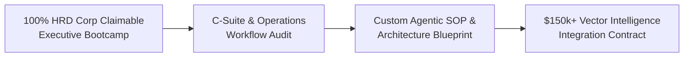

# Vector Institute — Enterprise HRD Corp Claimable AI & Agentic Leadership Prospectus

**Entity:** Vector Institute (A division of Vector One Holdings)  
**Target Market:** Malaysian Public Listed Companies (PLCs), Government-Linked Companies (GLCs), Financial Institutions, and Multinationals.  
**Accreditation Framework:** 100% HRD Corp (HRDF) Claimable under SBL-Khas Scheme.  
**Strategic Objective:** Execute the "Trojan Horse" strategy—deliver C-Suite & Enterprise AI Bootcamps funded by HRDF, conduct live operational audit during training, and convert target accounts into **$150k+ Vector Intelligence multi-agent system integration contracts**.

---

## 🏛️ Executive Summary & Program Value Proposition

Malaysian enterprises face an unprecedented challenge: board-level mandates demand immediate AI transformation, yet 82% of workforce AI initiatives stall due to generic prompt training, security fears, and a lack of integration with core ERP/CRM infrastructure.

The **Vector Institute Executive AI & Agentic Leadership Program** is engineered specifically for Malaysian corporate leadership. Unlike generic online courses, this program combines:
1. **100% HRD Corp Claimability:** Zero out-of-pocket friction for corporate L&D budgets.
2. **Enterprise Data Sovereignty:** Training on local Zero-Retention RAM architectures compliant with Bank Negara RMiT, PDPA 2010, and sovereign cloud mandates.
3. **Applied Agentic Auditing:** Teams complete capstone projects directly addressing internal operational bottlenecks, generating immediate ROI.



---

## 📜 Core Course Offerings (HRD Corp SBL-Khas Approved)

### Program A: Executive AI Strategy & Agentic Governance (L4 C-Suite Retreat)
* **Duration:** 2 Days (16 Hours) / Off-Site Executive Retreat
* **Target Audience:** Board Members, C-Suite (CEO, CDO, CTO, CHRO, CFO), VPs, Heads of Strategy.
* **HRD Corp Claim Code:** `VI-EXEC-AI-L4`
* **Investment:** RM 35,000 per corporate cohort (Up to 15 Executive Delegates)

#### Modules Breakdown:
* **Module 1: The AI & Agentic Landscape (2026–2027)**
  * Beyond Chatbots: Understanding Autonomous Multi-Agent Orchestration.
  * The Software 3.0 Paradigm: Intent-Centric Development vs. Legacy IT.
* **Module 2: AI Economics & Token Infrastructure Optimization**
  * Managing API Costs: Context Compression & Token Pruning via EvoMax Engine.
  * Sovereignty & Compliance: PDPA 2010, BNM RMiT, and RAM-Only Execution.
* **Module 3: The Security Paradox & Blast Radius Management**
  * Setting up deterministic guardrails for probabilistic LLMs.
  * Audit Framework: Identifying high-ROI automation targets across HR, Finance, Procurement, and Supply Chain.
* **Module 4: Enterprise Capstone & AI Transformation Roadmap**
  * Interactive Workshop: Drafting your organization's 12-Month Enterprise Agentic Roadmap.

---

### Program B: Applied Agentic Engineering & Operations Bootcamp (L2 Practitioner)
* **Duration:** 3 Days (24 Hours) / On-Site or Innovation Lab
* **Target Audience:** Department Heads, Operations Managers, Senior Engineers, HR Business Partners.
* **HRD Corp Claim Code:** `VI-OPS-AGENT-L2`
* **Investment:** RM 48,000 per corporate cohort (Up to 25 Delegates)

#### Modules Breakdown:
* **Day 1: Prompt Architecture & Enterprise Security**
  * Advanced Prompting: ReAct, Chain-of-Thought, and Few-Shot Structured Constraints.
  * Preventing Data Leakage: Secure Enterprise LLM Gateways.
* **Day 2: No-Code/Low-Code Multi-Agent Workflows**
  * Orchestrating Autonomous Agents for Document Parsing & Invoice Processing.
  * Connecting AI Agents to ERP (SAP/Oracle), CRM (Salesforce), and Google Workspace.
* **Day 3: Departmental Capstone Build & Hackathon**
  * Live Build: Teams create functional multi-agent workflows solving real company bottlenecks.
  * Evaluation & Conversion: Top 3 operational blueprints presented to C-Suite for full Vector Intelligence integration.

---

## 🎯 Target Enterprise Account Strategy (Top Malaysian PLCs & GLCs)

| Target Account | Sector | Target Personas | Initial HRD Corp Entry | Trojan Horse Upsell Target (Vector Intelligence) |
| :--- | :--- | :--- | :--- | :--- |
| **Maybank** | Banking & Financial Services | CHRO, Chief Digital Officer | Program A (Exec Retreat) | **$250k** Multi-Agent RMiT-Compliant Customer Onboarding Automation |
| **Sime Darby Berhad** | Industrial & Automotive | Head of L&D, Head of Ops | Program B (Ops Bootcamp) | **$180k** Supply Chain & Logistics Agentic Tracking Gateway |
| **Sunway Group** | Real Estate & Healthcare | CHRO, Group CDO | Program A (Exec Retreat) | **$200k** Cross-Business Unit AI Document Synthesis Hub |
| **PETRONAS Digital** | Energy & Infrastructure | Head of Talent, VP Digital | Program B (Ops Bootcamp) | **$300k** Refinery & Offshore Equipment Telemetry Analytics Agents |
| **CelcomDigi / Maxis** | Telecommunications | CHRO, Chief Technology Officer | Program B (Ops Bootcamp) | **$220k** High-Volume Customer Care Agentic Resolution Gateway |
| **Tenaga Nasional (TNB)** | Energy & Utilities | Head of L&D, CIO | Program A (Exec Retreat) | **$190k** Smart Grid & Outage Ticket Dispatch Multi-Agent System |

---

## 📋 HRD Corp Claim Execution Checklist for Corporate HR

```
[ ] Step 1: Select Program (Program A: Exec L4 or Program B: Ops L2)
[ ] Step 2: Receive Vector Institute SBL-Khas Official Quotation & Course Outline
[ ] Step 3: Log in to eTRiS Portal (www.hrdcorp.gov.my)
[ ] Step 4: Submit Grant Application under SBL-Khas Scheme (100% Upfront HRDF Approval)
[ ] Step 5: Execute Training Cohort & Receive Capstone Audit Findings
[ ] Step 6: Vector Institute Claims Directly from HRD Corp (Zero Upfront Corporate Cash Required)
```

---

## 📞 Executive Contact & Booking

* **Institution:** Vector Institute (Vector One Holdings)
* **Program Director:** Executive Education & AI Transformation
* **Corporate Booking Email:** `institute@vectorone.ai` / `silattrader@gmail.com`
* **Website:** [`index.html#pillars`](file:///c:/Users/User/Desktop/Vector%20One/Vector_One_Outputs/index.html)
