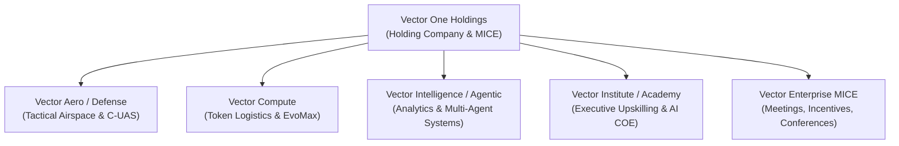
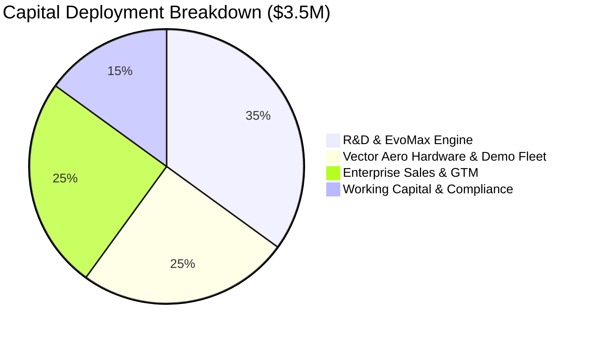

# Comprehensive Business Plan: Vector One Holdings

**Document Version:** 1.0  
**Date:** September 18, 2026  
**Entity:** Vector One Holdings / Vector One Enterprise (SSM Incorporated Sept 17, 2026)  
**Corporate Headquarters:** Malaysia / Global Operational Footprint  

---

## Executive Summary

### Company Vision & Thesis
**Vector One Holdings** is an integrated deep-technology and autonomous systems group operating at the nexus of physical aerospace technology, aerospace defense, and digital cognitive infrastructure. The group addresses the fundamental convergence of physical security threats and enterprise digital automation by providing sovereign, end-to-end capabilities across physical perimeter defense and enterprise cognitive workflows.

As artificial intelligence shifts from passive text generation to active, autonomous agentic execution, and as uncrewed aerial systems (UAS) reshape civil and defense airspace, organizations face a dual challenge: protecting physical infrastructure from airborne threats while scaling cost-efficient, production-grade AI agent infrastructure. Vector One Holdings bridges this gap through five tightly synchronized operating pillars.



### The 5 Core Operating Pillars
1. **Vector Aero (Vector Defense):** Tactical Airspace Dominance & Kinetic Infrastructure Protection. Commercial, industrial, and defense-grade drone operations, advanced counter-uncrewed aerial systems (C-UAS), perimeter surveillance, threat detection, signal jamming, and electronic/kinetic interception.
2. **Vector Compute:** Cognitive Infrastructure, Token Distribution & Compute Efficiency. Authorized reseller, distributor, and integration partner for frontier foundation model tokens (including MiniMax and global LLM providers), powered by the proprietary **EvoMax** performance optimization stack for token compression, API routing, and compute cost reduction.
3. **Vector Intelligence (Vector Agentic):** Data Science & Autonomous Multi-Agent Implementation. Operates two practices: *Analytics as a Service (AaaS)* for quantitative modeling and corporate strategy, and *Agentic AI Deployment* as a full-lifecycle systems integrator for multi-agent autonomous workflows.
4. **Vector Institute (Vector Academy):** Human Capital Upskilling & Center of AI Excellence. Corporate bootcamps, technical certifications, and executive training in prompt engineering, agentic orchestration, and enterprise AI adoption.
5. **Vector Enterprise MICE:** High-level Meetings, Incentives, Conferences, and Exhibitions management, providing corporate access and institutional networking for defense, tech, and enterprise leaders.

---

## 1. Corporate Structure & Governance

### Legal Structure & Incorporation
- **Legal Entity Name:** Vector One Holdings / Vector One Enterprise
- **Date of Incorporation:** September 17, 2026
- **Registration Body:** Companies Commission of Malaysia (SSM)
- **Corporate Office:** Malaysia (Serving SE Asia & Global Markets)

```
                       ┌─────────────────────────────────────────┐
                       │          Vector One Holdings            │
                       │     (Group Strategy & Governance)       │
                       └────────────────────┬────────────────────┘
                                            │
         ┌───────────────────┬──────────────┴──────────────┬───────────────────┐
         ▼                   ▼                             ▼                   ▼
┌─────────────────┐ ┌─────────────────┐           ┌─────────────────┐ ┌─────────────────┐
│   Vector Aero   │ │ Vector Compute  │           │Vector Intelligence│ │Vector Institute │
│ (Airspace/CUAS) │ │(Tokens/EvoMax)  │           │(Agentic / AaaS) │ │ (Upskilling)    │
└─────────────────┘ └─────────────────┘           └─────────────────┘ └─────────────────┘
```

---

## 2. Detailed 5-Pillar Operating Strategy

### Pillar I: Vector Aero (Vector Defense)
- **Core Mandate:** Tactical Airspace Dominance & Kinetic Infrastructure Protection.
- **Capabilities & Services:**
  - *Uncrewed Aerial Systems (UAS):* High-endurance commercial, industrial, and defense-grade drone operations for perimeter security, pipeline inspection, and critical infrastructure monitoring.
  - *Counter-UAS (C-UAS):* Multi-layered threat detection, RF spectrum scanning, radar tracking, signal jamming, electronic countermeasures, and kinetic/electronic interception systems.
  - *Sovereign Airspace Frameworks:* Custom airspace control architecture for military bases, airports, industrial complexes, and government facilities.

### Pillar II: Vector Compute
- **Core Mandate:** Cognitive Infrastructure, Token Distribution & Compute Efficiency.
- **Capabilities & Services:**
  - *Token Logistics & Reselling:* Official distributor and reseller of high-throughput foundation model tokens (including MiniMax and global frontier LLMs).
  - *EvoMax Optimization Stack:* Proprietary middleware that compresses prompt/response tokens, reduces inference latency by up to 40%, and optimizes API cost efficiency through intelligent dynamic model routing.
  - *Enterprise Gateway:* Managed API proxy for enterprise clients requiring high availability, fallbacks, and SLA-backed model access.

### Pillar III: Vector Intelligence (Vector Agentic)
- **Core Mandate:** Enterprise Data Science & Autonomous Agentic Systems Integration.
- **Capabilities & Services:**
  - *Analytics as a Service (AaaS):* Enterprise data architecture, predictive analytics, quantitative financial modeling, and strategic AI consulting.
  - *Multi-Agent Systems Integration:* Design and deployment of deterministic multi-agent workflows using tool-use schemas, state management, self-healing exception handling, and enterprise CRM/ERP connections.

### Pillar IV: Vector Institute (Vector Academy)
- **Core Mandate:** Human Capital Upskilling & Center of AI Excellence.
- **Capabilities & Services:**
  - *Executive AI Leadership Bootcamps:* Intensive training for C-suite and VPs on AI strategy, ROI calculation, and organizational transformation.
  - *Technical Certifications:* Hands-on curricula covering prompt engineering, agentic architecture, data science fluency, and secure LLM deployment.
  - *Corporate Workforce Upskilling:* Customized team training programs to transition traditional workforce roles into AI-augmented workflows.

### Pillar V: Vector Enterprise MICE
- **Core Mandate:** Institutional Networking, Strategic Conferences & Executive Exhibitions.
- **Capabilities & Services:**
  - *Conferences & Symposia:* Organizing high-profile defense-tech and AI summits for industry decision-makers.
  - *Exhibitions & Trade Shows:* Showcasing physical aerospace platforms, counter-drone technologies, and agentic AI frameworks to global buyers.
  - *Incentives & Executive Retreats:* Facilitating strategic retreats for corporate boards and institutional clients.

---

## 3. Market Opportunity & Sizing

The global market for Vector One Holdings' solutions spans four rapidly growing sectors:

| Sector | Target Market Segment | Estimated Global TAM (2026-2030) | Primary Growth Drivers |
| :--- | :--- | :--- | :--- |
| **Airspace Defense (C-UAS)** | Military, Airports, Critical Infrastructure | \$18.5 Billion (18.2% CAGR) | Proliferation of autonomous drones, geopolitical tensions, perimeter vulnerabilities |
| **AI Compute & Token Logistics** | Enterprise AI, SaaS, Financial Services | \$45.0 Billion (32.5% CAGR) | Skyrocketing LLM inference workloads, cost reduction pressure, multi-model strategies |
| **Agentic AI Integration** | Enterprise Automation, Operations | \$28.0 Billion (29.1% CAGR) | Transition from static chatbots to autonomous tool-using multi-agent workflows |
| **Corporate AI Upskilling** | Global Enterprise & Institutional Talent | \$12.0 Billion (15.4% CAGR) | Severe AI skills gap across legacy enterprise workforces |

---

## 4. Technology & Intellectual Property Architecture

```
┌─────────────────────────────────────────────────────────────────────────────┐
│                       VECTOR ONE INTEGRATED STACK                           │
├──────────────────────────────────────┬──────────────────────────────────────┤
│       PHYSICAL KINETIC LAYER         │       DIGITAL COGNITIVE LAYER        │
│          (Vector Aero)               │    (Vector Compute & Intelligence)   │
├──────────────────────────────────────┼──────────────────────────────────────┤
│ • Radar & Electro-Optical Sensors    │ • Multi-Agent Orchestration Engine   │
│ • RF Spectrum Scanning & Jamming     │ • EvoMax Token Compression Layer     │
│ • Autonomous Flight Controllers      │ • Dynamic API Router (MiniMax/LLMs)  │
│ • Kinetic & Electronic Interception  │ • Deterministic SOP Tooling Layer    │
└──────────────────────────────────────┴──────────────────────────────────────┘
```

### Core IP Assets:
1. **EvoMax Token Engine:** Proprietary algorithms for context window compression, reducing token consumption while preserving semantic accuracy.
2. **Unified Command Gateway:** Software interface connecting physical sensor telemetry (drone/radar data) directly into autonomous agent decision loops for real-time threat response.

---

## 5. Go-To-Market & Commercial Playbook

### Channel Strategy & Target Accounts
- **Defense & Public Sector:** Direct procurement sales to defense ministries, airport authorities, and critical infrastructure operators via Vector Aero.
- **Enterprise Tech & Financial Services:** High-volume token supply agreements and agentic integration contracts via Vector Compute and Vector Intelligence.
- **Corporate & Institutional Talent:** Enterprise subscription packages for Vector Institute bootcamps and certifications.

### Pricing Models:
- **Vector Aero:** Capital hardware sales + annual maintenance retainers (SaaS/MaaS model).
- **Vector Compute:** Per-token volume pricing, bulk token distribution margins, and EvoMax SaaS licensing fees.
- **Vector Intelligence:** Project-based integration fees (\$50k–\$250k per engagement) + recurring AaaS retainers.
- **Vector Institute:** Per-seat bootcamp fees (\$1,500–\$5,000/seat) and enterprise group licenses.

---

## 6. Financial Model & 3-Year Projections

### Consolidated Revenue & Margin Forecast (USD)

| Metric | Year 1 (2027) | Year 2 (2028) | Year 3 (2029) |
| :--- | :--- | :--- | :--- |
| **Vector Aero / Defense** | \$1,200,000 | \$3,500,000 | \$8,000,000 |
| **Vector Compute (Tokens/EvoMax)** | \$1,800,000 | \$5,200,000 | \$12,500,000 |
| **Vector Intelligence (Agentic)** | \$1,000,000 | \$2,800,000 | \$6,500,000 |
| **Vector Institute & MICE** | \$600,000 | \$1,500,000 | \$3,500,000 |
| **Gross Revenue** | **\$4,600,000** | **\$13,000,000** | **\$30,500,000** |
| Gross Margin (%) | 55% | 62% | 68% |
| **Operating Expenses (OpEx)** | \$2,100,000 | \$4,800,000 | \$9,500,000 |
| **EBITDA** | **\$430,000** | **\$3,260,000** | **\$11,240,000** |
| EBITDA Margin (%) | 9.3% | 25.1% | 36.8% |

---

## 7. Regulatory, Security & Risk Management

### Risk Mitigation Matrix

| Category | Potential Risk | Mitigation Strategy |
| :--- | :--- | :--- |
| **Regulatory & Airspace** | Civil aviation / frequency spectrum restrictions | Operate strict compliance protocols with national aviation authorities and defense bodies. |
| **Data Privacy & AI** | LLM data leaks & sovereignty concerns | Offer on-premise EvoMax deployments and local token routing to ensure total data isolation. |
| **Supply Chain** | Drone component shortages | Maintain multi-vendor sourcing across NATO and non-restricted friendly nations. |
| **Model Lock-In** | Dependence on specific LLM vendors | Vector Compute's dynamic router supports seamless switching across MiniMax, Claude, GPT, and open-source models. |

---

## 8. Organizational & Human Capital Plan

### Leadership & Hiring Roadmap
- **Phase 1 (Months 1–6):** Core leadership team (Group CEO, VP of Aerospace/Defense, Lead AI Architect, Head of Compute Logistics). Total headcount: 15.
- **Phase 2 (Months 7–18):** Expansion of systems integration engineers, C-UAS field operators, token optimization engineers, and enterprise sales leads. Total headcount: 45.
- **Phase 3 (Months 19–36):** Regional sales directors across ASEAN and global hubs. Total headcount: 100+.

---

## 9. Funding Request & Milestone Allocation

### Capital Requirement: \$3,500,000 (Seed / Series A)



### Strategic Milestones
- **Q1 2027:** Full commercial launch of Vector Compute token distribution & EvoMax beta stack.
- **Q2 2027:** Deployment of first sovereign C-UAS perimeter defense installation for anchor client.
- **Q3 2027:** Graduation of first 500 enterprise students via Vector Institute.
- **Q4 2027:** Achieve \$4.6M Year 1 revenue target with positive EBITDA.

---

## 10. Summary Walkthrough & Next Steps

This business plan establishes **Vector One Holdings** as a category-defining deep-tech group. By combining kinetic airspace defense with token efficiency and autonomous agentic software, Vector One provides unparalleled resilience for modern enterprises and sovereign institutions.
