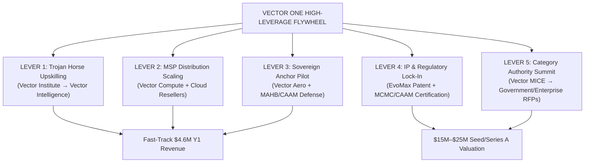

# Vector One Holdings — High-Leverage Action Blueprint (The 80/20 Strategic Playbook)

**Entity:** Vector One Holdings / Vector One Enterprise  
**Mission Statement:** Bridging Physical Kinetic Airspace Defense with Digital Cognitive Infrastructure.  
**Core Objective:** Execute high-leverage (asymmetric ROI) action items across the 5 operating pillars (Vector Aero, Vector Compute, Vector Intelligence, Vector Institute, Vector Enterprise MICE) to accelerate valuation, commercial traction, and technology moats.

---

## 🎯 The High-Leverage Framework (80/20 Matrix)

High-leverage tasks are activities where **1 unit of effort produces 10x–100x operational or financial returns**. They prioritize structural distribution, regulatory moats, capital leverage, and flywheel expansion over linear day-to-day operations.

---

## 🚀 Tier 1: Asymmetric Revenue & Distribution Levers (Immediate 30-90 Day Impact)

### 1. Execute the "Trojan Horse" Enterprise Pipeline (Vector Institute $\rightarrow$ Vector Intelligence)
* **The High-Leverage Action:** Offer 100% HRD Corp claimable *Executive AI & Agentic Leadership Bootcamps* to target PLCs and Financial Institutions (e.g. Maybank, Sime Darby, Sunway).
* **Why it's High-Leverage:** HRD Corp funds cover the initial entry cost ($35k–$50k per cohort), eliminating procurement friction. Once inside the C-suite, audit their operational bottlenecks during the bootcamp and convert them into **$150k+ Vector Intelligence multi-agent integration contracts**.
* **Target Metric:** 5 Enterprise Bootcamps $\rightarrow$ 3 Enterprise Agentic System Integrations ($450k+ pipeline).

### 2. Lock In Regional Cloud MSPs for EvoMax Volume Distribution (Vector Compute)
* **The High-Leverage Action:** Pitch EvoMax token compression middleware to Cloud Managed Service Providers (e.g., Axiata Digital Labs, TM One, Maxis Enterprise) as a wholesale white-label add-on rather than selling single SaaS accounts one by one.
* **Why it's High-Leverage:** Instant access to thousands of enterprise accounts without building an internal 50-person outbound sales team.
* **Target Metric:** 2 Regional MSP Distribution Agreements covering 100M+ monthly tokens.

### 3. Deploy the "48-Hour Staging Sandbox" Self-Serve Trial
* **The High-Leverage Action:** Provide B2B SaaS CTOs with a drop-in API proxy URL to route 5% of their non-production LLM traffic through EvoMax for 48 hours.
* **Why it's High-Leverage:** Frictionless proof of value—showing an instant 35% drop in token spend and 120ms drop in latency on their own real-world data closes deals in days instead of months.
* **Target Metric:** 15 Sandbox Demos per month with a >60% trial-to-paid conversion rate.

---

## 🛡️ Tier 2: Technology Moat & Regulatory Lock-in (Valuation Drivers)

### 4. File Core IP & Provisional Patents
* **The High-Leverage Action:** File provisional patent applications for:
  1. *EvoMax Semantic Context Compression Algorithm* (token pruning without intent degradation).
  2. *Unified Command Gateway (UCG)* (sub-100ms interface connecting AESA radar telemetry to autonomous threat decision loops).
* **Why it's High-Leverage:** Transforms software code into institutional trade secrets and defensible IP, increasing enterprise valuation multiples by 2x–3x during VC fundraising rounds.
* **Target Metric:** 2 Provisional Patent Filings with MyIPO / USPTO.

### 5. Secure CAAM & MCMC Type Acceptance Clearances (Vector Aero)
* **The High-Leverage Action:** Obtain official Civil Aviation Authority of Malaysia (CAAM) operational guidelines approval and MCMC Type Acceptance Certification for RF jamming frequencies.
* **Why it's High-Leverage:** Regulatory barriers to entry keep out 95% of foreign drone startups. Being the first CAAM/MCMC compliant provider in Malaysia creates an immediate government procurement monopoly.
* **Target Metric:** Full MCMC frequency compliance & CAAM flight safety sign-off.

---

## 🏛️ Tier 3: Sovereign Anchor Deals & Defense Positioning

### 6. Secure 1 Flagship Sovereign Perimeter Anchor Pilot (Vector Aero)
* **The High-Leverage Action:** Partner with an airport authority (e.g. MAHB) or critical infrastructure operator (e.g. PETRONAS) for a zero-cost 30-day C-UAS radar perimeter audit.
* **Why it's High-Leverage:** In the defense and infrastructure sector, 1 verified sovereign case study unlocks 10 subsequent government contracts across ASEAN.
* **Target Metric:** 1 Signed MOU / Case Study with a regional international airport or refinery complex.

### 7. Host the Inaugural *ASEAN Sovereign Defense & AI Summit* (Vector Enterprise MICE)
* **The High-Leverage Action:** Organize a high-level, invite-only conference convening Defense Ministry officials, Airport Security Directors, and Enterprise CTOs.
* **Why it's High-Leverage:** Positions Vector One Holdings as the undisputed category leader bridging physical defense and cognitive AI. Event sponsorships pay for event OpEx while generating qualified inbound RFPs.
* **Target Metric:** 200+ C-level delegates, $100k+ in sponsor revenue, 10+ high-value enterprise leads.

---

## 💰 Tier 4: Sovereign Grants & Institutional Fundraising

### 8. Ingest Non-Dilutive Government Deep-Tech Grants
* **The High-Leverage Action:** Apply for non-dilutive innovation grants in Malaysia and ASEAN:
  - **Cradle Fund CIP Sprint / Spark Grant** (Up to RM1.2M for commercialization).
  - **MDEC High Tech & AI Adoption Grant**.
  - **NTU / Enterprise Singapore Deep-Tech Seed Fund**.
* **Why it's High-Leverage:** Non-dilutive capital extends runway without giving away equity before achieving a higher Series A valuation.
* **Target Metric:** RM1.5M+ ($350k+ USD) in non-dilutive grant funding secured.

### 9. Execute the $3.5M Seed/Series A Pitch Roadshow
* **The High-Leverage Action:** Target top regional deep-tech and dual-use VC funds (MAVCAP, Cradle, Vertex Ventures, 500 Global ASEAN, Khazanah Dana Impak).
* **Why it's High-Leverage:** Secures $3.5M capital to scale the EvoMax engineering team, deploy demo C-UAS fleets, and expand across Singapore and Indonesia.
* **Target Metric:** Term sheet issued for $3.5M USD at a $17.5M–$23.3M Post-Money Valuation.

---

## 📋 Action Prioritization Execution Roadmap

| Priority | Action Task | Business Unit | Expected Impact / Output | Timeline |
| :---: | :--- | :--- | :--- | :---: |
| **P0** | Launch 48-Hr EvoMax Sandbox Trial offer to SaaS CTOs | Vector Compute | $24k–$72k ACV recurring contracts | Days 1–30 |
| **P0** | Execute HRD Corp "Trojan Horse" AI Bootcamp pitches to PLCs | Vector Institute | Instant HRDF cashflow + AaaS pipeline | Days 1–30 |
| **P1** | Partner with Regional Cloud MSPs for Token Reselling | Vector Compute | 100M+ token distribution network | Days 30–60 |
| **P1** | File Provisional Patents for EvoMax & UCG Architecture | Legal / Group IP | $15M+ valuation defense moat | Days 30–60 |
| **P2** | Close MAHB / PETRONAS Sovereign Perimeter Pilot MOU | Vector Aero | Anchor C-UAS case study for ASEAN | Days 60–90 |
| **P2** | Submit Cradle Fund & MDEC Deep-Tech Grant Applications | Group Finance | $350k+ non-dilutive capital | Days 60–90 |

---
*Vector One Holdings | Executive Strategy & Asymmetric Growth Engine*
