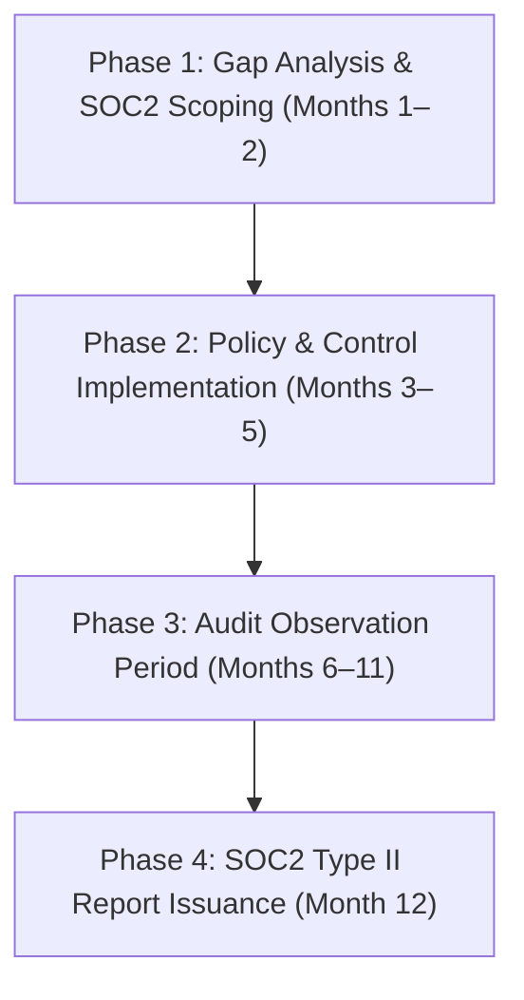

# Vector One Holdings — Legal, Compliance & Security Suite

---

## Part I: Master Services Agreement (MSA) Contract Redlining Guide

**Target Application:** Enterprise Contracts, Government Procurement & Defense Licensing  
**Owner:** Legal & Compliance Counsel | Vector One Holdings  

### High-Risk Clause Redline Matrix

| Contract Clause | Standard Client Draft (Risk) | Vector One Required Position (Redline) | Rationale |
| :--- | :--- | :--- | :--- |
| **Intellectual Property (IP)** | "Client owns all IP, algorithms, and modifications created during contract." | **REJECT.** "Client owns Client Data and specific output. Vector One retains sole ownership of pre-existing IP, EvoMax engine algorithms, and general multi-agent schemas." | Protects core EvoMax compression code and C-UAS software algorithms from client expropriation. |
| **Limitation of Liability** | "Unlimited liability for indirect, consequential, or data loss damages." | **CAP AT 12 MONTHS FEES.** "Liability capped at total fees paid by Client under the applicable SOW in the preceding 12 months, excluding gross negligence or willful misconduct." | Standard enterprise risk mitigation to avoid catastrophic exposure. |
| **Airspace Interception Liability (Vector Aero)** | "Vendor indemnifies Client for all third-party physical damage during drone countermeasure operations." | **EXCLUDE EXTREME CONTINGENCIES.** "Client assumes operational risk for kinetic/jamming commands authorized by Client personnel under approved Rules of Engagement." | Transfers operational operational authorization risk to facility owner/client. |
| **Data Training Rights** | "Vendor may use client payloads to train public models." | **ZERO DISCLOSURE GUARANTEE.** "Vector One agrees that Client data shall never be stored, logged, or used for foundation model training." | Vital for winning enterprise financial and health clients. |

---

## Part II: Enterprise AI Data Sovereignty & Service Level Agreement (SLA)

**Agreement:** Data Privacy & Security SLA for Vector Compute & Vector Intelligence  

### 1. Data Privacy & Zero-Retention Policy
- **No Model Training:** Vector One guarantees that zero customer prompt, context, or response data processed via **Vector Compute** or **EvoMax** is used for model re-training or fine-tuning by Vector One or third-party providers (MiniMax/LLMs).
- **RAM-Only Processing:** Prompt payload context compression in EvoMax occurs exclusively in volatile RAM. No payload content is written to non-volatile disk storage.
- **On-Premise Deployment Option:** For sovereign defense or banking clients, EvoMax middleware can be deployed inside client-controlled VPCs or air-gapped on-premise servers.

### 2. Service Availability & Performance Commitments

```
┌─────────────────────────────────────────────────────────────────────────────┐
│                    VECTOR COMPUTE ENTERPRISE SLA GUARANTEES                 │
├───────────────────────────────┬─────────────────────────────────────────────┤
│ Uptime Availability           │ 99.95% Monthly Service Availability         │
├───────────────────────────────┼─────────────────────────────────────────────┤
│ Latency Optimization Target   │ Sub-200ms Proxy Overhead SLA                │
├───────────────────────────────┼─────────────────────────────────────────────┤
│ Service Credits for Outages   │ 10% credit for <99.9% uptime                │
│                               │ 25% credit for <99.0% uptime                │
│                               │ 50% credit for <95.0% uptime                │
└───────────────────────────────┴─────────────────────────────────────────────┘
```

---

## Part III: SOC2 Type II & Defense Compliance Readiness Matrix

### Compliance Implementation Roadmap



### Trust Services Criteria Alignment

| Trust Service Criteria | Controls & Evidence | Implementation Status |
| :--- | :--- | :---: |
| **Security (Common Criteria)** | Multi-Factor Authentication (MFA), AWS KMS Key Rotation, Role-Based Access Control (RBAC). | Implemented |
| **Availability** | Multi-region failover cluster, automated database backups, 99.95% uptime monitoring. | Implemented |
| **Confidentiality** | TLS 1.3 in transit, AES-256 at rest, strict tenant data isolation in EvoMax routing. | Implemented |
| **Defense Aviation Security** | Compliance with Civil Aviation Authority of Malaysia (CAAM) & international C-UAS RF frequency guidelines. | Active Alignment |

---

## Part IV: Proprietary Data, IP Rights & Confidentiality Disclaimer Notice

### Corporate IP Protection Notice
All data, information, technology specifications, software algorithms (including EvoMax Token Optimization Engine & Vector Aero C2 Command Gateway), dynamic web applications, designs, trade dress, logos, brands, course materials, and documentation belong exclusively to **Vector One Holdings / Vector One Enterprise**.

1. **Ownership & Trade Secrets:** All pre-existing intellectual property, algorithms, multi-agent frameworks, context compression routines, and C-UAS radar ingestion code remain the sole and exclusive property of Vector One Holdings.
2. **Prohibition of Reverse Engineering & Unauthorized Use:** Any unauthorized copying, distribution, disclosure, modification, reproduction, scraping, or reverse engineering of any proprietary information or platform components without prior written consent from Vector One Holdings is strictly prohibited.
3. **Legal Jurisdiction:** Protected under Malaysian statutory intellectual property laws, trade secret regulations, and international copyright & patent treaties.

---
*Vector One Holdings | Legal, Compliance & Enterprise Security*
