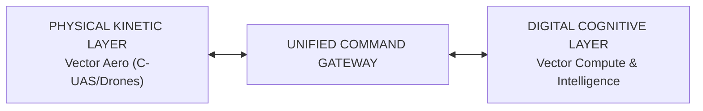

# Vector One Holdings — Investor Pitch Deck

**Round:** Seed / Series A  
**Target Raise:** \$3,500,000 USD  
**Entity:** Vector One Holdings / Vector One Enterprise (SSM Incorporated)  
**Deck Theme:** Sovereign Airspace Defense meets Digital Cognitive Infrastructure  

---

## Slide 1: Title & Vision
### **VECTOR ONE HOLDINGS**
#### *Integrated Deep-Technology & Autonomous Systems Group*
- **Tagline:** Bridging Physical Kinetic Airspace Defense with Digital Cognitive Infrastructure.
- **Presenter:** Executive Founders & Leadership Team
- **Contact:** ir@vectorone.com | Malaysia & Global Operating Centers

---

## Slide 2: The Dual Crisis (Problem)
### **The Physical-Digital Vulnerability Paradox**
1. **Physical Airspace Vulnerabilities:** Explosive growth of uncrewed aerial systems (UAS) has created massive perimeter security gaps for airports, military bases, energy grids, and critical industrial complexes.
2. **Digital Inference Cost & Latency Bottlenecks:** Enterprises scaling LLMs and multi-agent workflows face runaway token expenditures and severe API latency spikes.
3. **The Disconnect:** Current market solutions isolate physical security from software workflows, leaving enterprises without unified operational resilience.

---

## Slide 3: The Vector One Solution
### **Unified Physical Kinetic & Digital Cognitive Infrastructure**



- **Sovereign Airspace Dominance:** Perimeter surveillance, radar tracking, signal jamming, and electronic/kinetic interception via **Vector Aero**.
- **High-Throughput Token Logistics:** Official distribution of MiniMax & frontier LLM tokens powered by the **EvoMax Engine** (up to 40% latency & cost compression) via **Vector Compute**.
- **Production-Grade Agentic Execution:** Full-lifecycle multi-agent integration & quantitative analytics via **Vector Intelligence**.

---

## Slide 4: The 5-Pillar Operating Engine

| Operating Subsidiary | Core Mandate | Primary Revenue Engine |
| :--- | :--- | :--- |
| 🛡️ **Vector Aero (Defense)** | Airspace dominance & C-UAS perimeter defense | Defense contracts, hardware sales, MaaS retainers |
| ⚡ **Vector Compute** | Token distribution & EvoMax compression stack | Token volume margins, EvoMax SaaS licensing |
| 🤖 **Vector Intelligence** | AaaS & Autonomous Multi-Agent Integration | \$50k–\$250k integration fees + AaaS retainers |
| 🎓 **Vector Institute** | Corporate AI upskilling & executive bootcamps | \$1.5k–\$5k/seat bootcamps, enterprise licenses |
| 🎪 **Vector Enterprise MICE** | Institutional networking & defense tech summits | Conference sponsorships, delegate fees |

---

## Slide 5: Market Opportunity & TAM
### **Riding Four Multi-Billion Dollar Megatrends**

- **Airspace Defense (C-UAS):** \$18.5 Billion TAM (18.2% CAGR)
- **AI Token Logistics & Compute:** \$45.0 Billion TAM (32.5% CAGR)
- **Agentic AI Integration:** \$28.0 Billion TAM (29.1% CAGR)
- **Corporate AI Upskilling:** \$12.0 Billion TAM (15.4% CAGR)
- **Combined Group TAM:** **\$103.5+ Billion** globally by 2030.

---

## Slide 6: Technology Moat & Intellectual Property
### **Deep-Tech & Proprietary Middleware**

1. **EvoMax Token Engine:** Proprietary semantic context compression algorithms that shrink LLM prompt tokens without loss of intent, reducing enterprise LLM bills by 30–40%.
2. **Unified Command Gateway:** Patent-pending telemetry connector routing drone/radar sensor data directly into deterministic agentic decision loops for real-time autonomous threat response.

---

## Slide 7: Go-To-Market & Commercial Traction
### **High-Velocity Multi-Channel Playbook**

- **Defense & Public Sector:** Direct procurement pipelines with defense ministries, airports, and critical infrastructure operators.
- **Enterprise SaaS & Finance:** Bulk token distribution agreements for MiniMax & LLMs + EvoMax compression middleware deployments.
- **Workforce Upskilling Pipeline:** Vector Institute serves as an enterprise acquisition funnel—upskilling client engineering teams before deploying Vector Intelligence agentic integrations.

---

## Slide 8: Financial Performance & 3-Year Forecast

```mermaid
barChart
    title Consolidated Revenue Growth Forecast (USD)
    x-axis Year
    y-axis Revenue ($ Millions)
    "2027 (Year 1)": 4.6
    "2028 (Year 2)": 13.0
    "2029 (Year 3)": 30.5
```

- **Year 1 (2027):** \$4.6M Gross Revenue | \$430k EBITDA (9.3% Margin)
- **Year 2 (2028):** \$13.0M Gross Revenue | \$3.26M EBITDA (25.1% Margin)
- **Year 3 (2029):** \$30.5M Gross Revenue | \$11.24M EBITDA (36.8% Margin)

---

## Slide 9: Competitive Landscape & Moat

| Feature / Capability | Vector One | Legacy Defense Vendors | AI Token Resellers | Chatbot Agencies |
| :--- | :---: | :---: | :---: | :---: |
| **Physical Airspace / C-UAS** | ✅ | ✅ | ❌ | ❌ |
| **Token Compression (EvoMax)** | ✅ | ❌ | ❌ | ❌ |
| **Autonomous Multi-Agent Specs** | ✅ | ❌ | ❌ | ⚠️ (Basic) |
| **Institutional Upskilling** | ✅ | ❌ | ❌ | ❌ |

---

## Slide 10: Leadership & Governance
### **Proven Deep-Tech & Executive Leadership**
- **Group CEO & Founder:** Serial founder with 10+ years scaling tech companies & enterprise partnerships.
- **VP of Aerospace & Defense Systems:** Former defense tech lead specializing in drone operations & RF countermeasures.
- **Chief AI Architect:** Expert in LLM optimization, token logistics, and multi-agent systems engineering.
- **Head of Institutional Partnerships:** Lead for Vector Institute & MICE conference operations.

---

## Slide 11: Capital Requirement & Use of Funds
### **Fundraising Ask: \$3,500,000 USD (Seed / Series A)**

- **35% (\$1,225,000):** R&D, EvoMax Engine Optimization & AI Patent Filing
- **25% (\$875,000):** Vector Aero C-UAS Demo Fleet & Sensor Telemetry Hardware
- **25% (\$875,000):** Enterprise Sales, GTM Expansion & Defense Procurement Pipeline
- **15% (\$525,000):** Working Capital, Compliance (SOC2/Aviation) & Operational Contingency

---

## Slide 12: Summary & Investment Thesis
### **Why Invest in Vector One Holdings Now?**
1. **Proprietary Technology:** EvoMax token compression + physical C-UAS command integration.
2. **Defensible Business Model:** 5 synergistic revenue streams across hardware, token distribution, consulting, and education.
3. **Outsized Financial Returns:** Fast path to profitability with \$30.5M revenue & \$11.2M EBITDA by Year 3.
4. **Target Investment Round:** **\$3.5M USD** for 15–20% equity stake.

---
*Vector One Holdings | Sovereign Defense & Cognitive Infrastructure*
