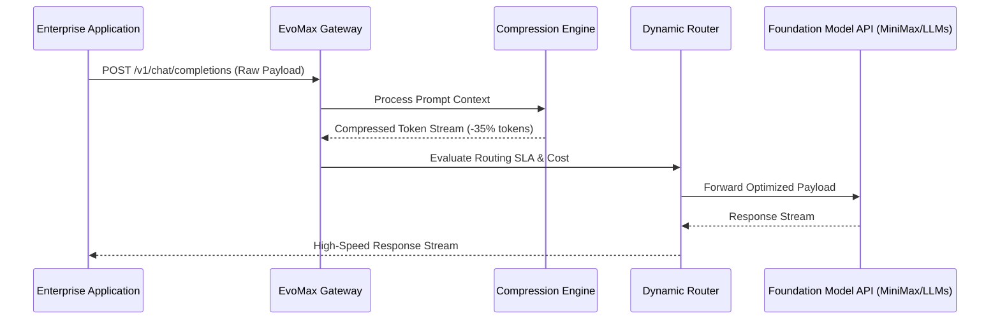

# Vector One Holdings — PRD & System Architecture Suite

---

## Part I: Product Requirements Document (PRD) — EvoMax Token Engine

**Document Status:** Approved for Engineering  
**Product Name:** EvoMax Token Optimization Engine (v1.5)  
**Owner:** Chief AI Architect | Vector Compute  
**Target Delivery:** Q1 2027  

### 1. Executive Summary & Objective
The **EvoMax Token Engine** is a high-performance API proxy and context-compression middleware engineered to sit between enterprise application layers and foundation model provider APIs (MiniMax & Global Frontier LLMs). 

**Primary Goals:**
- Reduce enterprise LLM token consumption by **30–40%** without loss of semantic intent or task accuracy.
- Reduce end-to-end API inference latency by **30–150ms**.
- Provide intelligent dynamic model routing based on cost, latency SLAs, and prompt complexity.

### 2. Architecture & Control Flow



### 3. Functional Requirements

| Req ID | Module | Requirement Description | Priority |
| :--- | :--- | :--- | :---: |
| **FR-01** | **Context Compression** | Algorithm must identify and prune redundant tokens, boilerplate instructions, and syntactic noise prior to API transmission. | P0 (Must Have) |
| **FR-02** | **Dynamic Routing** | Route queries dynamically between MiniMax high-throughput models and tier-1 frontier models based on prompt complexity scoring. | P0 (Must Have) |
| **FR-03** | **Streaming Support** | Full compatibility with Server-Sent Events (SSE) streaming for real-time chat & agentic interfaces. | P0 (Must Have) |
| **FR-04** | **Token Budgeting & Limits** | Enterprise tenant rate-limiting, monthly token cap enforcement, and cost-anomaly alerts. | P1 (Should Have) |
| **FR-05** | **Zero Data Retention SLA** | Option for zero log storage to comply with HIPAA, GDPR, and enterprise banking security requirements. | P0 (Must Have) |

---

## Part II: Technical System Architecture — Vector Aero C-UAS Command Gateway

**System Name:** Vector Aero Command & Control (C2) Airspace Protection Gateway  
**Owner:** VP of Aerospace & Defense Systems | Vector Aero  

### 1. System Overview
The **Vector Aero C2 Gateway** connects physical airspace sensors (radar, RF spectrum analyzers, electro-optical cameras) with automated countermeasure systems (RF jamming, electronic interception, kinetic neutralizers) through an ultra-low-latency sensor-fusion engine.

### 2. Hardware-Software Interface Stack

```
┌─────────────────────────────────────────────────────────────────────────────┐
│                       VECTOR AERO C2 SENSOR FUSION STACK                    │
├─────────────────────────────────────────────────────────────────────────────┤
│ 1. SENSOR INGESTION LAYER                                                   │
│    • AESA Radar Feeds (GigE Vision / MAVLink)                              │
│    • RF Spectrum Scanners (SDR 70MHz – 6GHz)                                │
│    • Thermal / Optical Camera Streams (RTSP H.265)                          │
├─────────────────────────────────────────────────────────────────────────────┤
│ 2. SENSOR FUSION & THREAT EVALUATION ENGINE                                 │
│    • Micro-Doppler Target Classification                                   │
│    • Threat Vector & Trajectory Prediction (Sub-10ms Calculation)          │
│    • Autonomous Interception Logic (Rules-of-Engagement Filter)            │
├─────────────────────────────────────────────────────────────────────────────┤
│ 3. COUNTERMEASURE EXECUTION LAYER                                           │
│    • Directional RF Jamming (GNSS / Control Link Suppression)               │
│    • High-Power Microwave (HPM) Electronic Interception                    │
│    • Kinetic Net-Drone Dispatch Trigger                                    │
└─────────────────────────────────────────────────────────────────────────────┘
```

### 3. Key Operational Specifications
- **Sensor Telemetry Latency:** < 5ms ingestion delay over industrial Ethernet.
- **Threat Detection Range:** 5.0 km micro-UAS identification | 12.0 km fixed-wing drone detection.
- **Interception Response Time:** Automated RF jamming trigger in < 100ms from threat confirmation.
- **Fail-Safe Protocol:** Hardware interlock requiring manual human-in-the-loop authorization for kinetic interception routines in civil airspace.

---
*Vector One Holdings | Technical PRD & Architecture Specifications*
